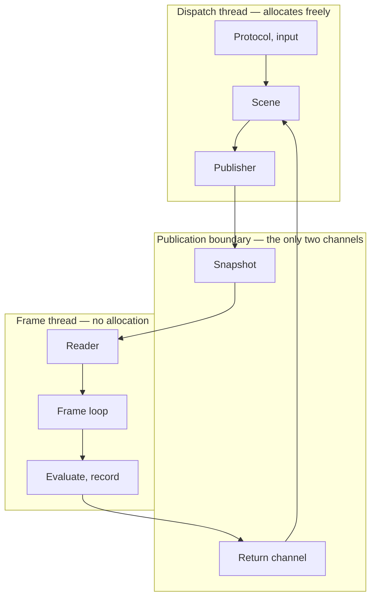
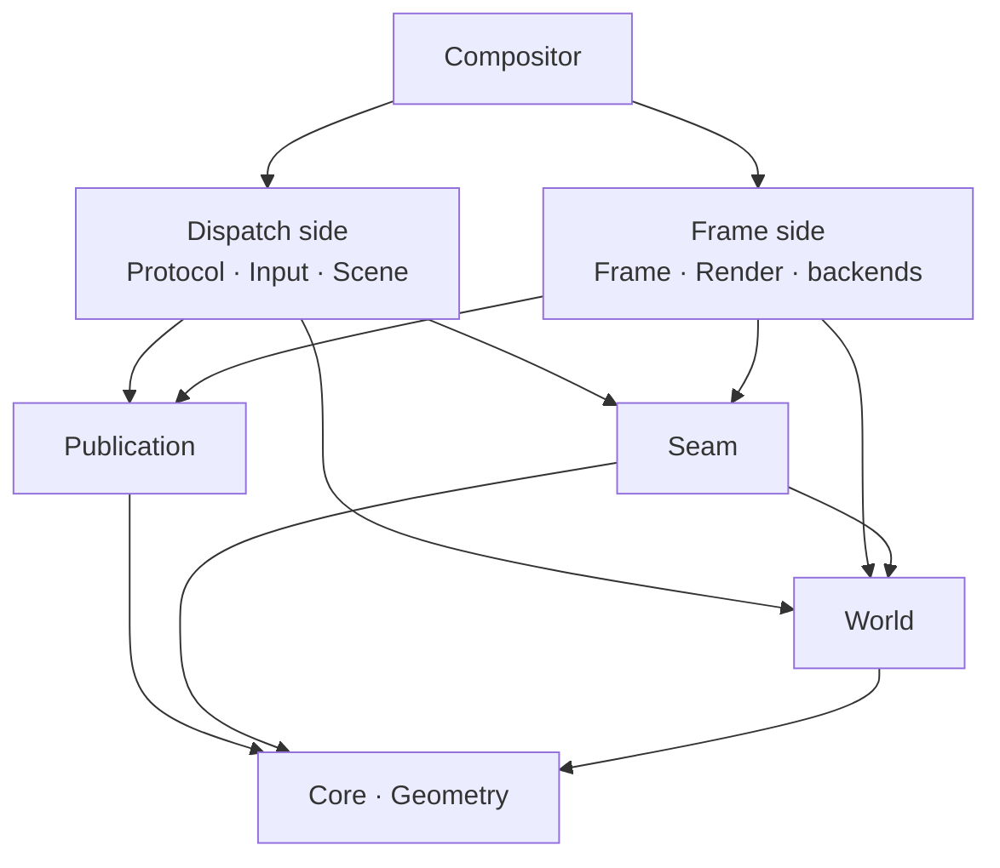

# Structure

Where gyro's code lives, what may depend on what, and which thread each piece runs on.

Companion documents: [Architecture.md](Architecture.md) for the platform seam and the frame loop,
[Animation.md](Animation.md) for the animation system, [Decisions.md](Decisions.md) for the decision
log.

This is the third tier. [Experience.md](Experience.md) says what a person perceives;
[Architecture.md](Architecture.md) and [Animation.md](Animation.md) say by what mechanism; this says
where that mechanism lives and what stops the parts reaching each other. Citations point up:
everything here rests on a decision recorded above it, and nothing above it needs this file in order
to be understood.

**Volatility: this document changes when the code moves**, which will be often. It is the most
volatile of the three tiers and that is the arrangement working correctly — a module appearing,
splitting, or being renamed changes this file and nothing else. If a change here forces a change in
[Architecture.md](Architecture.md), the change was not structural.

> **Every row in the table below is built except `Console`.** *(Rewritten 2026-09-06. This note
> said "most of this does not exist yet" and listed seven modules as the whole of the tree, which
> stopped being true months before anyone noticed — it is the paragraph a reader trusts first and
> the one nothing forces to stay honest.)*
>
> gyro now runs a session end to end: an agent hands over a listener, clients connect, windows map
> and are placed, they take pointer, keyboard and touch input, and they are composited onto a panel
> through KMS or into a window of another compositor. `CMakeLists.txt` is what to check this
> paragraph against — every row but `Console` is a `gyro_add_module` call in it, and the † note
> under the table says what `Console` is missing.
>
> What has not changed is why this document is a dependency graph rather than a file list. The edge
> that must not exist was cheapest to forbid while there was nothing to forbid, and
> `CheckLayering.cmake` has held it since the first module. The file list is
> [below](#what-each-module-contains), underneath the arguments, because the graph is the part that
> is enforced.

## Two waists

Everything hangs off two modules that nothing hangs off of.

**`Publication` is the data waist** — what crosses between threads. The snapshot representation, the
single-producer / single-consumer ring, the return channel, the consumed-sequence watermark, the
per-buffer hold. It is
[decision 45](Decisions.md#45-protocol-dispatch-is-a-thread-not-a-task) and
[decision 50](Decisions.md#50-the-world-is-authored-on-the-dispatch-thread-the-snapshot-carries-coefficients)
given somewhere to live.

**`Seam` is the control waist** — every interface with more than one implementation, and the plain
data that crosses them: `IPresenter`, `IEventSource`, `IRenderer`, `ITextureImporter`, `IInput`,
`IDmabufAllocator`, alongside `RenderTarget`, `TextureSource`, `SyncPoint`, and `PresentationInfo`. It is [the seam](Architecture.md#the-seam) plus
the one interface that is not platform at all, for the reason under
[Frame is portable](#frame-is-portable).

The presentation half is built, and it added `OutputConfiguration` to that list — what `Reconfigure`
asks for and what `Reconfigured` reports was achieved, which is one type because the interesting
comparison is between the two. It is portable in a way worth stating, because an interface to KMS
reads as though it could not be. Nothing in it names a Linux header: a format is a four-character code and a modifier is a number,
both **reproduced** from stable kernel ABI rather than included, and a descriptor is `Core/Fd.h`'s.
That is what lets the frame loop's schedulability sweep run against a fake presenter on a machine
with no GPU. It also declares no dispatch half — both threads name these types and neither owns
them, since the frame thread calls both verbs and dispatch authors the configuration one of them
takes.

The render half is built beside it and is written against it: `IRenderer::Record` fills a target the
presenter owns and yields the `SyncPoint` that presenter's `Present` waits on. It is a second
interface rather than more of the first because
[decision 40](Decisions.md#40-software-rendering-is-a-device-not-a-backend-and-it-is-the-floor-tier)
and [decision 79](Decisions.md#79-the-console-is-a-renderer-not-a-presenter) make the writer vary
independently of where the pixels go — one DRM presenter is paired with `Blit` at boot and with a
Vulkan device a moment later. It added the evaluated draw list to the waist's data, for the reason
under [The draw list is in Seam](#the-draw-list-is-in-seam).

It added `IEventSource` on the same grounds and at a different granularity, which is the part worth
noticing. A presenter is one output's; the descriptor its completions arrive on is one *device's* —
one DRM file for every CRTC, one host connection for every window. So the drain that turns a
readable file into `Presented` is the backend's rather than the presenter's, and hanging it off
`IPresenter` would have had the loop register the same file once per output. See
[decision 80](Decisions.md#80-the-frame-loop-is-a-step-the-composition-root-owns-the-wait).

Both are portable, both depend only on `Core` and `Geometry`, and **the composition root is the only
thing that knows both sides of either.**

The two waists are reachable from different places, and that decides which one a piece of crossing
data belongs to — see [Region is in Geometry](#region-is-in-geometry-and-reachability-is-why).

## The runtime

The shape is a cycle, and the two crossings are the whole of the traffic between the threads. Down
the right goes the snapshot: offset-addressed POD, spring coefficients rather than evaluated values,
acquired once per iteration. Up the left goes the return channel: frame callbacks,
`wp_presentation_feedback`, `wl_buffer.release`, the exit-blit hold, and the measured costs that
feed [budgets](Architecture.md#budgets).

**The return leg lands on `Scene` rather than on `Protocol`**, which is
[decision 115](Decisions.md#115-scene-drains-the-return-channel-and-protocol-observes-what-it-derives)
and is not where it reads: the report names a presented *sequence*, and turning that into per-surface
consequences needs what dispatch authored. Three quarters of what it carries never reaches a client
at all — the watermark that frees snapshots, the exit-blit hold, the damage clear — and gyro drains
it during boot with no protocol in the process. What `Protocol` needs of it arrives as an ordinary
intra-thread signal, which is why no arrow is drawn for it: the graph is about the two channels, and
a signal is not one.

A third channel would be a design error rather than an addition, which is why the return channel is
one bounded queue and not four ad-hoc mechanisms — see
[the publication boundary](Architecture.md#the-publication-boundary).

## The modules

`World` is not a third waist. Nothing crosses *through* it — it is the vocabulary both halves of the
world spell their nodes in, placed below both waists for the reason
[the rule below](#region-is-in-geometry-and-reachability-is-why) gives. `Seam` reaches down into it,
which is the one direction a waist may go: a draw item carries the material the shell asked for, so
the enum is *below* the seam rather than declared in it, and `Protocol` and `Scene` can name a
material without either of them naming `Seam`.

**The frame side does not depend on `Scene`, `Protocol`, or `Input`, and that edge must never be
added.** It is the one thing in this document worth enforcing rather than describing: an include of
`Scene` from `Frame` compiles, links, runs, and surfaces months later as jitter with no obvious
cause. `CMake/CheckLayering.cmake` is what draws the line.

| Module | Tier | Thread | Depends on |
| --- | --- | --- | --- |
| `Core` | portable | either | — |
| `Geometry` | portable | either | `Core` |
| `Wire` | portable | either | `Core`, `Seam` |
| `Text` | portable | **both** | `Core`, `Geometry` |
| `World` | portable | **both** | `Core`, `Geometry` |
| `Animation` | portable | **both** | `Core`, `Geometry` |
| `Publication` | portable | **both** | `Core`, `Geometry` |
| `Seam` | portable | **both** | `Core`, `Geometry`, `World` |
| `Scene` | portable | dispatch | `Core`, `Geometry`, `World`, `Animation`, `Publication` |
| `Gym` | portable | dispatch | `Core`, `Geometry`, `World`, `Text`, `Animation`, `Scene` |
| `Dispatch` | portable | dispatch | `Core`, `Publication`, `Scene`, `Seam`, `Gym` |
| `Trace` | portable | own | `Core` |
| `Blit` | **portable** | frame | `Core`, `Geometry`, `Seam` |
| `Frame` | portable | frame | `Core`, `Geometry`, `World`, `Animation`, `Publication`, `Seam` |
| `Render` | platform | **both** | `Core`, `Geometry`, `Seam` |
| `Session` | platform | dispatch | `Core` |
| `Protocol` | platform | dispatch | `Core`, `Geometry`, `Scene`, `Session` |
| `Input` | platform | dispatch | `Core`, `Seam` |
| `Headless` | **portable** | split | `Core`, `Geometry`, `Seam` |
| `Virtual` | platform | frame, own | `Core`, `Geometry`, `Seam`, `Headless` |
| `Nested` | platform | split | `Core`, `Geometry`, `Seam`, `Wire` |
| `Drm` | platform | frame, own | `Core`, `Geometry`, `Seam` |
| `Console`&nbsp;† | platform | own | `Core`, `Geometry`, `Seam`, `Blit` |
| `Compositor` | platform | constructs | everything |
| `Shell`&nbsp;‡ | platform | — | `Core`, `Geometry`, `Text`, `Wire` |
| `Testing` | portable | — | — |

**† `Console` is the one row that is not built.** *(Marked 2026-08-29, having read as built since
the table was written.)* The recovery console is promised by [Experience.md](Experience.md) and its
renderer half exists — that is `Blit`, and
[decision 79](Decisions.md#79-the-console-is-a-renderer-not-a-presenter) is why the two are separate
modules rather than one — but the grid, the cursor and the input that would sit above it have no
code. The row is the shape it will take rather than a description of the tree, and every other row
matches `CMakeLists.txt` exactly. Note also that `Gym/Console.h` is *not* this module arriving early:
it is a gym driver that puts every rung of `Text`'s font ladder on screen, and it is the specimen the
console will be built against rather than the console.

**‡ `Shell` is a client rather than a part of the compositor**, which is why it depends on `Wire`
and on nothing below either waist: it talks to gyro over the Wayland socket exactly as any other
application does, and the thread column is empty because it is not one of gyro's threads. It is the
reference shell — the bar and its canvas — and it exists so that the things a shell owns under
[decision 51](Decisions.md#51-the-shell-is-a-per-session-client-gyro-owns-mechanism) have somewhere
to be written that is not this process.

The tree builds four programs from these modules: `gyro` itself, `gyro-session` — the per-session
agent that creates the listeners and hands them over, whose code is `Source/Agent/` over the ABI in
`Session` — `gyro-control`, the machine peer by hand from `Source/Control/`, and `gyro-shell`. Only
the first links the module graph above; the others link the handful of modules that are portable
enough to be a client's. `gyro-control` is the login agent's conversation with gyro with the
authentication removed, it is what makes assignment exercisable before that agent exists, and it is
deliberately not installed — a second party entitled to assign screens would make a deployment
ambiguous about which one is in charge.

Portable means what [decision 6](Decisions.md#6-no-macos-port-development-continues-over-ssh) means:
ISO C++ and POSIX, no Linux-only or platform-stack headers, so the tests build and run on a machine
with no GPU, no seat, and no compositor. `CMake/CheckPortability.cmake` enforces it.

### Blit is portable, and it is the module where that matters most

The CPU renderer [decision 79](Decisions.md#79-the-console-is-a-renderer-not-a-presenter) names lives
in its own module rather than inside `Console`, and it is `PORTABLE` for a stronger reason than the
others are: a composite into a mapped pointer is arithmetic, so there is no platform header to
name, and `CheckPortability.cmake` holding it to that is what keeps the renderer that runs *when
there is no GPU* testable on a machine that has none. Every assertion about where an edge landed and
what a half-covered pixel is worth runs in CI, on the one path a failure cannot be diagnosed from —
by the time `Blit` is what is drawing, there is nothing else left to draw with.

It is not inside `Console` because the console is a text grid with its own thread and its own input,
and the blitter is an `IRenderer` on the frame thread that the boot splash reaches before any console
exists. `Console` will depend on it; the reverse would put the console's grid, its cursor and its
input below the seam. That the blitter is built and the console is not is the order this argument
predicts — the splash needs the renderer first.

*(Clarified 2026-08-25 by [decision 155](Decisions.md#155-text-is-a-producer-of-pixels-rather-than-a-verb-on-a-renderer-and-the-font-is-spleen-because-it-is-a-ladder),
which does put the glyph tables in the portable tier — in `Text`, which is a peer of `World` rather
than anything `Blit` depends on. The distinction the sentence above was reaching for holds: `Blit`
still names no font, and what a console hands it is coverage.)*

### Frame is portable

`Frame` holds the frame loop, `FrameClock`, admission control, and the timing policy, and it drives
`IRenderer` and `IPresenter` as interfaces rather than as Vulkan and KMS. That is what lets the
schedulability sweep and the idle assertion run in CI against fake clocks and a null renderer that
merely charges a simulated `C`, which is the first point at which
[decision 29](Decisions.md#29-outputs-are-periodic-real-time-tasks-the-test-allocates-effect-budget)
becomes falsifiable rather than argued.

If those interfaces lived in `Render` instead, `Frame` would be platform code and the sweep would be
testing a reimplementation of the loop — which is the thing that rots.

The table above is what `Frame` declares. `gyro_add_module` names the edges the code actually has,
because `CheckLayering.cmake` denies what is not declared, so the narrower declaration is the stronger
rule — `Publication` and `Seam` arrived with the loop that reads a snapshot and posts a watermark, and
`World` and `Animation` with the evaluator, which reads the node and content records and evaluates the
coefficients they name. What it reaches of `Animation` is the frame half: `Solve` is the default and
`Author` is a dispatch half, which the check denies from outside it without the declaration having to
say so.

**The evaluator is an interface inside `Frame` and not at either waist**, which is the one place this
module has a seam of its own. It has no second implementation that is not a test — `Scene` publishes,
`Frame` evaluates, and no backend is ever on the other end of it — so putting it in `Seam` would widen
the control waist for something with one caller and one callee. What crosses *out* of it is
[the draw list](#the-draw-list-is-in-seam), which is at the waist because a renderer does read it.

**Which is also why `Frame` does not wait.** It exposes one iteration, returning the
[`Wake`](../Source/Core/Wake.h) the next one is owed at; the `while` above it and the `io_uring`
timeout under it are the composition root's, because the root already constructs the threads. The
shim's whole contract is *wake at or after this instant, or earlier when a registered descriptor is
readable* — it may wake spuriously, it is handed no say in ordering, and the loop the sweep runs is
therefore the loop that ships. One of the descriptors it registers is dispatch's, per
[decision 83](Decisions.md#83-dispatchs-publication-is-an-event-source): a publication has to reach a
frame thread that folded to idle, and making that an `IEventSource` like any other is what keeps the
step's signature from growing a case for it.
[Decision 80](Decisions.md#80-the-frame-loop-is-a-step-the-composition-root-owns-the-wait) has why
the alternatives — a wait interface in `Seam`, a readiness set passed into the step — both put a
correctness ordering in the one place nothing exercises it.

### Headless is portable, and it is the instrument

`Headless` sits in the tier with `Frame` rather than with the two backends it shares a job title with,
and the reason is the same one [Frame is portable](#frame-is-portable) gives. It is what the
schedulability sweep runs *against*: the fake clock that takes arbitrary rates and phases, the
simulated panel that does not run at its nominal rate, the deliberately injected miss. That sweep has
to run on a machine with no GPU, no seat, and no compositor, and a module that is merely *incidentally*
portable stops being so the first time a platform header is convenient — silently, since nothing fails
until CI is the environment that no longer has what it acquired.

Nothing in it needs the platform. A vblank is a phase and a period; the images are heap pages behind
`RenderTarget`'s `MappedImage`; and the descriptor a backend would ordinarily wake on is *invalid*
here, which [Seam/EventSource.h](../Source/Seam/EventSource.h) had already settled as the ordinary
answer rather than a gap — a headless flip is a function of the clock, so there is no file to poll. The
null renderer that charges a simulated `C` is here for the same reason and not in `Render`, which is
platform code holding Vulkan. See
[decision 85](Decisions.md#85-the-headless-backend-is-portable-and-the-instrument-is-the-reason),
including what would take it back out of the tier and why the build would say so.

It has no dispatch half yet. Presentation is all that is built; scripted input is dispatch-side and
arrives with the input seam, at which point the module names one.

### Virtual is platform, and it is the one that allocates

`Virtual` is a presenter whose consumer is a file, an encoder, or a test rather than a panel. It sits
one row below `Headless` in the table and on the other side of the tier line, and the two differences
are the whole of why it is a separate module: its images are real dmabufs, so it names
`linux/udmabuf.h` and cannot be portable; and its targets retire when the *consumer* releases them
rather than when the next flip lands, which is the backpressure
[Seam/Presenter.h](../Source/Seam/Presenter.h) writes `AcquireTarget`'s empty answer around.

**It depends on `Headless`, and that edge is one class.** `VblankTimeline` is a period and a phase and
the arithmetic between them, which is what a recording's cadence is as much as a panel's. A platform
module depending down onto a portable one is the direction the graph allows; what would change the
answer is the timeline acquiring behaviour only a sweep wants, at which point it moves rather than
being copied.

**Presentation here is frame-side entire**, like the presentation half of every other backend. The
allocation is not — `BindTargets`' whole contract is that it runs at a target invalidation and never
inside the frame section — but that is a phase rather than a thread, and nothing here is authored on
dispatch. See
[decision 102](Decisions.md#102-a-virtual-output-allocates-the-buffers-it-hands-out-and-that-is-what-stands-the-renderer-up).

**It also runs a thread of its own, and it was the only portable-graph neighbour that did until
`Trace` became the second.** *(Added 2026-08-22, amended 2026-08-23.)* [Virtual/Dump.h](../Source/Virtual/Dump.h) writes a PAM per presented frame, and a file
write from the frame thread is the hazard [Open.md](Open.md)'s *spdlog async sink* entry names — so
the sink copies on the frame thread and a writer thread does the `open`, the `write`, and the
`rename`. That thread is neither frame nor dispatch: it is off both partitions, it touches nothing
either one owns, and what crosses to it is a copy in the sink's own slab rather than a target
descriptor, which is why it does not race `AcquireTarget` on the ring it is reading out of. This is
the "own" in the table's thread column, which `Trace`'s writer carries for the same reason and
`Console` is marked for in advance. See
[decision 121](Decisions.md#121---backenddump-is-a-backend-and-the-frame-it-writes-crosses-to-a-writer-thread-as-a-copy).

**The allocator it drives is in `Seam` rather than in this module.** *(Revised 2026-08-22.)*
[Virtual/Allocator.h](../Source/Virtual/Allocator.h) kept `IDmabufAllocator` out of the waist because
nothing outside `Virtual` named one, and
[decision 120](Decisions.md#120-a-nested-outputs-targets-are-exported-from-the-vulkan-device-and-the-allocator-moves-to-seam)
gives it a second caller: a nested output's targets are exported from the Vulkan device, so `Render`
implements the interface and `Nested` consumes it, and neither may name the other. That is the waist
rule met rather than bent — two implementations, two consumers in different modules, and the
composition root the only thing that knows both sides. `Virtual` still owns the `udmabuf` provider,
which is still the one that runs where there is no GPU.

**`Nested` is split and declares no `DISPATCH_HALF`, which is decision 81's rule being *per object*
rather than per module.** The host connection is pumped by the frame thread and
[Nested/Input.h](../Source/Nested/Input.h) is drained by the dispatch thread, so the module genuinely
straddles the boundary — and nothing in it needs the declaration, because the partition exists to stop
an *include* crossing where the graph calls it legal, and the input path names nothing a frame-side
file may not. What crosses between the two threads is a bounded ring and an eventfd, which is
[decision 173](Decisions.md#173-nested-gyro-takes-input-from-the-hosts-seat-and-a-host-window-is-an-absolute-device-bound-to-the-output-it-is)
and is a handoff rather than a second reader. *(Revised 2026-08-30; this said only the frame half
existed and that a `DISPATCH_HALF` would appear when input landed. Input landed and no directory did
— the declaration names a subdirectory and the honest answer here is a per-object thread rule, which
is what `Wire`'s own row has said all along.)*

### Drm runs a thread per output, and it is the one "own" thread that is not off to the side

`Trace`'s writer and `Virtual`'s are off both partitions: they touch nothing either thread owns, and
what reaches them is a copy. [Drm/Commit.h](../Source/Drm/Commit.h) is the third and it is nothing
like them — it sits *in* the path to the glass, one thread per output, and it runs at the frame
thread's priority plus one.

**What it is for is that a non-blocking atomic commit does not do the work.** The ioctl returns
having queued it, and a `SCHED_OTHER` kernel worker is what then waits on the composite's fence,
evades the vblank and writes the registers that arm the flip — so the last few hundred microseconds
before a person sees the frame run at a priority gyro cannot raise, and gyro's own real-time thread
can preempt the worker arming gyro's own flip. Dropping `DRM_MODE_ATOMIC_NONBLOCK` runs all of that
on the caller instead, and the caller may not be the frame thread, because the frame thread may not
sit in a syscall for a refresh. Hence a thread, and hence one per output: KMS refuses a second commit
on a CRTC that has not flipped, so a thread shared between two panels would put one panel's
flip-done wait in front of the other panel's latch.

**It does not make `Drm` a straddler.** The straddler table below is about a *dependency* half — code
that may name authoring — and nothing here does. What crosses to a commit thread is a
`CommitRequest` copied out of the output, so the frame thread may refill its own arrays the moment it
has armed, and what comes back is an errno and a duration. The frame thread's whole cost is one
atomic store and a futex wake; it never blocks on this thread, and the flip still completes through
the card's descriptor and the device's ordinary drain.

### The draw list is in Seam

What `IRenderer::Record` takes is a flat span of evaluated draw items — quads with a source, a colour
state, an opacity, and a material name — built by `Frame` into its own arena and read by whichever
renderer is bound. It sits at the control waist for the reason everything else here does: both sides
name it and neither owns it.

The alternative was to route it through the *other* waist, since
[the table above](#the-modules) already gives `Render` a `Publication` edge and the snapshot is
already the thing that crosses between threads. It does not work, and the reason is one tier up:
[decision 50](Decisions.md#50-the-world-is-authored-on-the-dispatch-thread-the-snapshot-carries-coefficients)
puts coefficients in the snapshot and evaluation on the frame thread, so a renderer reading it would
be the second evaluator of the same spring. Once `Frame` is what evaluates, something has to carry
what it evaluated, and that something belongs beside the interface that consumes it.

Which also keeps the two waists from touching. `Publication` and `Seam` both rest on `Core` and
`Geometry` alone and the composition root is the only thing that knows both sides of either; an edge
from one to the other, added for the benefit of a single interface, is the kind that is never removed
afterwards. See [decision 82](Decisions.md#82-the-renderer-is-handed-an-evaluated-draw-list-not-a-scene).

### The importer is the first waist interface the dispatch thread calls

`IRenderer` and `IPresenter` are frame-side entire, so reading the table above as *`Seam` straddles
because two threads each own some of it* was true only of the plain data until now.
[`ITextureImporter`](../Source/Seam/Importer.h) is the first interface here whose verbs run on the
dispatch thread, and the reason it is an interface of its own rather than two more methods on
`IRenderer` is exactly that: a caller holding one holds a type whose thread is settled, where a caller
holding the other would be reading a comment.

[The straddler table](#threads-are-a-second-partition) already predicted this — `Render`'s dispatch
half is named `Import` there, against nothing that existed. *(Corrected 2026-08-23, against the code
that arrived.)* **The prediction was wrong, and it was wrong about the interesting part.** It assumed
the split could be declared because a Vulkan import creates images, uploads and negotiates modifiers,
which is a directory's worth of code. It is — [Render/Textures.h](../Source/Render/Textures.h) — and
the partition still cannot be declared over it, because the *table* is read by both threads on
purpose. `Adopt` and `Forget` are dispatch's; `Find`, which resolves an id to a descriptor set, is
called from inside `Record`. A directory the frame half may not include is exactly what
`CheckLayering` means by a dispatch half, and this is a file the frame half must include.

That is not an accident of layout, it is the design:
[decision 131](Decisions.md#131-texture-import-is-a-second-interface-and-a-texture-retires-on-the-watermark)
rejected refcounting the table precisely so that the frame thread's lookup costs no synchronisation,
and what makes that safe is the watermark rather than a boundary — dispatch only ever writes a slot no
published snapshot names, and the frame thread only ever reads slots the snapshot it is composing from
does name. Two disjoint sets in one array, which is the same shape as `Blit`'s table one tier down and
the same reason it cannot be split either.

**So both renderers straddle and the build says so about neither, and that is the limit worth stating
rather than papering over.** Nothing stops the frame thread calling `Adopt`. What stands in for the
check is the discipline in [Seam/Importer.h](../Source/Seam/Importer.h), and it is not a convention:
`Forget` is defined below `Publication`'s watermark, so a caller on the wrong thread does not have the
number the verb is stated in terms of.

See [decision 131](Decisions.md#131-texture-import-is-a-second-interface-and-a-texture-retires-on-the-watermark)
and [decision 137](Decisions.md#137-the-vulkan-texture-table-belongs-to-the-device-and-a-mapped-buffer-needs-host-image-copy).

### A dressing's numbers are in Seam, and the enums naming it are not

`World/Material.h` says which materials exist and `Seam/Dressing.h` says what each one *is* — the
radius, the tint, `Smoke`'s contrast floor, and the tier table that decides a chain's structure.
`World/Elevation.h` and the light table below it in the same file are that split a second time, for
the other dressing: the levels are up where a shell can name one, and the height each becomes is
down here with a renderer that is never told which level it drew
([decision 129](Decisions.md#129-a-height-is-the-offset-and-the-light-is-two-constants-its-size-and-its-weight)).
The split is not a tidiness preference; each half is somewhere the other may not be.

The numbers cannot go up beside the enum, because
[decision 33](Decisions.md#33-effects-are-named-materials-not-parameterized-filter-calls) forbids the
call site naming a radius and `World/Material.h` is precisely the header a call site includes in order
to say `Material::Glass`. They cannot go into `Render` either, because
[decision 40](Decisions.md#40-software-rendering-is-a-device-not-a-backend-and-it-is-the-floor-tier)
makes software rendering a device rather than a backend — so `Blit` and the Vulkan renderer are two
implementations of one look, and a number in either is a number the other can disagree with. `Seam`'s
charter is *every interface with more than one implementation and the data crossing it*, and this is
the second half of that sentence with no interface attached.

Same shape as `Pixel` one file over: what a fourcc means in memory lives at the waist because a
renderer encodes through it and a test decodes through it.
[Decision 117](Decisions.md#117-a-gather-reads-the-target-it-is-drawing-into-the-numbers-live-in-seam-and-the-tier-rides-the-request).

### The quad builder is in Frame, and neither type it joins could take it

`Seam/Renderer.h`'s `Quad` and `Geometry/NodeTransform.h`'s `ComposedTransform` are the two ends of
one short function — four corners projected out of a composed chain — and it lives in neither. It
cannot live in `Geometry`, which may not say `Seam`. It could compile in `Seam`, and the waist's own
definition is what refuses it: *every interface with more than one implementation and the data
crossing it*. A quad builder is not an interface, has one caller and one implementation, and no
backend is ever on the far end of it — the same test that keeps
[the evaluator](#frame-is-portable) inside `Frame` rather than at the waist.

So it is `Frame/Projection.h`, beside the loop that will call it. Note which rule did *not* decide
this: [the rule below](#region-is-in-geometry-and-reachability-is-why) is about types both halves of
the world must name, and nothing dispatch-side has ever built a quad. What it takes as the output's
placement is `Geometry`'s own output adapter, which is where the origin folds against a global
translation while both are still double. See
[decision 93](Decisions.md#93-the-quad-is-assembled-in-frame-and-the-back-face-is-the-signed-area).

**The list is at the waist; two of the fields in it are not, and the split is by producer rather than
by awkwardness.** A quad, its sampling, its opacity, and its corner radius are frame-derived, which is
what the decision above is for. A `TextureId` is an import's identity and a `ColorState` is what the
client declared — both authored on the dispatch side, so both are in `Core`, by
[the rule below](#region-is-in-geometry-and-reachability-is-why). `Seam/Renderer.h` includes them the
same way it includes `Geometry/Space.h`, and the item's shape is unchanged.
`BufferId` relocates for `TextureId`'s reason exactly, and *(2026-08-23)* it is the one that says
something about the check rather than about the type: `Protocol` mints it and the identity was
declared in `Publication`, which `Protocol` may not name. Nothing caught it because a type with no
producer has no call sites to deny — `CheckLayering` reads includes, and an id nothing mints is
included by nobody who would fail. The moment to re-read a placement is when the first party that
*produces* the type appears.
`KeyEvent` is the third and moved for the same reason *(2026-08-25)*: `Seam/Input.h` declares the
interface that emits one and `Protocol` is what turns it into a `wl_keyboard.key`, and `Protocol` may
not name `Seam`. The interface stayed at the waist and only the record came down, which is the line
this rule draws — the data crossing between two parties is not the interface between them.
See [decision 87](Decisions.md#87-a-type-both-halves-of-the-world-name-lives-below-both-waists-not-in-seam).

### The plane partition is in Frame, and the backend is not asked what it wants

[Frame/Assign.h](../Source/Frame/Assign.h) decides which of a frame's draw items go on planes and
which are left for the GPU, and it is in `Frame` for the same reason the quad builder is: it is a
walk over the evaluated draw list rather than an interface, and what it produces is a type
`IPresenter` already took. A backend computing its own partition would be four backends each
deciding what gets promoted, differing, and each having to be tested for it.

The split with the backend is where the *cost* is. This side is a suffix rule over the list with no
memory — nothing is sticky, an item promoted this frame may composite the next, and the two frames
are the same picture — so it allocates nothing and asks the hardware nothing. Asking the hardware is
`IPresenter::TestLayers`, which is an ioctl, and it stays behind the seam because it is the expensive
half and the one worth caching. See
[decision 152](Decisions.md#152-promotion-is-a-partition-of-the-draw-list-computed-every-frame-and-a-node-is-promotable-when-its-resample-is-a-no-op-and-it-carries-no-dressing-on-itself).

`PromotionRefusal` rides on the partition rather than being logged where it is computed, which is the
frame section's rule showing through: the party that can record is the one holding a trace row, and
that is the caller.

### Geometry is not part of Core

`Core` is dependency-free primitives: the timebase, the wake, handles, the slot allocator, the
observer signal, the result and descriptor types, logging, and — since both halves of the world name
them — a texture's identity and a buffer's color state.
`Geometry` is domain content: the exact rational scale, the restricted transform and its
classification predicate, the 3D TRS with anchor and quaternion, the coordinate spaces.

The split earns itself on one file.
[Architecture.md](Architecture.md#resample-once-and-know-when-it-is-zero) requires the transform
classification predicate to exist before it has a second caller, because plane promotion, damage
mapping, and the sharpness path all ask the same question and three independently derived answers is
how they drift apart. One module gives it one home.

### The wire codec is its own module, and it is not `Nested`'s

`Wire` is the Wayland wire codec: message framing, the argument vocabulary, fd passing over
`SCM_RIGHTS`, and the per-connection object map. It sits below both waists, because `Nested` is split
across the threads and reaching `Protocol` for a codec would make `Scene` reachable from the frame
side — the one edge [the table above](#the-modules) says must never be added.

**It depends on `Seam` for `IEventSource` and nothing else.** A connection is drained by the frame
loop alongside a DRM device and a simulated vblank, so it is a source like any other rather than
something `Frame/Loop.h` learns to poll specially. The edge is confined to `Wire/Connection.h`:
`Wire/Writer.h` forward-declares `Connection` and the one constructor needing it complete lives in
`Wire/Writer.cpp`, so marshalling a request does not pull the control waist into every generated call
site.

**It has one caller today and that is stated rather than hidden.**
[Decision 2](Decisions.md#2-gyro-owns-the-protocol-seam-libwayland-implements-the-server-codec)
gives the server codec to `libwayland-server`, so `Protocol` does not consume this; the client half
`Nested` needs is all of it. What earns the module anyway is that a codec with no backend in front of
it is exercised over a `socketpair` by a peer the test wrote — truncated headers, an fd arriving a
message early, a `new_id` reused inside the `delete_id` window — none of which a real host can be
asked to produce. See
[decision 119](Decisions.md#119-the-wayland-wire-codec-is-its-own-module-wire-and-it-is-portable).

**Portable, and that is the same argument.** `sendmsg` with `SCM_RIGHTS` over `AF_UNIX` is POSIX, so
the tier costs nothing and buys the machine with no GPU, no seat, and no compositor that decision 6
is about. `Nested` stays platform for its own reasons.

**A connection is pumped by one thread; the module is pumped by none.** That is
[decision 81](Decisions.md#81-a-source-is-pumped-by-one-thread-nested-opens-one-connection-pumped-by-the-frame-thread)'s
rule applying per object, which is why the table reads `either` rather than `both`: gyro's host
connection is the frame thread's for its whole life, and nothing here is shared between the two.

### Animation's Geometry edge is one member

The edge is worth a paragraph because the obvious reasons for it are all wrong, and each of them
would have put it in a different place.

Not the springs. A spring's parameters are scalar whatever its channel's value type is — a
translation, a rotation, and an opacity are solved by the same two coefficients — so the solver is
generic over the channel and names none of its types. Not the settling thresholds either: those
arrive as arguments precisely so that neither the geometric ones settled by [decision
54](Decisions.md#54-settled-geometry-snaps-to-the-outputs-device-grid) nor the non-geometric ones
still [open](Open.md) have to be known inside `Animation`. And not the catalog's channel set, which
names translation, rotation, scale, and opacity as *labels* — a bundle holds a motion per channel
and never a value.

It is one member of one structure: the travel distance in a bundle's gesture mapping, which
[decision
13](Decisions.md#13-a-closed-motion-vocabulary-with-runtime-configuration-exposing-only-that-vocabulary)
puts in the catalog and [decision
65](Decisions.md#65-interactive-transitions-are-driven-by-a-progress-parameter-not-by-a-moving-target)
makes a displacement rather than a scalar. It has to be output-independent — a travel in device
pixels would make the same swipe mean a different fraction of the transition on a 1× and a 1.5×
monitor — and global space is the only space with that property, so the type is what obliges the two
conversions in front of it to be written rather than assumed. That is [decision
52](Decisions.md#52-coordinate-spaces-are-three-and-quantization-belongs-to-the-output) being
load-bearing at a distance from where it was made, and it is the whole of why this row says
`Geometry`.

The edge is also confined to `Author`, and that is checked rather than described. `Solve` is scalar
throughout, so the frame half of the module carries none of it — which is the general shape of this
table rather than a coincidence: a dependency that arrives with authoring stops at the publication
boundary. `gyro_add_module`'s `FRAME_DEPENDS` is where a module names the subset its frame half may
reach, and `CheckLayering.cmake` holds it to that, so a geometric type appearing in `Solve` fails the
build with the reason rather than with the generic missing-edge message.

It is worth noticing which of the two the module graph could see. The graph is per module, so it
would have permitted the include and had nothing to say: the row above says `Geometry` and `Solve` is
in the module the row is about. The rule that catches it is the thread partition rather than the
dependency one, which is the same shape as the halves themselves — the graph draws what may be
reached, and the boundary draws which half may reach it.

### The wake is in Core, and the table above is why

`Wake` is what [doing nothing must cost
nothing](Architecture.md#doing-nothing-must-cost-nothing) folds over, and it reads as animation
content — a spring is its commonest contributor and
[Animation.md](Animation.md#settling-answers-with-a-wake-not-a-boolean) carries the argument for its
shape. It is in `Core` anyway, and the module table settles it rather than taste: `Console` is to depend
on `Core`, `Geometry`, and `Seam` alone, and the recovery console's blinking cursor is one of the
contributions the fold exists to accept. Putting `Wake` in `Animation` would make the console unable
to name its own blink in the vocabulary the scheduler reduces, and `CheckLayering.cmake` would say so
rather than letting a second vocabulary grow beside the first. The idle ladder's timeouts and
retirement expiry make the same argument more quietly.

It is a `Core` primitive on its own terms too, by the test the paragraph above uses: it is a
statement about the timebase, it names nothing in any domain, and it has more than one caller before
it has two implementations.

### Region is in Geometry, and reachability is why

`Region` reads as `Seam` data. It appears in `IPresenter::Present`, it becomes `FB_DAMAGE_CLIPS` on
KMS and `wl_surface.damage_buffer` nested, and the two backends are the reason
[Architecture.md](Architecture.md#presentation) says damage is in the interface from the start. That
is three arguments for the control waist and all of them are about the consumer.

The table settles it against them, the same way it settled the wake. **A type that a dispatch-side
module and a frame-side module must both name lives in `Core`, `Geometry`, or a waist both can reach
— never in `Seam`.** `Seam` is on the frame side's edge set and not on the world's: `Scene` depends
on `Core`, `Geometry`, `Animation`, and `Publication`, and `Protocol` on `Core`, `Geometry`, and
`Scene`. Neither can say `Seam`, and neither should — the composition root being the only thing that
knows both sides of a waist is what would be given up.

Damage has producers on that side. A client's `wl_surface.damage_buffer` rectangles are wire
knowledge and nothing else in the process can hold them, so `Protocol` receives them, `Scene` stores
them, and the publisher serialises them, in `BufferSpace`, before any of it reaches a presenter. With
`Region` in `Seam` the first of those three fails `CheckLayering.cmake` the day surface damage is
written, and the report would name an edge rather than this paragraph.

`Geometry` is where it lands rather than `Core` by [the split above](#geometry-is-not-part-of-core):
it is rect arithmetic over the coordinate spaces, `Rect<S, T>` is already there, and
[decision 52](Decisions.md#52-coordinate-spaces-are-three-and-quantization-belongs-to-the-output)
already writes damage into `Geometry`'s vocabulary by making a damage rectangle the enclosing integer
rectangle *plus the resampling filter's support radius*. Mapping damage between spaces is then
`AxisTransform`'s `Map`, which exists, rather than a second traversal written beside it.
`Seam` loses nothing by the move, because it depends on `Geometry` and `Present`'s signature does
not change. `Scale` is the settled precedent — it crosses in `OutputConfiguration` and has always
lived here.

Two things this does *not* rest on, because both are wrong and each would generalize badly.

**Not that `Region` has no implementations.** Neither do `RenderTarget`, `SyncPoint`, or
`PresentationInfo`; the waist is interfaces *and the plain data that crosses them*, and the data
half was never expected to have a second implementation.

**Not that `Publication` would have to name it.** The waist is type-blind on purpose —
`Publication/Snapshot.h` carries a payload as an offset, a count, and a stride, never as a type,
which is how it carries `Spring<double>` without an `Animation` edge and how it would carry a rect
run without a `Geometry` one. `Publication` is therefore exempt from the rule above rather than an
instance of it, and a crossing type is never placed by asking what the snapshot must include.

The rule earns itself once more, on the channel running the other way. Most of a frame's damage is
not published at all: animation crosses as coefficients and is evaluated per output at that output's
own presentation time, so where a moving node *is* on frame N is frame-side knowledge, and
[decision 63](Decisions.md#63-effects-declare-their-kind-and-their-damage-the-verifier-keeps-them-honest)'s
expansion and accumulation are frame-side with it. What crosses forwards is the client's rectangles;
what crosses backwards is the report. `Protocol` sends `wp_presentation_feedback` and cannot say
`Seam` either, so the presented timestamp reaches it as `Core` types in
[decision 75](Decisions.md#75-the-return-channel-is-one-report-per-frame-per-surface-facts-are-derived-not-sent)'s
record, and `PresentationInfo` stays in `Seam` as what a presenter signals to `FrameClock`. The two
are near enough to fuse and the table says not to.

**The pair landed and the table held.** *(2026-08-23.)* What crosses back is the published sequence
and the instant, as `Core` types; the observed period, the vblank counter and the honesty flags stayed
in `Seam`, because they are the frame clock's inputs and no derivation on the far side is a function
of them. A record that had taken all six would have been `PresentationInfo` under another name,
reaching the one module forbidden from naming the waist it lives at.

**The rule has since been applied four more times, and it does not always answer *move*.**
`TextureId` and `ColorState` relocate to `Core` for damage's reason exactly — `Protocol` mints one
and `Scene` stores the other, and neither may say `Seam`. `OutputConfiguration` does not: `Scene`
needs an output model, but almost nothing `OutputConfiguration` carries serves it, because that type
is a negotiation between the frame thread and a backend. So `Scene` declares the record it wants and
the composition root fills it in — which it may do, being the only thing that knows both sides of
both waists. The axis is how often the fact moves: translation is right for a fact that changes on
hotplug and wrong for one that changes per commit, since a per-commit translation is a map consulted
on the frame path.
See [decision 87](Decisions.md#87-a-type-both-halves-of-the-world-name-lives-below-both-waists-not-in-seam).

**The fourth application is what finally costs a module.** The published node record is a type
`Scene` writes and `Frame` walks — the frame side validates the tree as it traverses it, so it reads
these fields rather than passing them along — and `Frame` may not depend on `Scene`, which is
[the one edge](#the-modules) above. Neither relocation nor translation answers it. `Core` cannot take
it, because a node names a transform and an extent and `Core` may not say `Geometry`; a per-node
translation on the frame path is what the axis above rejects; and `Scene` declaring it is the edge
that must not exist. So `World` is created on `Geometry` alone and the record lives there, with the
node kind and `Material` following when the scene vocabulary [Open.md](Open.md) holds open is
designed. Note what did *not* have to change: `Publication` still names none of it, because
`PutNodes` and `Nodes<T>()` are templates for the same reason `Put` and `Run<T>` are — the exemption
two paragraphs up, working. See
[decision 91](Decisions.md#91-the-worlds-vocabulary-is-a-module-of-its-own-below-both-waists).

### Scene is one tree, and the entity is the record's authoring side

`World` holds what a node *is*; `Scene` holds what writes one. The shape is settled by
[decision 111](Decisions.md#111-an-entity-is-a-nodes-authoring-side-the-store-is-one-tree) and it is
one kind of object rather than two: an entity is the dispatch side's record, a `World::Node` is what
it publishes, and the two are one to one. The store is
[`SlotAllocator`](../Source/Core/SlotAllocator.h) for identity and intrusive parent / first-child /
next-sibling links for the tree, with a top level that is a list rather than a root — matching the
node run, which [`Evaluator`](../Source/Frame/Evaluator.h) already walks as siblings from index zero.

Four things live here and each is a decision above rather than a new choice. The **store** and its
handles. The **differ**, which
[decision 89](Decisions.md#89-a-commit-resolves-in-two-phases-a-change-becomes-motion-where-its-inputs-are-complete)
placed here so that `Animation` stays a pure library. The **commit**, which
[decision 112](Decisions.md#112-a-commit-is-a-scope-with-an-origin-and-the-wire-says-when-it-closes)
makes a scope with an author and an origin rather than an object with a lifetime, so it is a member
of the scene with reusable work lists. And the **return channel's reader**, which is
[decision 115](Decisions.md#115-scene-drains-the-return-channel-and-protocol-observes-what-it-derives):
`Protocol` depends on `Scene` and not the reverse, so what `Protocol` needs of a presented sequence
arrives as a `Signal<>` it owns the link to — [decision 77](Decisions.md#77-a-signals-observers-are-links-the-observers-own)'s
shape, legal because both are the dispatch thread and a signal is intra-thread by rule.
[`Return`](../Source/Scene/Return.h) is that reader *(2026-08-23)*, and it announces per output rather
than per surface for as long as there are no retained handle runs to turn a sequence into surfaces —
which is enough to exercise the leg end to end, and the boot path is why that is worth having before
a client exists.

**Its dependency row does not change, and that is the check that the placements above are right.**
`Scene` was already declared on `Core`, `Geometry`, `World`, `Animation`, and `Publication`. A commit
scope needs the timebase; the store needs `SlotAllocator` and `Handle`; client damage needs
`Region<BufferSpace>`, which is in `Geometry` for
[the reason above](#region-is-in-geometry-and-reachability-is-why); the return drain needs `Signal`
and the report record. Every one of those is already reachable, and nothing here wants `Seam`.

**`Scene` is `DISPATCH` whole rather than a straddler**, which is what makes the frame side's
inability to reach it a graph property instead of a directory one. Nothing in it runs on the frame
thread — the walk that consumes what it publishes is `Frame`'s, and the two never meet.

### The gyms are a module, and the invariant is scenes with no protocol behind them

`Gym` holds the scenes gyro authors for itself: a handful of nodes moving under springs, as the
instrument for looking at what the compositor actually draws. It is the first thing in the tree that
authors a scene the way a shell would, outside a test.

**It is a module rather than files under `Compositor`, and `PORTABLE` is what earns it.** A gym
reaches none of the root's vocabulary — no ring, no `SCHED_FIFO`, no backend, no output negotiation —
so it builds and is tested on a machine with no GPU, no seat, and no compositor, which is the tier the
whole instrument case rests on. Left in the root it would be portable *by accident*: the root is the
one module that is not, so the first time something there reached for a platform header nothing would
say so. The boot splash is the second scene with exactly this shape, and the alternative worth naming
is a directory inside `Scene`, which is refused because `Scene` is the machinery a gym is a *caller*
of and a module holding its own call sites stops being the thing under test.

**`DISPATCH` whole, for `Scene`'s reason.** A gym holds a `SceneStore` and opens `SceneCommit`s, so
the frame side's inability to reach it is a graph property rather than a directory one. It does not
depend on `Publication`: a gym authors and never publishes. The loop around it — `Open` once,
`Advance` on the wake it asked for, publish — is `Dispatch`'s, and the `sleep` at the end of that
sentence is the composition root's, exactly as the frame loop's `while` is.

**Two of its scenes do not draw under the CPU renderer, and the module says so rather than leaving it
to be found.** [Blit/Blit.cpp](../Source/Blit/Blit.cpp)'s `Classify` refuses a material, an
elevation, a nonzero corner radius, and a quad that is not axis-aligned — and one refused item fails
the whole `Record`, so the frame is *lost* rather than degraded. That makes rotation and materials
instruments for the Vulkan renderer specifically: under `--backend=dump` they write no frames at all
for as long as they are moving, which is an empty directory somebody would otherwise file against the
backend. `DrawsOnCpu` is a free function beside the interface rather than a verb on it, so the root
can say so at startup without a gym having to answer a question about a renderer it never sees.

### The dispatch loop steps one author, and there are two of them

`ISceneAuthor` in [Scene/Author.h](../Source/Scene/Author.h) is the slot the dispatch loop steps:
`Open` builds a tree once, `Advance` retargets what is due and answers when to come back. `Gym` is one
implementor and `Protocol`'s `ClientHost` is the other — gyro authoring for itself against nothing,
and a person's windows arriving over a socket. `--gym` selects between them, `--no-socket` selects
neither, and the loop never learns which it has.

**They meet at `SceneStore`, not at the interface**, which is the whole reason the contract is general.
A gym opens a `SceneCommit` and retargets a lane; a host will open one and place a window. Both are
writing the same tree, so the interface carries only what the *loop* needs — a wake, and a failure
path that exists in `Open` and not in `Advance`.

**What the host has and a gym does not is a descriptor, and that never becomes a verb here.** The
composition root takes the host's one pollable fd — libwayland multiplexes every client behind it —
and puts it in the dispatch thread's `ppoll` beside the stop. Reading it is the host's, inside its own
`Advance`, because a request handler needs the store and the texture space at the instant it runs and
`ISceneAuthor` passes both in as arguments precisely so no author retains them. Writing back is the
root's, immediately before the wait: everything gyro owes a client is queued during the step, and a
flush deferred to the next `Advance` deadlocks on a settled world, where the only thing that would
wake dispatch is the client acting on the callback it never received.
[Decision 143](Decisions.md#143-the-client-host-is-a-scene-author-and-the-flush-belongs-to-the-thread-that-sleeps)
has the argument.

### The dispatch step is a module because the outbox is behind a dispatch half

`Dispatch` holds one function: author, serialise, publish, reclaim, and answer when to come back. It
is [decision 80](Decisions.md#80-the-frame-loop-is-a-step-the-composition-root-owns-the-wait)'s shape
on the producer side of the boundary — a step, with the wait left to whoever owns the thread — and the
symmetry is deliberate, since the composition root is the only thing in the process permitted to name
a ring, a descriptor, or a thread.

**It is a module because `CheckLayering` leaves no alternative, and that is a better reason than
taste.** `SnapshotOutbox` lives in `Publication/Publisher`, which is a declared dispatch half, and the
check reads every file outside a dispatch half as the side being protected. The composition root is
*neither* thread — it constructs both — so `Compositor.cpp` cannot name the outbox, cannot name the
serializer, and cannot hold the store. Putting the step in its own `DISPATCH` module turns the
boundary into a graph property, and `PORTABLE` keeps the producer half of the publication boundary
runnable on a machine with no GPU, no seat, and no compositor — the same tier `Gym` is held to, for
the same reason.

**What is here is not the dispatch loop [Architecture.md](Architecture.md#the-dispatch-loop)
describes**, and the difference is scope rather than disagreement. That one drains input first,
demarshals client traffic under a per-connection budget, and imports buffers; none of those have a
producer yet. What exists is the part underneath all of it that does not change when they arrive, with
a gym standing where the clients will stand — `ISceneAuthor`'s two verbs being the shape a shell has anyway.

**The one number it carries is a poll, and it is there because the return direction has no doorbell.**
[Decision 83](Decisions.md#83-dispatchs-publication-is-an-event-source) gave the forward channel an
eventfd because an idle frame thread had nothing to wake it. The mirror hole is a publish the ring had
no room for: it is unblocked by the frame thread posting a `FrameReport`, and
[Publication/Return.h](../Source/Publication/Return.h) carries no descriptor, so dispatch retries on a
timer instead. It is [open](Open.md), and the path is only reached when the frame thread is already
four publishes behind.

## Threads are a second partition

The module graph is a dependency graph. Thread affinity is a different partition over the same code,
and the two are not the same shape. Four modules straddle the boundary, and each splits in half:

| Module | Frame half | Dispatch half |
| --- | --- | --- |
| `Animation` | `Solve` — closed form over published coefficients | `Author` — `Animatable`, catalog, retargeting |
| `Publication` | `Reader` — wait-free, const | `Publisher` — serializes, allocates, reclaims |
| `Render` | `Record` — passes, submission | `Import` — dmabuf, shm upload, resource creation. **Not declarable**, and [the section above](#the-importer-is-the-first-waist-interface-the-dispatch-thread-calls) says why: `Textures` is read from both threads by design |
| `Platform` | presentation | input |

That last row is worth noticing rather than arranging: [the seam](Architecture.md#the-seam) keeps
session, presentation, input, and outputs independent on testability grounds, and **they turn out to
split by thread as well.** Presentation is frame-side and input is dispatch-side. Keeping them
unfused buys the thread separation for nothing. Session is absent from the row because
[decision 145](Decisions.md#145-the-drm-backend-takes-master-by-opening-the-node-and-libdrm-stops-at-the-frame-section)
left it with no work to place on either thread — a device is opened once, by the composition root,
from a udev rule.

What the module graph enforces is the negative form, and that is the half that matters: the frame
side cannot reach the world, because the edge does not exist. What it cannot express is that `Frame`
must not reach `Animation::Author` — both are modules `Frame` legitimately depends on. For the four
straddlers that check runs at directory granularity, and `gyro_add_module` is where a module declares
its halves: `DISPATCH_HALF` names the subdirectories that are dispatch-side, `DISPATCH` says the
whole module is, and everything else is denied.

**Only the dispatch half is named, and the asymmetry is the point.** The frame side is what is being
protected, so it is the default and the exception is what gets declared — a module that has said
nothing cannot reach authoring. The opposite polarity would put the burden on whoever adds the next
module to notice that they had a duty, and they will not. What makes it a directory test rather than
a reading of the contents is
[decision 50](Decisions.md#50-the-world-is-authored-on-the-dispatch-thread-the-snapshot-carries-coefficients):
producing spring coefficients is dispatch-side and consuming them is not, so the halves split by
*direction* and the split is a path prefix.

A file is dispatch-side by where it sits, tests included. A test for something in a dispatch half
belongs in that half; one written at the module root fails the check rather than quietly
establishing that the root may reach authoring.

**The same partition applies to the module's own edges, and that is `FRAME_DEPENDS`.** A straddler's
two halves need not want the same dependencies, and the interesting direction is a dependency that
arrives with authoring: `Animation` reaches `Geometry` for
[one member of the gesture mapping](#animations-geometry-edge-is-one-member), which is authoring, so
the solver the frame thread calls has no business with it. Naming the subset the frame half may
reach is what turns that from a sentence in this document into a build failure, and the report says
which of the two lines was crossed — an edge the module does not have is a graph question, an edge it
has but only for its dispatch half is a boundary one. Declaring it is optional and silence means both
halves get `DEPENDS`, since a module whose halves want the same edges should not have to say so
twice.

**Three threads are neither, and the table's "own" column is where they are.** `Trace`'s writer and
`Virtual`'s are off both partitions by construction; `Drm`'s commit threads are not, and
[the section above](#drm-runs-a-thread-per-output-and-it-is-the-one-own-thread-that-is-not-off-to-the-side)
is why that is deliberate. None of them is a straddler, because a straddler is a *dependency* half
and none of these may name authoring.

The rest of thread discipline is runtime instrumentation rather than structure — the debug allocator
of [decision 36](Decisions.md#36-frame-path-discipline-is-enforced-mechanically-not-by-review),
which aborts on an allocation inside the frame section, and the priority ordering of
[decision 45](Decisions.md#45-protocol-dispatch-is-a-thread-not-a-task).

## Orchestration

**One composition root.** `Compositor` constructs the clock, the backend, the rendering device, the
publication channel, the scene, the protocol, and the threads, and hands each subsystem what it
needs. Nothing else names an implementation. This is `IClock`'s argument generalized: a subsystem
that can reach a dependency ambiently is a subsystem that eventually does, and *a singleton would
put a reachable now back exactly where this design just took one out.*

**An interface exists where there is a fake.** Clock, presenter, renderer, input — that set
is exactly what the headless backend substitutes, which is a serviceable test of whether a seam is
real or merely tasteful. An interface with one implementation and no prospect of a second is a cost
with no buyer.

**`Signal<>` is intra-thread only.** [The seam](Architecture.md#the-seam) puts signals on
`IPresenter` and `IInput`, and they are ordinary observer callbacks within one thread — one set
emitted on the frame thread and the other on dispatch, neither crossing. A signal
crossing the boundary would be a third channel, and the design turns on there being two. The rule is
mechanical in the one direction where it is unambiguous: a signal is claimed by the first thread to
emit it and aborts on a second. Connect and disconnect are not checked, because teardown legitimately
crosses threads — migration destroys the presenter from the composition root — and nothing in the
object separates that from the bug.
[Decision 77](Decisions.md#77-a-signals-observers-are-links-the-observers-own) has the rest,
including why the observer owns the link and why a `Connection` cannot move.

**Nothing crosses the boundary by ownership.** No `shared_ptr`, no mutex spanning it. Shared
ownership puts `free` on the frame path wearing a destructor's clothes, where the debug allocator
cannot catch it, and a shared lock rebuilds the priority inversion the thread ordering exists to
prevent. Reclamation is deferred against the consumed-sequence watermark.

### Trace depends on Core and nothing else, and that edge is the design

*(Added 2026-08-23.)* The ring a thread writes into is in
[Core/Trace.h](../Source/Core/Trace.h) rather than in `Trace`, for
[Core/FrameSection.h](../Source/Core/FrameSection.h)'s reason one layer along: every module records,
so the verb has to be reachable from everywhere the way the frame-path marker already is. What is in
the module is the expensive half — interning, protobuf encoding, the file, and the thread that does
all three.

**`Core` is the whole of `DEPENDS`, and the temptation it forecloses is the point.** A tracing module
permitted to name `Frame` would sooner or later read a budget, a clock or a decision to annotate a
record with, and an instrument that reaches into what it measures is one whose absence changes the
answer. Everything a record carries is pushed in by the call site: a literal, a track, and one
number. Nothing is pulled.

**`PORTABLE` is not free here and is worth the price.** The snapshot writes a file and runs a thread,
which are ISO C++ rather than POSIX, so the encoder is testable on a machine with no GPU, no seat and
no compositor — and it is tested there, against a decoder the test writes, because a trace nobody has
parsed is a file nobody knows the shape of. What the tier forecloses is any attempt to *collect* the
kernel's side of the picture from in here: scheduling, io_uring and the GPU scheduler are `traced`'s
to record, and this module's entire claim on the format is that its output concatenates with that
one. See [decision 139](Decisions.md#139-the-trace-ring-is-always-armed-and-the-format-is-somebody-elses).

**The writer thread is neither frame nor dispatch, which is the "own" in the table's thread column** —
the same answer `Virtual`'s dump writer carries, and now the second instance of it. It touches
nothing either loop owns: it copies a ring against a live producer, validates the copy afterwards
against the producer's own index, and never makes the frame thread wait for it.

### The root is where the platform collects

`Compositor` is the first module here that is not portable, and that is the tier working rather than
eroding. `io_uring`, `SCHED_FIFO`, `mlockall`, and `RLIMIT_RTTIME` all live in it, and they live in it
*because* `Frame` and `Headless` may not say any of those words.
[Decision 80](Decisions.md#80-the-frame-loop-is-a-step-the-composition-root-owns-the-wait) is what put
them on this side of the line: the loop is a step and the wait is the root's, so the platform
collects at the top instead of seeping into the module the
[schedulability sweep](Architecture.md#outputs-are-independent-periodic-tasks) runs.

Five things sit here and nowhere else, and each is a consequence of something above rather than a new
choice.

**The `while`, the ring, and the thread.** The shim arms one absolute `IORING_OP_TIMEOUT` for the
`Wake` the step returned, waits, and calls the step again. It is *absolute* rather than relative
because a relative timeout has to be computed from a `now` read before the enter, which puts every
preemption between the two on the far side of the deadline — and a late wake is the one error the
contract does not permit it to make. The ring has exactly one reap site, for the reason
[why io_uring](Architecture.md#why-io_uring) gives: `DEFER_TASKRUN` defers only while the ring is
reaped through `io_uring_enter`, and peeking the completion tail withdraws the property silently
rather than failing.

**The stop path is an `IEventSource`.** A `SIGINT` has to reach a frame thread that folded to idle,
which is the same problem
[decision 83](Decisions.md#83-dispatchs-publication-is-an-event-source) solves for a publication, so
it gets the same answer and the machinery is written once. Dispatch's nudge is a second instance of
`Interrupt` rather than a second mechanism, and
[decision 128](Decisions.md#128-the-publication-doorbell-rings-when-a-snapshot-crossed-not-on-every-step)
is when it is written: a publication the ring accepted, and not a step that had one refused.

**The other thread, and the other wait.** The dispatch thread is the root's for the frame thread's
reason —
[decision 80](Decisions.md#80-the-frame-loop-is-a-step-the-composition-root-owns-the-wait) is a rule
about who owns a wait rather than about which wait — so `Dispatch` is a step and the `while` around it
is here. What is *not* symmetric is the wait itself: it is a `ppoll` on one descriptor rather than a
second ring, and the deadline it computes is relative rather than absolute, both for reasons
[decision 126](Decisions.md#126-the-dispatch-threads-wait-is-a-ppoll-on-one-descriptor-and-the-root-converts-the-wake)
gives and neither of which survives the arrival of client sockets. The root also lays the outputs out
in global space and converts a `Wake` the author answered into an instant, because a scene's position
and a panel's rate are two things only this module holds at once. It runs at normal priority by
omission: `PromoteToRealTime` is called inside the frame thread, and a scheduling policy is one
thread's property.

**Admission control's answer has to be turned back into two numbers.** `Admit` reasons about one `C`
per output; [Budget](../Source/Frame/Budget.h) keeps a CPU mark and a GPU mark and
[Timing](../Source/Frame/Timing.h) composes them as a *pipeline* rather than a sum. So something
crosses that difference in both directions, and it is `Compositor/Schedule.h`: going in, `C` is the
composed reserve, because a set admitted against a smaller figure than the record-time check
evaluates is a set that passes the test and misses the frame; coming back, a reduced allocation
scales both device halves and leaves the safety margin alone, since the margin is gyro's own wakeup
latency and not the scene's to give up. It is here rather than in `Frame` because admission runs when
a *configuration* changes and the configuration is the root's.

**The renderer is per output; the device is per queue.** `IRenderer::BindTargets` allocates and
imports, so a writer is bound to one presenter's target set for as long as that set exists. What
`FrameOutput::Bind` is told is the *device* index — the queue the work serialises on — and that is
what makes [decision 29](Decisions.md#29-outputs-are-periodic-real-time-tasks-the-test-allocates-effect-budget)'s
blocking term per device rather than per output. Two outputs on one GPU are two renderers naming one
queue.

## The three cases that decide ownership

Ownership questions are settled by the paths that tear things down, not by the paths that build
them. These three decide most of it.

**[Device migration](Architecture.md#device-migration) runs on every boot**, because `simpledrm`
binds the framebuffer before the real driver loads. `Render` must tear down and rebuild whole while
`Frame` keeps running and the presenter holds the last frame on glass. So `Frame` holds nothing of
`Render`'s beyond an interface pointer, no Vulkan handle outlives the device that made it, and the
swap is the composition root's.

**[Restart](Architecture.md#restart)** returns the DRM fd from the service manager's fd store, and
the mode is adopted rather than re-set. So `Seam` takes an already-open fd as its primary path with
"open one yourself" as a provider rather than as the only option —
[decision 39](Decisions.md#39-running-from-the-initramfs-is-deferred-and-deliberately-not-foreclosed)
wants the same affordance.

**[Resume](Architecture.md#suspend-and-resume) is a modeset**, and its checklist touches `Frame`
(invalidate every clock), `Scene` (hard-settle every spring, drain the retiring set), and `Render`
(expect `VK_ERROR_DEVICE_LOST`) in that order. Something has to sequence that, and the composition
root is the one place a cross-module sequence is allowed to exist. A subsystem reaching sideways to
another during resume is how this becomes a graph with no top.

## What is enforced

Each of these is a build failure rather than a review comment, which is the standing
[decision 36](Decisions.md#36-frame-path-discipline-is-enforced-mechanically-not-by-review)
establishes for the frame path and this file extends to the module graph.

| Check | Rule | Recorded in |
| --- | --- | --- |
| `CheckClockDiscipline.cmake` | one reader of the timebase | [decision 57](Decisions.md#57-one-timebase-clock_monotonic-converted-at-ingest-and-nowhere-else) |
| `CheckPortability.cmake` | no platform headers in a `PORTABLE` module | [decision 6](Decisions.md#6-no-macos-port-development-continues-over-ssh) |
| `CheckLayering.cmake` | every `#include` lies on a declared edge; the graph is a DAG; nothing outside a dispatch half includes one; a narrowed frame half reaches only its `FRAME_DEPENDS` | this document |

The fourth is not a build check and belongs in the table anyway, because it is the one decision 36
actually names: `Core/DebugAllocator.cpp` replaces the global `operator new` and `operator delete`
set and aborts on a call made inside a `Core/FrameSection.h` guard. It is thread-local by
construction — the dispatch thread allocates freely, which
[decision 45](Decisions.md#45-protocol-dispatch-is-a-thread-not-a-task) requires — so it is a
property of the frame thread's frame section and never of the process. Compiled in wherever
`_GLIBCXX_ASSERTIONS` is, which is `Debug` and `RelWithDebInfo`; the second is the one that matters,
since the assertion this exists to serve is a headless test and headless tests are what CI runs.

`Core` is an `OBJECT` library for it. A replacement operator that no symbol references is never
extracted from a static archive, and CMake adds an object library's files only to the targets that
name it directly — which is why `gyro_add_module` names `Core` on every test executable rather than
letting the module graph carry it.

`gyro_add_module` is where a module declares itself to all three. `PORTABLE` enrols it in the
second; `DEPENDS` is the graph the third holds it to. Dependencies are transitive, matching
`PUBLIC` linkage, so `Core` does not have to be named by everything — the frame-side edge is caught
either way, because nothing in that closure leads to the world.

A module with no `SOURCES` is header-only and becomes an `INTERFACE` library, since a static archive
needs something to archive. Most of this codebase is headed that way, so it is the ordinary case
rather than the exception, and it makes one more rule true by construction: the tests are then the
only thing that compiles the module, so **a header with no test is a header nothing has compiled.**
`gyro_add_module` requires `TESTS` where `SOURCES` is absent, which is what keeps that from being a
coincidence.

The check exists because CMake enforces a dependency it can see a *symbol* for, and most of this
codebase is headers. The timebase, handles, geometry, `Animatable`, and the snapshot accessors all
have no symbol to link, so CMake has nothing to notice and an include is the only dependency there
is.

## What each module contains

The sections above are the arguments — why an edge exists, why a module is portable, why a type
landed on the side of a waist it did. This is the reference underneath them: what is actually *in*
each module, file by file, and the invariant it carries. Bare parenthesised numbers are
[Decisions.md](Decisions.md) entries.

It lived in [AGENTS.md](../AGENTS.md) until 2026-09-06, where every agent read all of it on every
query in order to answer a question about one module. The map there is now one line per module and
points here.

### Core

*portable, either.*

Timebase (`Time.h`), `IClock`, `Signal`, `Result`, `Fd`, `Wake`, `Handle` the generational identity
(15), `SlotAllocator`, `FrameSection`, `Trace` the always-armed ring every module records into,
whose rows are one screen's life of a frame, whose slices carry that frame's number rather than an
arrow to it, and whose `TraceAttribute` is the number a slice has to carry but must not be named by
— one more record in the ring rather than a field on every record (139, 144), and whose naming table
is how a row gets a name the source did not know: a client, a session and the seat are named by the
world, so the name lives in a fixed-size table beside the ring under a mutex, written by the dispatch
thread and read by the writer at snapshot, rather than in a record that would then either copy bytes
on the frame path or dangle (192), `ColorState`, `Pam`
the netpbm grammar both directions read — here rather than beside the dump writer that has emitted
it since frames were first written to disk, because the reader's caller is `Scene` and a second
statement of a format nothing else on the machine checks agrees on the day it is written (139, 179)
— `Texture`, `Buffer` the client buffer's identity — here rather than at the waist because
`Protocol` mints it and may not name `Publication`, which nothing caught for as long as nothing
minted one (87) — `Input` the one key transition, down here for the same reason with its interface
left at the waist. Types the world authors live here rather than `Seam`, because neither `Protocol`
nor `Scene` may name `Seam` (87) — the ones that also need a coordinate go to `World` instead (91)

### Geometry

*portable, either.*

`Scale` the exact rational, `Space` the coordinate spaces, `Region` the damage set. The integer grid
is kept off the world (52, 53)

### Wire

*portable, either.*

The Wayland wire codec: framing, the argument vocabulary, `SCM_RIGHTS` fd passing, the
per-connection object map. Below both waists because `Nested` is split and reaching `Protocol` for a
codec would put `Scene` on the frame side. One caller today — decision 2 leaves the server codec to
libwayland — and what earns the module anyway is that a codec with no backend in front of it is
testable against a `socketpair` peer the test wrote. Portable because `sendmsg` over `AF_UNIX` is
POSIX; a connection is pumped by one thread, which is decision 81's rule per object rather than per
module. An unbound id keeps its dispatcher and loses its object, because a stale event still has to
be *read* — descriptors ride out of band with no framing of their own, so a message whose arguments
go unread hands the next one somebody else's buffer (2, 81, 119, 123)

### World

*portable, both.*

What a node is. `Node` is the record the published scene is a preorder run of — `Scene` writes it,
`Frame` walks it, and neither may name the other, so it lives below both waists rather than in
either half (86, 90, 91). The node kind and `Material` join it when the scene vocabulary lands.
`Root` is decision 21's partition beside it: which session each top-level node belongs to, a run
rather than a field because a session is meaningful at depth one and would otherwise be four bytes
every node in the scene drags through cache in order not to use — and `None` on one is gyro's own,
drawn on every output, which is the pointer glyph before it is the splash

### Text

*portable, both.*

Monospaced bitmap text, and it is a *producer of pixels* rather than a verb on `IRenderer` — a text
verb at the waist would put a font and a glyph cache behind `Blit`, `Render` and `Headless` alike,
one per output, and oblige the backend that draws nothing to fake typography. `Font` is a face and
the ladder of them, `Nearest` the whole of the sizing policy, because a bitmap glyph does not scale
and the only way a console is legible on a 4K panel and a 1366x768 laptop is to *have* a glyph at
that size. `Raster` is the layout and deliberately is not one: a cell per code point, a newline, a
tab to the next eight. `Label` is a string as `ARGB8888` words, one texture per string, standing
exactly where `Gym/Card.h` stands — and `Gym/Console.h` is what finally draws one, this module
having had no caller outside its own tests until then. Coverage is one bit, which is why nothing
here takes an `AlphaMode` — no texel is ever a blend. The font is Spleen, vendored in
`Vendor/Spleen` and baked by `Tools/Fonts` into the build tree (38, 155)

### Animation

*portable, both.*

Split by direction: `Solve/` is the closed forms the frame thread evaluates, `Author/` produces
coefficients and is dispatch-side (11, 12, 72)

### Publication

*portable, both.*

The data waist. `Snapshot` the offset-addressed layout — coefficient runs by channel, and the scene,
the per-output wakes, the per-output placement, and the per-kind content runs by name — `Ring` the
newest-wins forward channel, `Return` the per-frame report carrying the watermark and, per output,
the published sequence that reached the glass and when — the *published* one rather than the panel's
vblank counter, because it is the only number the far side can turn back into surfaces, which is
also why the rest of `PresentationInfo` stayed in `Seam` (75); `Reader/` frame-side, `Publisher/`
dispatch-side (45, 50, 74, 75, 86, 90, 97)

### Scene

*portable, dispatch.*

What writes a node. An entity is a `Node`'s authoring side and the two are one to one, so the store
is one tree rather than entities owning subtrees — `SlotAllocator` for identity, parent / first
child / next sibling held as handles, and a top level that is a list rather than a root (111).
`Serializer` is decision 86's preorder run coming out the other end: model values inline,
coefficients by reference, and a coefficient only where a channel is still owed a frame — which is
also where a channel that has settled is *retired*, since the walk that decides whether a
coefficient crosses is the walk that has the thresholds in hand (86, 90, 98, 122). `Settle` is those
thresholds as numbers: device pixels of the finest grid for geometry, an eight-bit code point for
opacity, and the two substitutions both rest on — every output rather than the ones a node
intersects, and the screen's half-diagonal rather than a node's own radius (54, 122).

`Output` is the output model decision 87 has it declare for itself rather than reach into `Seam`
for. `Author` is `ISceneAuthor`, what the dispatch loop steps — a gym or the client host, and the
two meet at the store rather than at the interface — and `Textures` is the two verbs either of them
has onto the texture id space, declared here and implemented in `Dispatch` so that neither names
`Seam`, which is *the party that adopts names the format* (136, 143). `Return` is decision 115's
drain and, since 146, its derivation: the report's presented pair and its holds become signals
`Protocol` owns the links to, and beside them a ledger of the entities a commit said were owed a
frame — stamped with the sequence about to carry them, resolved on the first output to show it, and
re-armed while a window is on none. The drain is here rather than in `Protocol` because the splash
and the recovery console present frames with nothing on the far end of them — a reader that lived
there would stop the ring on the screen gyro exists to keep showing.

`Cursor` is the pointer glyph as a subtree of nodes, and it is here rather than in `Gym` because
decision 152 has gyro drawing its own — a theme is a set of files on disk and this process is also
the recovery console — so the splash, the console and the client host all draw it and none of them
may name a gym; `Gym/Pointer.h` is the instrument the shape was chosen with and is now one caller.
It is also `Scene`'s first `.cpp`, because a glyph is a drawing rather than a rule about the world.
Beside the glyph is `SceneCursor`, which is the thing on screen: authored on the first motion —
which is what makes it the last root and so the frontmost node (55) — kept on `ScenePointer` by an
immediate write every dispatch iteration, re-baked when the pointer crosses onto a panel of another
density, and *retired* rather than faded when a touch hides it, because nothing in the frame walk
culls a transparent quad. It is stepped by `Dispatch/Loop.h` rather than by an author for the reason
it lives here at all: an author that had to remember to draw a pointer is one that forgets, and the
recovery console is the machine where that is worst.

`Background` is the second member of `SessionId::None` after the glyph and the inverse of it: a
container authored *before* any author opens, so that a wallpaper a shell hands over an hour into a
session lands behind every window rather than in front of them, with an image shown on an output
whose device extent it matches exactly and on no other — no crop, no stretch, no resampler, because
the party that knows what a picture is *of* is the party that should choose what to keep of it, and
an output with nothing that fits draws the black it drew before. The first image waits two seconds
and then fades up from black — a wallpaper that appeared the instant a file could be read would be
racing the boot it arrives after — and it answers a `Wake` to do it, being the one thing in the
scene waiting on the clock alone. A replacement is a cross-fade in one commit, the outgoing nodes
fading and retiring in the same scope so that decision 114's sweep *is* the exit, and the replaced
image is given up when the last node naming it has left the world rather than when it stopped being
current — a panel is still sampling it for every frame of the fade (152, 179).

`Focus` is who the keyboard is on, held here rather than in `Protocol` because the focus ring and
the motion that goes with it are authored here and a `wl_keyboard.enter` is one consumer of the
fact: a stack, newest on top, withdrawn from at *retirement* rather than at the free, so a person
stops typing into a window before it stops being drawn (114, 149) — and `Alt+Tab` walks that same
stack with a cursor that is a *window* rather than a position, so nothing under it moves until the
hand comes off `Alt` and an application exiting mid-gesture cannot leave the walk pointing at
somebody else (177). An entry carries a `FocusKind` because one stack answers two questions and
chrome needs only one of them: a shell's launcher takes the keyboard and the walk steps over it,
which is why the walk is a loop rather than one modular step — a panel and a launcher up at once are
two entries to pass in a single press (187).

`Reach` is the outputs a node's quad lands on, composed per entity asked about rather than per node
published, which is decision 32's *which outputs does this surface intersect* and is deliberately
the static bound rather than the swept one Open.md wants for the wake fold. `Commit` is decision
112's scope — one open at a time, carrying an author and an origin, closing when the wire request
that opened it does — and it is the only door onto a channel, because decision 89 makes setting a
model value *be* a retarget under that shared origin. The wake schedule is folded here too,
scene-wide and replicated per output, because partitioning a node's contribution needs a
screen-space bound dispatch does not have — the cost is an idle panel compositing for its
neighbour's animation, and it is an Open.md entry rather than a silence (69, 122). Phase two is not
built: matching, lifetime, the atlas reservation, and every derived geometry resolve at close, where
nothing runs yet (89, 112)

### Gym

*portable, dispatch.*

The scenes gyro authors for itself, with no protocol behind them: a handful of nodes moving under
springs, as the instrument for looking at what the compositor actually draws. `Lanes` is the scene —
one lane per sprung channel, each a still track and a marker that moves against it, so a reader can
tell from one frame *which* channel is misbehaving. `Card` is the same standard one layer down: a
test card whose regions each fail in a way that names the *stage* that did it — a corner mark for
orientation, full-amplitude bars for channel order, a one-texel checkerboard beside solid 188 for
whether the decode happens before the filter — and `Cards` draws it four times, once untouched at
its own texel size as the reference and three times with exactly one thing done to it. The texture
verbs a gym adopts a card through are `Scene`'s now — they started here on the reading that a gym
stands where a client will stand, and moved when the client host turned out to be their heaviest
caller rather than a party that could ignore them (136, revised).

`Gym` is the seven drivers and the vocabulary that names them: `lanes` retargets forever, which is
the only way a scene keeps moving once settling is exact, and is therefore the traffic decision 89's
eager path is measured at; `settle` authors once and answers `Never()`, which is the only instrument
for *doing nothing costs nothing*; `turn` and `materials` want the Vulkan renderer, because `Blit`
refuses a rotated quad, a material and an elevation alike and one refusal loses the whole frame —
which is what `DrawsOnCpu` exists to say before the directory stays empty; and `card` is the
inverse, the one gym that draws *only* on the CPU renderer until the Vulkan sampler lands, and the
only caller `Forget` has before there is a protocol.

`pointer` is the specimen grid decision 152's glyph was chosen against, kept for the two findings it
produced rather than for the shape it lost with. `console` is what `Text` had no caller for at all:
every rung of the font ladder, the face three candidate row counts resolve to on the panel in front
of you, and one string drawn off its own size at a factor nothing lines up on — because at exactly
double a one-bit glyph is not degraded and the specimen would argue against the ladder decision 38
rests on. Still, so it is `settle`'s claim without the springs: a screen of text nobody is animating
has to wake nothing, and there is no other contributor in the frame to blame a wake on. A module
rather than root files because `PORTABLE` is what keeps it authoring the way a shell would, and the
boot splash is the second scene of this shape (13, 55, 79, 87, 89, 112, 131, 136)

### Session

*platform, dispatch.*

The listener handover: how gyro learns a session exists. Socket creation is inverted — gyro cannot
`chown` a socket into a user's runtime directory without a capability decision 22 refuses to hold —
so the user's own agent creates the Wayland listener and passes the descriptor over a world-writable
control socket. `Handover` is that as an ABI and nothing else: `SOCK_SEQPACKET` so a `SCM_RIGHTS`
descriptor cannot attach to a message the receiver has not finished parsing, four messages, and a
version settled before an offer is spent on it — not greetd's JSON, which is the *login* agent's ABI
where a third-party greeter has to speak it. A session is offered *whole* — every listener it has,
in one message, each with the role it plays as a bit in the payload and the descriptors in ascending
bit order — because an agent created all of them before it connected, so offering them one at a time
would invent a session that exists with half of itself; the format could take a payload where it had
none because nothing has shipped, and the freeze the file argues for begins at the first package
rather than now. The second role is the shell's, and it is where `Trust::System` comes from in a
real session: trust belongs to the socket, so the party that decides which process is the shell is
the party that can create a file in the user's runtime directory, which gyro cannot. `Listener`
binds it beside the display and names it after it — no lock, no search, and no name in any
environment — and the agent *connects to it itself*, `Child` handing the shell the connected
descriptor as `WAYLAND_SOCKET`, because a path in an environment is a path every program the shell
launches inherits and a browser that inherited this one could enumerate every window in the session.
A boundary between users and none within one, so the trust is per user rather than per program
(189).

`Control` is gyro's side and the whole of what bounds an unauthenticated entry point into the one
process whose death takes every session on the machine: `SO_PEERCRED` on the connection, four
questions asked of the offered descriptor — an `AF_UNIX` stream, listening, bound inside the runtime
directory of the uid the *kernel* named — one session per uid, and two caps. It multiplexes its
listener and every agent's connection behind one epoll descriptor, so `Compositor/Wait.h`'s array
grows by a file rather than becoming the registry decision 126 would have to be reopened for. It is
also where the session row is written: an agent connecting, a greeting or an acceptance that went
unanswered — the two halves of a stalled handshake, visible only from the end that stayed up — a
session established, ended, or refused with the sentence that refused it as the mark's name, which
works because every reason in the file is already a literal with static storage. A uid identifies a
session and a username never does, and a test sweeps the row rather than trusting the comment (195).
What
it does not do is adopt: the listener leaves through a verb rather than a signal, because a
broadcast can never transfer a resource (Core/Fd.h), and the party that takes it is `Protocol` (22,
126, 165)

`Control` serves a second kind of connection beside the agents, and `Machine` is its far end. A peer
may *claim the machine* and then say which user's session belongs on which screen; gyro grants that to
uid 0 and nothing else, because assignment is the verb locking is built out of and a peer that could
reach it could put a session onto a locked panel (202). The claim is an explicit message rather than
something inferred from the first assignment, since gyro places sessions itself until somebody is
entitled to and the moment it learns that has to precede the first session arriving. A request names a
*uid* — one user, one session (44), and the login agent knows the uid it authenticated while the
session id went to the agent it forked — and a connector name, or no name at all meaning every output.
gyro holds what it cannot satisfy yet, which is the ordinary case at boot, and answers when the screen
actually moves rather than when the message arrived. Neither end resolves anything: a uid is not a
session here and a connector is not an output, because only the composition root sees both.

### Protocol

*platform, dispatch.*

gyro's Wayland server, and the author with clients behind it. `Server` owns what decision 2 left
gyro after giving the wire codec to libwayland — the display its clients' objects live in, the loop
they are demarshalled on, and the sockets they reach it through — and hands the composition root one
pollable descriptor, because libwayland multiplexes every client behind it. Bringing up the display
is separate from binding, because under the handover there is nothing to bind at startup and may
never be: an agent that never connects is an ordinary state of a machine, and `PollFd` is the *event
loop's* file rather than a socket's, so the wait is wired at startup and a listener arriving hours
later lands behind the same number.

`Adopt` is where a session's listener arrives and `wl_display_add_socket_fd` is *not* how it is
taken — libwayland cannot remove a socket from a display, so a session could never end, and the uid
check would have to build a `wl_client` for a stranger before refusing it. gyro accepts itself, one
connection per readable callback on a blocking descriptor exactly as libwayland's own `socket_data`
does, checks `SO_PEERCRED` against the uid the offer was attributed to, and `Release` closes the
listener and ends that session's clients — which retires their windows through the path a client
exiting already takes (114, 165). `Host` is the second `ISceneAuthor`: it stands where a gym stands,
the dispatch loop steps it the same way, and `--gym` is what selects between them. It reads its
clients *inside* `Advance`, so the store and the texture space are on the stack when a
`wl_surface.commit` arrives and a host retains neither — but the flush is the root's, called
immediately before the thread sleeps, because a frame callback held until the next `Advance` is a
window that stops redrawing and never starts again on a world that has settled. It answers
`Wake::Never()` and means it: nothing falls due at an instant a host chose, and a window's animation
wakes the loop through the retarget its commit performed.

`Compositor` is the first global: `wl_compositor` at version 5, and the `wl_surface` and `wl_region`
it mints. The version is a promise about the *events* gyro sends rather than a ceiling on what it
parses — 6 obliges a `preferred_buffer_scale` per surface and there is no output model reaching this
module — so the number goes up in the commit that builds the thing it names. `Surface` is the double
buffering, and every request stages: a commit is the only thing that changes what the world sees,
which is what makes a whole change arrive as one `SceneCommit` with one origin — and it is where an
attached buffer becomes a texture id, a *new* one per committed frame, because the frame thread may
still be recording from a snapshot that names the last one.

`Viewporter` is `wp_viewporter` at version 1 and how a client says how big its surface is when the
buffer does not say: a destination is a resize of the node (171) and a source is which texels fill
it, both staged into the surface's own state because that is where the protocol double-buffers them.
It is the global whose absence opened Firefox at twice its size — a toolkit puts its page in a
subsurface, leaves the buffer scale at 1 on it, and carries the size in the destination alone, so a
compositor with none reads no size and takes the buffer's own pixel count — and it is what
`wp_fractional_scale_v1` rests on, since `set_buffer_scale` is an integer and 1.7 is not. Two
errors are deferred to the commit rather than refused at the request, because a client may legally
describe a source rectangle before attaching the buffer it has to fit inside.

`Fractional` is `wp_fractional_scale_v1` at version 1 and the other end of that pair: what scale gyro
would like a window drawn at, in the 120ths `Geometry/Scale.h` has stored since before there was a
wire to put them on. The value is the maximum density over the outputs the surface reaches — the same
`Scene/Reach.h` mask `wl_surface.enter` is sent from, folded beside it in `Output.cpp` rather than
walked again — and a surface that reaches none of them, which is every surface at the moment its
client creates the object, is told the densest panel on the machine rather than 1x (200). It is the
first global gyro serves and does not speak as a client, so the two binding lists in
[CMakeLists.txt](../CMakeLists.txt) diverge here for the first time. `Dmabuf` is
`zwp_linux_dmabuf_v1` at version 5 and the other way pixels arrive: descriptors rather than bytes,
which is what makes a window something a panel can scan out at all — every buffer before it was
copied at commit and refused by the scanout importer by design. It shipped at 3 for two months on
the reading that the format and modifier events are what every toolkit handles, and the reversal is
that a toolkit is not who asks: Mesa has deleted `wl_drm`, so `get_default_feedback` is the only way
left for a client to learn *which* device to allocate against, and a compositor that lists layouts
and names no device leaves every GL and Vulkan client on llvmpipe — which is a browser burning a
core to scroll a page. So `DmabufFeedback` is the answer honoured rather than the version claimed: a
sealed format table, one main device, one tranche, sent at bind, with `get_surface_feedback`
answering the same thing because refusing it ends the client. What is still deferred is re-sending
it — the tranche that changes when a window moves to another card, and the one decision 41 needs
when `simpledrm` is replaced mid-boot — and 5 rather than 6 because 6 would oblige three new
promises where 5 obliged an error `Build` already posts. It is the one place a client's own fourcc
and modifier cross into a module decision 87 keeps formats out of, because the client chose them and
a modifier is an opaque token nobody in the middle may interpret — and the release it owes is the
whole of its lifetime, counted per adoption and answered when the watermark says nobody is reading,
because a client told it may redraw while a panel is scanning the buffer out is a window tearing
into itself (41, 87, 152, 153, 154).

`Shm` is where the pixels come from: a pool mapped read-only, copied at commit, and released back in
the same step, so a toolkit drawing into one buffer never waits for a second. The only way a client
can kill this compositor is to truncate a file gyro is mapping, and the answer is to remove the
condition rather than catch it with a `SIGBUS` handler on a `SCHED_FIFO` process: a descriptor that
takes `F_SEAL_SHRINK` is mapped, with `fstat` at map and at every resize proving the file is as long
as the pool — the seal says nothing about a client growing the pool past a file it never grew — and
a descriptor that will not take the seal is read with `pread` instead, where a truncation is a short
read. That second path is GTK, whose pool is a plain `memfd_create`, and refusing it ended every GTK
connection on the machine before a window opened.

`Buffer` is what a surface needs of a `wl_buffer` whatever made it, because `wl_buffer` is the one
core interface with two factories and `zwp_linux_dmabuf_v1` is the second. `Context` is how a
request reaches the world it changes: `Advance` is handed the store and the texture space, and this
is the pointer that is live for exactly that call and null outside it. `Shell` is `xdg_wm_base` at
version 1 and the whole mapping handshake, which is one state machine and therefore one file: a role
object, an empty commit, a configure of `0x0` — *pick your own size*, the only answer a compositor
that places windows at their natural size can honestly give until a person takes hold of an edge —
an acknowledgement, and only then a buffer. A window exists in the world from that last step and
nowhere else. The configure carries two states: `activated`, because focus is a fact about the world
`Scene/Focus.h` already holds, and `resizing`, which is a promise about latency rather than a fact
about geometry — it is what lets a terminal defer reflowing its scrollback until a drag ends. The
rest of that list is window management a shell owns (51). Both are what a client has been *told*
rather than what is true, compared against the world once per `Advance` exactly as the seat compares
its own. The question is asked *up the tree*, so a window whose menu has the keyboard stays lit
rather than going grey in the middle of a person's click. `Context` holds the mapped toplevels that
comparison walks, because a window is per session and an `xdg_wm_base` is per connection. A popup
runs the identical sequence, differing in two lines: its configure carries a position and a size
instead of *pick your own*, and its container is parented into its parent's rather than into the
floor, so a menu moves with its window, draws over it and is not clipped by it.

`Positioner` is where that position comes from, and it is a file with no client, no store and no
output in it: the anchor, the gravity, the offset and the flip, slide and resize a client permits at
the edge of a screen — the one piece of window placement the *protocol* specifies rather than the
shell, so resolving it is arithmetic on the client's own numbers rather than the decision 51 keeps
out. Its behaviour is Mutter's deliberately, down to leaving the offset unmirrored when a placement
flips, which reading `constraints.c` is what settled. `Popup` is the grab: one stack for the machine
rather than one per connection, dismissed from the top down on a press outside every popup in the
chain, with the topmost taking the keyboard through the same `Offer` a toplevel maps with. It
dismisses and does not *route*, and the cost of that half is stated there rather than silent (163).

`Floor` is decision 141: gyro authors the container, a client's window is parented into it at
commit, and the Floorplanner centres it on the output holding the pointer because that is the one
placement that takes no parameter. Two roots per session rather than one since 187 — the floor and a
chrome root created after it, which makes *above every window* a fact about which chain a node is in
rather than a rule every future caller of `Raise` has to remember. Two entities per window — the
container is the window and the pixels are an image child of it, which is decision 111's toplevel
and is where the offset between declared geometry and the surface's own origin lives. `Region` is a
`wl_region` and is *not* `Geometry/Region.h` — that one collapses to its bounding box when it runs
out of rectangles, which is right for damage and wrong for an input region, where collapsing outward
is a dead strip beside a window that is not there. It keeps the client's own sequence of adds and
subtracts and never reduces it, because the only question ever asked is *is this point inside* and
the last op covering it answers exactly.

`Data` is `wl_data_device_manager` at version 3 and copy and paste work through it, with the
selection offered to whoever has the keyboard by the same comparison the seat's focus runs under
(149) — an offer minted per client per selection, carrying the generation it was made under so a
client that kept an old one reads end-of-file rather than the next person's copy. Drag-and-drop is
not built and `start_drag` answers `cancelled` rather than silence, because a toolkit told nothing
waits for an `enter` that never arrives. `Clipboard` is the half that is not the protocol and is
decision 176: **gyro holds the text itself**, so closing the application a person copied from does
not empty the clipboard — which it does on every other compositor, the selection being an object the
source client owns, and which is what every desktop ships a clipboard manager to work around by
*taking* the selection away from the application in order to hold it. One text type, fetched once at
the copy and capped at a megabyte, because asking for every type a source offers turns a Ctrl+C in a
spreadsheet into the app rendering four formats nobody will paste; a UTF-8 name preferred so the
re-offer under every other text name is honest; an image or a file list left where it is and the
offer's mime list shrinking to say so. The fetch and the cached paste are both armed on the
display's own event loop with a deadline, for `ExplicitSync`'s reason one step further — a blocking
read on a stopped client's pipe is the whole machine on a `SCHED_FIFO` process — and a live source
is still handed the receiver's own descriptor, so a hundred-megabyte paste costs this process
nothing. `x-kde-passwordManagerHint` is honoured, sixteen past selections are kept per session, and
the first read of a selection by each application is recorded, which is the fact a phone renders as
*Notes pasted from Safari*; neither the history nor the notice reaches a person yet and both are
Open.md's. Per session and dropped with the session's listener, because gyro serves every user on
the machine from one process (21) and logging out must not leave what a person copied behind (176).

`Seat` is `wl_seat` at version 5 with all three capabilities. The touchscreen is advertised whether
or not one is plugged in, exactly as the keyboard and the pointer are — gyro says what the seat is
for rather than what is attached, so a panel unplugged mid-session does not have every toolkit tear
its touch path down and rebuild it. A contact carries a fraction of the device's own glass and
becomes a place on a screen in the composition root (167), so what reaches this module is the event
and the point as two arguments; a sequence is bound to what its `down` landed on and stays there,
which is what a `wl_touch` has instead of the pointer's implicit grab, and the wire ids are the
seat's own because two touchscreens' slots collide by construction. `frame` closes the group per
client rather than per contact, since a toolkit reading a pinch wants both positions before it
measures between them, and `cancel` is the coarse thing the protocol makes it — every contact that
client holds — which is what a palm libinput rejected and a touchscreen unplugged with a finger on
it both come out as, the second through `Forget` because nothing downstream could ever discover it
by waiting. The pointer's position is `Scene/Pointer.h`'s single copy (152) and what is under it is
`Scene/Hit.h`'s, so the seat queues what the devices said and routes it once per `Advance` against
the world the same iteration's commits produced — with the implicit grab pinning every event to the
surface a button went down on, which is what keeps a person dragging a scrollbar off the edge of its
own window. `set_cursor` is accepted and ignored, because decision 152 has gyro drawing its own
glyph and what a client sends is a surface rather than a name; the answer is `wp_cursor_shape_v1`
and it is its own commit. It does not hold focus — `Scene/Focus.h` does, because a focused window is
a fact about the world and a `wl_keyboard.enter` is one consumer of it — and what it holds instead
is which client has been *told* it has focus, compared against the world once per `Advance` rather
than pushed at it, because the keystroke that moved focus and the step that notices are the same
wakeup of the same thread.

`Sealed` is the descriptor two of these owe a client rather than a message — the keymap and the
format table — created, filled, reopened read-only through `/proc/self/fd` and sealed behind,
because what a client does with one is `mmap` it and a mapping somebody can still write into is live
memory in another process. `Keymap` is xkbcommon: the layout `XKB_DEFAULT_*` names, serialised into
a descriptor reopened read-only and sealed, and the state machine every key is folded into —
including the ones the chord swallowed, because what is held down is a fact about a person's hands
rather than about who is listening. A window opens, is placed, redraws, and can be typed into:
`Host` observes decision 146's signal and `Surface::Present` answers the callbacks a commit made
due, with the instant the frame reached the glass converted to the milliseconds the protocol wants.
A window can be pointed at, clicked, and brought to the front by the click — `Protocol/Floor.h`
holds click-to-focus beside the placement as the second stand-in for an absent shell (162) — and its
menus open, are placed by their own positioner and dismiss on a press outside them (163); the one it
is typing into looks like it. And it can be dragged: `Drag` is decision 51's continuous
manipulation, which is the first mechanism gyro holds *because* a shell would be too far away rather
than because there is no shell yet — a drag routed through one would reach the window two hops after
the hand moved. `xdg_toplevel.move` starts it and the button coming up ends it; in between the seat
writes the window's position every iteration, immediate rather than sprung, anchored where the
window was *seen* so that grabbing one mid-entrance does not snap it. The compositor grab supersedes
the protocol's implicit one and the client is told with a `wl_pointer.leave`, because a toolkit
still receiving motion would run its own drag logic underneath a gesture it is not in. The request
is checked against the serial gyro sent with the press that opened the grab — one entry rather than
a history, which is the ledger `Popup`'s own grab says it has no way to check against — and against
whether that press landed in the window being asked for. Nothing constrains where it ends up: snap
targets and the edges a window may not cross are the shell's to declare and there is none, so a
window dragged off a screen goes there. And it can be resized, which is the same gesture split down
the middle by decision 166: `Drag` turns the pointer into a size, the configure carries it with
`resizing` beside `activated`, and the *client* decides what it actually draws — so the extent in
the world changes at a `wl_surface.commit` and nowhere else. What gyro keeps is the anchor: the
origin is recomputed from the size that arrived rather than the size that was asked for, so the edge
a person is holding still stays still even when a terminal rounds to whole character cells. Every
size the hand asks for goes out and nothing waits for the client to answer: xdg-shell already lets a
client ignore every configure but the newest, so the coalescing is specified and belongs on its side
— a gate here made the whole gesture conditional on a toolkit acknowledging the one no-op configure
that opens it, which is the failure decision 166 records having shipped for a day. The client's own
minimum and maximum bound it — staged and applied at commit like the window geometry, since they are
the one constraint that comes from the party being resized rather than from a shell — and
`SyncWindows` is one walk for both facts, because a window told it is being resized and not told it
still has the keyboard would go grey under a person's own hand.

`Presentation` is `wp_presentation` at version 1 and what a frame callback cannot say: the callback
answers *draw again* in truncated milliseconds, and this answers *what you drew was seen, at this
nanosecond, on that panel, and here is how much the number is worth* — which is what a media player
matches audio against and what gyro's own nested backend builds a frame clock out of, this being the
one global whose absence meant gyro could not be run inside gyro. It is a second reader of decision
115's signal rather than a second mechanism, and what it needed was for the return leg to carry the
panel's own account of the flip beside the published sequence: the retrace counter, the measured
period and the three honesty flags, forwarded rather than derived, with the mode gyro programmed
standing in for a refresh nobody measured and a zero where genuinely nothing is known. A feedback is
*discarded* where a frame callback would be answered — a commit that superseded one is pixels nobody
saw, and a timestamp on those is the latency of a frame that was never displayed (172).

`ExplicitSync` is `wp_linux_drm_syncobj_v1` at version 1 and the one global gyro serves to take
something *away* from itself: every dmabuf client is otherwise on implicit sync, where the kernel
puts the client's fence inside gyro's own queue submission at composite time — a stall gyro cannot
see, cannot schedule around, and cannot preempt, since preemption preempts running work and does
nothing to a dependency. So a surface that takes one of these objects has its acquire point waited
on *before* the commit instead — which is what makes the kernel's wait a no-op rather than what
removes it, gyro having no per-submission opt-out and never touching the buffer's `dma-resv`: a
`DRM_IOCTL_SYNCOBJ_EVENTFD` armed on the display's own event loop, the state becoming current when
it fires, and nothing of the client's ever reaching the queue or a plane's `IN_FENCE_FD`. That is
the inverse of decision 125's trade and the asymmetry is the argument — there gyro was the client
and refusing cost gyro a frame of its own latency; here gyro is the host and waiting would spend
gyro's deadline on a client's. A late client drops a frame; the compositor does not. The hold sits
*after* the import and before the publication, because importing a descriptor reads nothing — which
is what makes a second commit arriving on a held one coalesce correctly, retiring the first's
texture through the path that signals its release point. Releases go out at zero outstanding beside
`wl_buffer.release` rather than instead of it, since a buffer is per buffer and a synchronization
object is per surface; `wl_shm` is `unsupported_buffer` because those pixels are copied *inside*
`Adopt` and deferring the copy is deferring the thing that hands the buffer back.

`Sync` is the DRM half — the node gyro opens for this alone, a client's timeline imported into it,
and the query, signal and eventfd it is read and written through — deliberately not shared with
`Nested/Sync.h`, which mints timelines gyro owns on a node the host named and is read from the frame
thread, the two having opposite lifetime rules and forty lines in common. Where no node opens or the
kernel has no eventfd ioctl the global is simply not advertised, which is honest: a machine with no
device has no dmabuf clients, and the alternatives are blocking dispatch or sampling early (174).
`Bindings` is `gyro_bindings_v1` at version 1 and the first thing gyro serves that no upstream
protocol describes: the keys a shell claims, taken before the window in front of a person sees them,
which is what a launcher and an overview have in common and had no channel for. A chord is a
*keysym* and four modifiers rather than a keycode — the inverse of `Input/Chord.h`'s escape hatch
and deliberately, since a way out of a compositor holding the display must not move when somebody
selects a layout and a shell's shortcut is not a way out of anything — matched at shift level zero
of the effective group, so the modifiers and the key in a chord stay independent and *shift and 2*
means the key rather than the character. The match is exact, because a subset would have every chord
silently shadow the ones it contains; every claimant fires, because a session with a shell and a
recorder in it is ordinary and refusing the second is a refusal it can do nothing about. The event
carries seconds and nanoseconds rather than the seat's truncated milliseconds, and that is the point
rather than a detail: it is the `t₀` decision 51 has two shell processes stamp the same origin with,
and a millisecond is a fifteenth of a frame. gyro's own keys are matched first and cannot be
claimed; the release is swallowed from what the press did rather than matched again, since a hand
lets go of `Super` before `Space` half the time; and a binding is registered with the *global*
rather than the manager, because dropping the factory has to leave the chords. What is not built is
a chord a person *holds*, which is what decision 177's `Alt+Tab` needs before a shell can displace
it, and a session filter, which wants the same *who has the keyboard* the seat will (186).

`Chrome` is `gyro_chrome_v1` at version 1 and the second: the surfaces a shell draws rather than the
windows on them. One declaration on an `xdg_toplevel`, made before it maps and never taken back, and
everything that separates a launcher from an application follows from it — it hangs on its session's
*chrome root* rather than its floor, so decision 55's paint order puts it in front of every window
and a click raising one (162) reorders a chain it is not in; `Foreign` does not enumerate it,
because the client most likely to be holding a window list is the shell that drew the panel; and
`Scene/Focus.h`'s stack learns a `FocusKind`, so it takes the keyboard when it maps and `Alt+Tab`
steps over it — a launcher a person cannot type into is not one, and a walk that stopped on it would
be the switcher listing itself. `set_material` is the other half and is the first protocol in gyro
that carries a material at all: before it, nothing outside a gym ever set `Entity::Dress` and every
client's window was `Material::None` for the whole of a run. A name and never a number, which is
decision 33 from the client's side — the compositor is the only party that can make every glass
surface on the machine look like the same glass at the same moment — double buffered onto the
toplevel's own commit beside the window geometry, and written on the window container rather than on
the pixels, because a material behind the image would be a blur the size of the buffer. Two errors
are the same refusal twice: `get_chrome` on a mapped toplevel, and `destroy` while one is on screen
— the one destructor in gyro's own protocols that can fail, because there is no state to give a
mapped launcher back to. It is deliberately not layer-shell, whose anchors, exclusive zones and
interactivity modes are decision 51's window management; what is missing with them is *where*, so a
panel has nowhere to be and only chrome that wants the middle of the screen is writable. Elevation
is left off the wire for the same reason a second guess is worse than one, so a launcher has glass
and no shadow — and neither draws on `Blit`, which refuses both, so all of this is visible nested or
on DRM and nowhere else (187).

`Scene` is `gyro_scene_v1` at version 1 and the third: where the windows are, said by the shell. It
is the seam `Foreign` said enumeration was landing ahead of, and a window is named by the
`ext_foreign_toplevel_handle_v1` that protocol already mints rather than by a second handle that
could go stale on its own. Three verbs and one refusal. `get_container` creates a container under
the session's floor, or hands back the one already declared under that name — the name is the
shell's, the container is gyro's (141), and `destroy` on the wire object leaves the container
standing, which is what makes a shell crash cost the panel and not the arrangement; `remove` is the
deliberate act and hands whatever is still inside back to the floor. A child of the floor rather
than a root beside it, because decision 55 makes the sibling list the paint order and a later root
is in front, so a workspace authored as a root would draw over the shell's own launcher.
`place_window` says where a window goes and what it is in, and the *first* placement of a window is
its entrance — the position lands and gyro plays `Transition::WindowOpen`, both at the commit's
origin, with the shell's own transition deliberately not consulted, since naming `WindowOpen` there
would have the position silently dropped by an entry that is silent about translation on purpose.
`claim_placement` is what stands the Floorplanner down, a request rather than the bind because the
System tier admits a recorder and a settings panel as well as a window manager, and a second claim
is an error rather than a second placer — which is where this parts company with `Bindings`, since a
keystroke can be told to everybody and a window has one place to be. The refusal is the transition
enum: it is the catalog minus `None`, so there is no way for a shell to state a coordinate that does
not animate, and the state it would have wanted that for is carried on the requests that create
something instead. `SessionFloors` holds the declared containers and the claim beside the two roots,
`SceneStore::Reparent` is the one structural change a shell makes that is neither a create nor a
remove, and `SceneCommit` gains `Reparent`, `Show` and `Hide`. What is missing is the gesture, which
needs a driven channel dispatch-side and a recognizer in `Input` first; decision 95's reference kind,
which is what an overview needs; what is *in* a container, which a restarted shell is not told; and
nesting (198).

`Trace` is what this module knows about a trace row that `Core` cannot: how a client's row is spelled,
which truncates the program name and never the pid, since the pid is what joins this client to its own
threads in a merged system trace. A row is claimed where the connection is admitted, beside the
`SO_PEERCRED` check that already read the pid, and renamed when the client sets an `app_id`. A window
title is never written into one — a title is the document a person has open and a capture gets mailed
to strangers — and the rule is stated both there and at the call site.

What a person still cannot do is *drag* anything — between windows or between applications — and
there is no middle-click paste, both of which are Open.md's (2, 21, 51, 87, 111, 112, 114, 115, 126,
131, 136, 141, 143, 146, 149, 152, 162, 163, 166, 171, 172, 174, 176, 186, 187, 190, 192)

### Input

*platform, dispatch.*

Where a keystroke comes from. `Devices` is libinput's udev context behind `Seam/Input.h`'s `IInput`
— which is an `IEventSource` because the drain contract is the same one, and the only difference is
that the root registers this source with the dispatch thread's wait rather than the frame ring (81).
Devices are opened with a plain `open`: access is a udev rule, so there is no seat manager, no pause
and no resume, which is decision 145's answer for DRM master applied to the second device class. A
key carries the kernel's keycode and libinput's own `CLOCK_MONOTONIC` timestamp, converted at ingest
because it is the `t₀` an animation starts from (26) — no keymap, because xkbcommon belongs beside
the seat that sends one to clients and a compositor whose escape hatch moved when somebody selected
Dvorak would not be one. `Latency` is where an event enters the trace, and it exists because the device's timestamp is the
earliest instant anything in the process can know about: an arrival mark is stamped with it and a
drain mark with the clock's now, so the stack ahead of gyro and gyro itself stop being one number. A
mark's name is the kind of event and never its content — a keycode in a trace is a keylogger, and the
argument sits in the file rather than in a document. Motion folds to one mark per drain, since a
thousand-hertz mouse marked per event laps the ring and destroys the frame it caused. `Chord` is that
hatch: `Ctrl+Alt+Esc` arms a leader and the next key is a
verb, `q` quits and `t` writes a trace. `Alt+Tab` is the one binding not behind the leader, because
cycling needs somewhere to stop and only a held modifier says *still choosing* and then *this one*
(177). Matched on keycodes and read before anything routes to a client, for the same reason — the
way out of a compositor that holds DRM master with no VT behind it may not depend on a keymap having
compiled or on what has focus. It is not a rescue and the docs say so: these keys are read on the
dispatch thread, so a wedged dispatch thread never sees them. `Trigger` is the same three verbs
asked for from *outside* the process — a fifo opened read-write so it never reads end-of-file,
drained on the dispatch thread beside the keyboard, and present only where `--chord-pipe` asked for
it, because `q` ends every session on the machine and there is no credential check on a pipe. It
exists because a screenshot is the frame the key was pressed on, so without it nobody who is not
sitting at the keyboard can ever ask for one; the verb table it shares with the chord lives in
`Chord.h` so that a letter cannot come to mean two things (185). What the chord does not take goes
to `Protocol`'s seat, marked as taken where it does, because a modifier gyro consumed is still one a
finger is on (148, 149)

### Dispatch

*portable, dispatch.*

The dispatch thread's iteration, with the wait left to the root: collect the return channel, let the
author retarget what is due, serialise, publish, and answer when to come back. Decision 80's shape
on the producer side of the boundary. A module rather than root files because `SnapshotOutbox` sits
behind a dispatch half and the root is neither thread, so `Compositor.cpp` cannot name it — and
`PORTABLE` then keeps the producer half of the publication boundary runnable with no GPU, no seat
and no compositor. `Textures` is decision 136's minter, and the `Seam` edge is what earns it the
job: minting is dispatch-side, importing goes through the waist, and releasing is the watermark, and
this is the only module that sees all three. The loop's own row is one slice per iteration with the
work nested inside, plus a mark for every cause the wake had rather than one chosen by priority —
a report and an animation edge arriving together is the ordinary case at panel rate. The wake it
cannot account for is `unattributed` and deliberately not `idle`, because client traffic is drained
inside the author, so an iteration that served a flood looks identical from here to one that served
nothing (193). It holds the pixels because the importer borrows them,
which is also what lets a device rebuild re-adopt every live image under the same ids; a retirement
is sealed with the sequence about to be published — the first that cannot name it — and reclaimed
beside the outbox's own, under the same number. Not yet Architecture.md's dispatch loop: input,
demarshalling and buffer import have no producer, and a gym stands where the clients will. Its one
number is a millisecond poll retrying a publish the ring refused, because the return channel has no
doorbell and decision 83's answer runs the other way (74, 80, 83, 131, 136)

### Trace

*portable, own.*

What the process was doing, written out for somebody else's tool to open. `Core/Trace.h` is the ring
— four relaxed stores and a release, legal inside a frame section because it allocates nothing,
locks nothing and calls nothing — and this is the expensive half: `Protobuf` the wire primitives
*and the walker that reads them back*, `Schema` Perfetto's field numbers as one table both
directions share, `Perfetto` the packets, `Recorder` the storage, the `SIGUSR1` request and the
writer thread. The reader is here rather than in a test because gyro writes this format by hand and
nothing else checks it — a field number that moved writes a field the reader skips, which opens as a
row that drew nothing. **Always armed and overwriting**, because a profiler you switch on records
the run after the interesting one; the ring is the continuous cost and a snapshot is the rare event.
Perfetto's protobuf rather than Chrome's JSON for one reason: a `.pftrace` is a concatenation of
self-delimiting packets, so gyro's trace and a system trace merge with `cat` — which is the only way
to see what gyro cannot see about itself, being `sched_switch`, `dma_fence` and `gpu_scheduler`.
`Recorder` also holds the log store — a bounded ring of fixed-size messages beside the rings proper,
because a log line is a runtime string and a record is a literal and a number, and because spdlog
already allocates and locks so logging was never legal on the frame path anyway. The sink that feeds it
is the composition root's, not this module's. `Core` is the whole of `DEPENDS` on purpose: a tracer
permitted to name `Frame` would read a budget to annotate a record with and become an instrument whose
absence changes the answer. The same rule is why the run's identity — kernel, version, backend,
clocksource, whether real-time priority was actually granted — arrives as plain strings the root
gathered rather than as anything this module reads for itself, and why `Schema` now records which
Perfetto `.proto` each field number was verified against: a wrong number writes a field the reader
skips, which opens as a row nothing recorded on. The clock is
reachable from the trace path and the *now* is not, because nothing there returns an `Instant` —
which is also why `Core/Clock.cpp` grew the boot-time reader the merge needs, returning two raw
counts rather than a second domain something could schedule against (36, 57, 139, 144)

### Seam

*portable, both.*

The control waist: every interface with more than one implementation and the data crossing it.
`IPresenter` — whose fourth signal is a frame the host accepted and never showed, because silence
there is an output that stops drawing for good (124) — `IEventSource`, `IRenderer`,
`ITextureImporter`, `IScanoutImporter` — the same texture id asked the *other* question, whether a
display engine can scan it out, and a second interface rather than two more verbs because a machine
can composite on one card and scan out on another (153) — `IInput`, `IDmabufAllocator` and the
`DmabufBuffer` it hands out, which moved up from `Virtual` when a second backend wanted one and a
second module implemented it (120); `RenderTarget`, `SyncPoint`, `PresentationInfo`,
`OutputConfiguration`, `RenderMode`, and `Pixel` — what a fourcc means in memory, beside the
fourccs, because `Blit` encodes through it and a test decodes through it, and `TextureSource`, which
is `RenderTarget` pointed the other way. `MaxTargets` is beside `RenderTarget` because it is an
agreement rather than a capacity: five modules were picking the same four independently, and one of
them described the others' choice by hand — while `Render` keeps a deliberate doubling behind it,
written as that doubling (134). `ITextureImporter` is a second interface rather than two more verbs
on the first because every verb on `IRenderer` runs on the frame thread, and it is at the waist at
all because a private import verb is one the composition root cannot call across a device rebuild
(131). `Dressing` is that argument for numbers rather than types: the radius, the tint, `Smoke`'s
contrast floor and decision 34's tier table, and below them the one light — a level's height, the
two constants that turn it into an offset, a softness and an alpha, and the truncation that bounds a
penumbra's reach — here because two renderers must produce one picture and because decision 33 keeps
a radius out of the header a call site includes, which `Elevation` has as little room for an offset
in as `Material` has for a radius (33, 34, 63, 73, 78, 79, 80, 82, 104, 117, 129, 131)

### Frame

*portable, frame.*

`FrameClock` the per-output prediction, `Budget` the cost figures, `Timing` the one runtime timing
decision, `Loop` the step, `Admission` the processor-demand test read backwards, `Projection` the
composed chain turned into a `Quad` — it is here because `Geometry` may not name `Seam` and a quad
builder is not an interface (93). `Evaluator` the walk that turns a published scene into a draw
list, whose interface is internal because no backend is ever on the far end of it. `Assign` is
decision 152's partition of that list: which items go on planes and which the GPU composites,
recomputed every frame with no memory, taken as a *suffix* so the composite is simply the prefix and
needs no hole cut in it — and it allocates nothing and asks the hardware nothing, because asking is
`IPresenter::TestLayers` and is the expensive half the backend caches. It carries a
`PromotionRefusal` per item, which turns *the panel is compositing* into *the panel is compositing
because this window has a shadow under it* (152, 157). Its six trace rows per output are decision
144's: the refresh ruler that tiles, the frame, the device's batch, a flight lane per commit slot,
the backend's commit journey — drawn by the presenter itself, handed its row and frame per present
as `PresentTrace` — and the glass (29, 30, 35, 61, 80, 97–101, 144)

### Headless

*portable, split.*

The instrument the schedulability sweep runs against, so it must work on a machine with no GPU.
Simulated vblanks, an `IPresenter` over them, one `IEventSource` for all of them, a synthetic plane
catalog, a renderer that charges a cost and draws nothing (85)

### Blit

*portable, frame.*

The CPU renderer, and the floor beneath the floor tier: `Band` the linear premultiplied scratch a
composite happens in, banded to stay in cache so the panel's size stays out of the footprint,
`Transfer` the sRGB curve in the two forms two rates need, `Blit` the `IRenderer` itself, and the
mapping arm of decision 131's importer — adoption is a table entry rather than a device allocation,
and descriptors are refused because there is no device to put them on. Portable because a composite
into a mapped pointer names no platform header, and that is what keeps the renderer that runs when
there is no GPU testable on a machine with none (79, 110, 131)

### Render

*platform, frame.*

The Vulkan renderer. `Device` brings up an instance and a device by *class* — decision 40 makes
software rendering a device selection rather than a backend, so the floor tier is
`DeviceClass::Software` — and `Renderer` imports the presenter's dmabufs under an explicit DRM
modifier and composites the damage region. It is also where a nested output's targets are *exported*
from — the same modifier query, `VkExportMemoryAllocateInfo` on the allocation, and the fd going out
instead of coming in — and `Allocator` is that behind the interface a presenter names, carrying the
`VkImage` and its memory as the owning half of a `DmabufBuffer` so that a window resize releases the
device allocation along with the descriptor (120).

`Pipeline` is the quad pipeline and the first entry in decision 62's variant lattice, so a solid
draws — and beside it the shadow program, which is decision 104's closed form and the one draw with
*no* lattice behind it, because premultiplied black is the same four components in every colour
state. Its coverage is the exact separable rectangle less four corner deficits rather than the
distance field everyone ships, which measured wrong by a factor of two at a corner, and it draws a
node spun in the plane while refusing one tilted out of it (104, 130, 132, 133). `Backdrop` is the
second and the first *gathering* one: it reserves the offscreens a blur chain ping-pongs through,
splits the render pass so a material can read the target it is drawing into, and falls to the tint
where the device will not have that — which is decision 34's third rung, and the first behaviour
either renderer attaches to `RenderMode`. Glass owns it and decision 60's group flattening will not
want it, because a group *writes* an offscreen and a material *reads the one it is already on*. A
group or an elevation is still refused rather than silently dropped.

`Textures` is Seam/Importer.h's dispatch half, and it belongs to the *device* rather than to a
renderer: a renderer is per output, so a table hung off one would hold a `VkImage` and a descriptor
set per monitor for every window on the machine. A mapped buffer is written straight into a tiled
image with `VK_EXT_host_image_copy` — no queue, no staging buffer, and therefore no lock the
`SCHED_FIFO` frame thread can block on behind dispatch — and refused by name where the device has
none; a dmabuf needs no write at all and is reacquired from `VK_QUEUE_FAMILY_FOREIGN_EXT` per frame
beside the targets. `Forget` is a promise to release rather than a release, which is decision 131's
rule corrected: the watermark says the scene stopped naming an id, and only the renderer knows its
queue stopped reading one (131, 137).

`Governor` is the party decision 142 named and did not build: it submits a calibrated composite
twice, once stating a deadline and once not, and commands `GpuFloor` where the clock did not move.
Frame-shaped on purpose — a composite and then the rest of a refresh idle — because the first
version ran its batches back to back, which is the one regime the kernel's governor already serves,
and read the ceiling on both arms of a part that composites at a quarter of it. The floor it takes
is the ceiling, since nothing yet turns a measured cost into a frequency it wanted, and the part
parks to RPn between frames whatever the softlimit says. It is also the only renderer that answers
`CollectCosts` with anything: a timestamp pair per target, reset and written inside the command
buffer that is being submitted, read back with neither a queue wait nor a query wait because both
would put the GPU's schedule on the `SCHED_FIFO` thread — and read back *through*
`DeviceDescription`, because a tick is 52 ns rather than 1 on real hardware and the counter is 36
bits rather than 64, which makes a plain subtraction across its wrap an hour-long frame held as the
mark for a whole window. What the pair measures is elapsed GPU time and not gyro's occupancy — the
opening stamp is written when the GPU *reaches* the batch, so queue wait is already outside it and
only mid-batch preemption is inside — and Vulkan offers nothing that separates the two (29, 35).
While a trace ring is armed the pair becomes a *run*: a mark at every point the command buffer
already drains — composite, extract, blur, resumed composite — never one inside a render pass,
because a mark between two draws would order two things the hardware was overlapping and the
instrument would report the cost it just created. What decomposes a pass instead is a fragment count,
one pipeline-statistics query per span beginning and ending where a mark is already written, so the
figure says which of the composite, the extract and the blur chain drew the pixels while ordering
nothing the barriers had not already ordered; the batch total is the exact sum of them. What places
the run on the wall is `VK_EXT_calibrated_timestamps`, read once per collection because an anchor
taken at startup drifts a whole refresh out over a session. Beside it `VK_EXT_memory_budget` samples
the device-local heap's headroom, sampled where the batch is recorded rather than where its stamps
come back — two frames later the pressure that evicted the texture has passed — and reported as the
distance to the line rather than the line, because that is what predicts an eviction on sight (194).

`GpuCost` is still the first stamp against the last, which is what lets tracing be switched on
without moving the tier a panel draws at (140). `Unfused` is decision 62's *other* execution and the
thing its oracle compares against: every element of a pointwise chain as a pass of its own through a
half-float intermediate, five pipelines rather than the lattice's sixty because a separate pass
carries its conversion selectors as data — and it has no sampling element, so a textured item is
skipped under it and Open.md carries what that costs the oracle, and selected by a `Fusion` fixed at
construction so both executions can be live at once against one device (103, 107, 108, 109, 116,
117, 118, 142)

### Virtual

*platform, frame, own.*

The presenter that *allocates*: an output whose consumer is a file, an encoder, or a test rather
than a panel. `udmabuf` turns a sealed `memfd` into a real dmabuf, so the renderer is exercised
against real imports on a machine with no GPU. Targets retire on consumer release, not on a flip,
which is why it is not `Headless` with a provider. It still owns the `udmabuf` provider and the heap
stand-in; the interface they implement is `Seam`'s now, and what stayed behind with them is
`DmabufRead` — the dma-buf sync bracket, which is the one part of an allocated image that is Linux's
rather than POSIX's and so could not go to the portable tier with the rest (120). `Dump` is the
consumer that is a file and the module's one thread: the sink copies a frame on the frame thread and
a writer does the `open` and the `rename`, because the deferral in `Sink.h` was about handing over
the *descriptor* — which races the ring — and a copy races nothing (102, 120, 121)

### Nested

*platform, frame.*

The daily driver: gyro as a client of another compositor, one host window per output. `Host` is the
one connection and the `IEventSource` over it, pumped by the frame thread — decision 81 as reversed,
because a `wl_surface` id means nothing outside the connection that made it, so whichever one owns
the windows owns both feedback and input. `Output` is the `IPresenter`: targets exported from the
Vulkan device through `Seam`'s allocator under a modifier the host *ranked* and the device vetoed,
wrapped as `wl_buffer`s; a commit that is attach, damage_buffer, a sync point and a
`wp_presentation.feedback`; and `xdg_toplevel.configure` as a mode change, which is what makes real
hotplug the same path rather than a rewrite. `Feedback` reads the host's format table and tranches;
`Sync` mints the release timelines the syncobj protocol demands beside every acquire point, on a DRM
node the feedback named, and where there is none the commit is held until the composite lands and
the log says the pacing figures are not to be trusted.

`Peer` is the host a test plays over a `socketpair` — a discard, a stalled ring, a resize nobody
asked for, none of which a real compositor can be asked to produce. `Input` is the host's `wl_seat`
as gyro's own device set, and decision 81's handoff finally built: the pointer is decoded on the
frame thread with everything else on the socket, crosses on a bounded oldest-wins ring behind an
eventfd — rung once per drain, because a syscall per report is a syscall on the thread that owes a
frame — and is emitted on the dispatch thread. A host window is an *absolute* device bound to the
output it is, which is decision 167's machinery with the binding exact for once rather than
inferred, and the host's own cursor is hidden on every enter because gyro draws the glyph. libinput
is not opened here and must not be: its udev backend takes every device on the seat, so a nested
gyro would be reading the surrounding session's every keystroke. The keyboard is one device for the
whole connection rather than one per window, because the host has one focus and a keystroke means
the same thing whichever window is in front — so it is announced when the seat admits it and binds
to nothing, which is why the backend says so in the log and the root, which only ever announces a
device it *bound*, cannot. What crosses is the kernel's keycode and nothing else: the host's keymap
is a descriptor read and closed, its `modifiers` are the host's layout's rather than gyro's, and
`repeat_info` is the client's business — so `Ctrl+Alt+Esc` works under nested, and a person who
selected Dvorak in their desktop types QWERTY inside gyro, which is Open.md's. The keys held on
entry are not replayed, because `wl_keyboard` says a client must not and the replay would be a
character nobody typed reaching a terminal inside the session; what focus *leaving* does is release
everything gyro still believes down, since a person holding `Alt` to switch away releases it where
gyro cannot see and a stuck modifier turns every keystroke after it into a shortcut. The one thing
still missing is the host's bindings: a compositor that claims the chord for itself swallows it, and
the way out of that window stays its close button (1, 73, 78, 80, 81, 120, 124, 125, 173, 175)

### Drm

*platform, frame, own.*

The panel, and the backend decision 5 designed the seam from. `Device` is the card node and the
`IEventSource` over it — one file carrying every CRTC's page flips, which is the granularity
`Seam/EventSource.h` names — and it is where master comes from *first-open* rather than from a seat,
which is decision 7's deferral finally closing: nothing on a machine with no VTs can take it away,
so there is no pause, no resume and no bus (145). `Output` is the `IPresenter`: targets exported
from the Vulkan device under a modifier the *plane* said it can scan out, wrapped as framebuffers
once, and one atomic commit per frame carrying an `IN_FENCE_FD` — held until the composite lands
where the device will not export one, which is `Nested`'s fallback and costs the same frame of
overlap. It drives the primary plane plus every overlay its CRTC has, up to `MaxLayers`, committed
together, and refuses a partition with more layers than it has planes rather than honouring part of
one; the hardware's cursor plane is skipped by name, because several drivers take one size and one
format on it and a promotion that works on this machine and not the next is worse than none. The
per-frame commit is a bare ioctl and everything else is libdrm's, and the line between them is
`Present`: `drmModeAtomicCommit` allocates four arrays per call and `Present` runs inside decision
36's frame section, where that is an abort.

`Commit` is where that ioctl actually runs, which is a thread per output rather than the frame
thread: a *non-blocking* atomic commit returns having only queued the work, leaving a `SCHED_OTHER`
kernel worker to wait on the fence and arm the flip in the last few hundred microseconds before a
person sees the frame — at a priority gyro cannot raise and can preempt. Dropping
`DRM_MODE_ATOMIC_NONBLOCK` runs all of it on the caller, so the caller may not be a thread that owes
a frame every refresh. One per output because KMS refuses a second commit on a CRTC that has not
flipped, so a shared thread would put one panel's flip-done wait in front of the other's latch; it
runs at the arming thread's priority plus one, takes a `CommitRequest` *copied* out of the output so
the frame thread may refill its own arrays immediately, and answers with an errno and the duration —
which is `KernelWishlist.md`'s weakest ask granted by instrument rather than by the kernel. A commit
the kernel refused now arrives as `Missed` rather than as a `Present` failure, because `Present` has
already returned (124).

`Dumb` is decision 151's last rung, the display device asked to allocate what it will scan out, for
the real devices that import a dmabuf and refuse to export one. `Fence` is the translation between
the two dialects at the ends of gyro's sync story — `Seam/SyncPoint.h` is syncobj timelines
throughout and `IN_FENCE_FD` is a binary `sync_file`, so a transfer, an export and a close per
frame, none of which allocate. `Scanout` is decision 153's importer: the same texture id a shader
samples, asked whether a display engine can read it, held per card rather than per output and
released when no commit could still be showing it. The drain is gyro's own read for the same class
of reason — `drmHandleEvent` reports an empty file and a dead device identically, which turns *drain
to empty* into a spin on the `SCHED_FIFO` thread.

`Catalog` is the half a machine with no panel can run, and is where the two mistakes this backend is
most likely to make live: a period taken from the rounded `vrefresh` field rather than from the
timings, and an `IN_FORMATS` table read one entry out. A mode set after startup is not built and
`Reconfigure` says so rather than claiming one; and while the planes are driven, *which* overlay a
layer lands on is not chosen — a layer takes the plane at its own index — so the assignment policy
and what it costs to be wrong are still Open.md's (5, 7, 36, 73, 120, 145, 151, 152, 153)

### Compositor

*platform, constructs.*

The composition root and the first non-portable module. `io_uring`, `SCHED_FIFO`, `mlockall`,
`RLIMIT_RTTIME` live here *because* `Frame` and `Headless` may not say those words. `Uring`,
`Schedule`, `RealTime`, `Options`, and `Wait` — the dispatch thread's block, which is a `ppoll` on
one descriptor rather than a second ring for as long as one descriptor is all there is to wait on
(126), and which the frame thread now rings when a frame reached the glass and a client is waiting
to hear about it, because the return channel carries no descriptor and a settled world would
otherwise be a deadlock rather than a delay (147). It runs *both* threads now: the frame loop's step
and the dispatch loop's, each answering a `Wake` the root does the sleeping for, with idle meaning
both halves at rest and only this module able to see both (127). `IBackend` is the fork the second
backend forced — a source, a `NextEvent`, a presenter-plus-renderer per output, and whether the
session is over — and it is root-local rather than a seam type on purpose, because two clock-driven
fakes are not two implementations and `IEventSource` would gain a verb only they answer. It is also
the one place that knows both a Vulkan device and a nested presenter, which is what decision 120
moved the allocator to the waist for (80, 83, 120, 121, 126, 127, 128)

`Notify` is the datagram gyro sends the service manager, and it is the only thing in the tree that
speaks to systemd rather than being configured by it: `READY=1` and a status sentence, on an
`AF_UNIX` socket, with no libsystemd — which is what lets `Deploy/gyro.service` be `Type=notify`, and
therefore what makes ordering a login agent after gyro mean anything. What is *not* there is the half
[decision 49](Decisions.md#49-the-restart-boundary-is-made-cheap-where-it-can-be-and-stated-where-it-cannot)
actually rests on: `FDSTORE=1` needs the descriptor taken back out on the next start, and storing
without adopting turns a restart from a black screen into a compositor that refuses to open a card
node it is already master of.

### Shell

*platform, not one of gyro's threads.*

The reference shell, and it is an ordinary Wayland client — `gyro-shell`, built from `Source/Shell/`
and linking `Wire` rather than anything below either waist. Nothing it sends says it is a shell:
trust is a property of the listener it reached rather than of the connection (`Protocol/Tier.h`), so
the whole of *am I a shell* is whether `gyro_bindings_v1` and `gyro_chrome_v1` were announced at
bind, and `Session` treats their absence as the answer rather than as an error. It reaches gyro
through the descriptor `WAYLAND_SOCKET` names, which is what [decision
189](Decisions.md#189-a-session-is-offered-whole--every-listener-it-has-each-with-the-role-it-plays--and-the-shell-is-handed-a-descriptor-rather-than-a-path)
has the agent hand it in place of a path every program it launches would inherit.

`Bar` is the run bar: a surface a person summons with a chord, types into, and dismisses. It covers
the *whole output*, which is a claim about the material rather than about taste — a chrome surface
is dressed in glass and gyro draws that behind whatever the surface leaves transparent, so a
full-output surface is the screen blurring behind one line of text. It is also the only way this
shell can dismiss on a click, a chrome surface having no grab, so a click beside a narrow bar would
land on the window underneath it instead.

`Canvas` is the pixels and the `wl_buffer` gyro reads them out of, and it holds two rather than one:
a launcher redraws on every keystroke, and a single buffer makes each redraw wait for the compositor
to finish with the last — which on a compositor holding a frame while it composites is a character
appearing later than it was typed. Two is enough because nothing here draws faster than a person
types. `Session` is what the shell is connected to and everything it was given on arrival.

### Integration

*portable, —.*

The tests that name two modules no module may: `Publication` with `Animation`, and `Render` with
`Virtual` — a renderer and a presenter, which only the composition root wires together

### Testing

*portable, —.*

The hand-rolled harness and every test binary's `main()`: `GYRO_TEST` / `GYRO_CHECK` /
`GYRO_REQUIRE` (9)

### Tools and the rest of the tree

`Source/Main.cpp` is a thin entry point, and so are `Source/Agent/Main.cpp` and
`Source/Shell/Main.cpp` — the three programs the tree builds. `Tools/UringProbe.cpp` is a standalone
io_uring probe with raw syscalls and no liburing, so it runs on a target machine before gyro does
(3); `Tools/Fonts` is the font baker and is a host project for `Tools/Bindings`' reason;
`Tools/VulkanProbe.cpp` is the same idea for Vulkan — headers only, `dlopen`s the loader, runs where
there is no ICD — and it is what retired decision 40's unverified extension claim and produced 108.

`Tools/TraceDump.cpp` is the third and its subject is a file rather than the machine — it reads a
`.pftrace` back, prints per-row counts or one JSON object per record, and `--check` answers the
question no reader of the file will raise, because a malformed trace and a run where nothing
happened both open as an empty timeline. It links `Trace` for the walker in `Protobuf.h` and the
field numbers in `Schema.h`, so what it reads is what gyro wrote or the build fails — a separate
parser agrees on the day it is written and then reports a stall that is not there. Perfetto's own
`trace_processor_shell` is the better instrument for open-ended digging and does not replace it:
`.venv/bin/python` has the wrapper, it offers SQL over the same file, and it will not object to a
file that is malformed.

`Protocols/` is not a tool and is named here because nothing else in the tree is compiled from XML:
it is gyro's own protocol documents — `gyro-bindings-v1`, `gyro-chrome-v1` and `gyro-scene-v1` —
searched by `gyro_add_bindings` ahead of wayland-scanner's and wayland-protocols' `pkgdatadir`s, because a
first-party document is not subject to what a distribution shipped.

`Deploy/` is the other thing in the tree that is not compiled: the unit files, the sysusers
declaration, the PAM stack and the udev rules that make gyro a boot service rather than a program
somebody runs.
They are one directory because they are only correct together — the rules name a group the sysusers
file creates, the service runs as the user it creates, and those rules are what give that user a
display and a keyboard, so a machine missing one of them fails as *gyro will not start* with the
reason three files away. `Docs/Architecture.md#privilege` is the table it implements, and
`CMakeLists.txt`'s install rules are where it is wired up. `71-gyro-boot.rules` is separate from the
other three and is not installed by default, because it is the file that decides what the machine
boots into rather than what a development run may open.

`gyro-autologin@.service` and the PAM stack beside it are the exception to that directory being about
gyro: they are about the *absence* of the login agent. The unit logs one user in at boot with nothing
asked of them, which is [the login agent](Architecture.md#the-login-agent)'s sequence — PAM, `setuid`,
start an agent — with the conversation removed and systemd running the PAM half. It is a stand-in that
is deliberately the same shape as what replaces it, so what a greeter adds later is the missing
conversation rather than a different arrangement.

`Tools/Build.sh` is the odd one out and is not a probe: it is the build itself, serialised, and it
is a shell script because the thing being protected is a `flock` around a `ninja` that any number of
agents may reach for at once. Everything in this repository is built through it.

## Open

- **Generated sources.** `gyro_add_module` prepends the module directory to every source, so the
  protocol bindings — generated into the build tree by a host tool — cannot yet be expressed.
- ~~**Where the differ lives.**~~ *Answered 2026-08-22 by
  [decision 89](Decisions.md#89-a-commit-resolves-in-two-phases-a-change-becomes-motion-where-its-inputs-are-complete):
  `Scene`, as placed here, and the module question was the smaller half of the entry. What the
  reconciliation had to settle is *when* a mutation becomes motion — at the write for a property
  change, at commit close for anything whose inputs are the rest of the commit — and the second of
  those is entity knowledge throughout, which is what keeps it out of `Animation` and leaves
  [decision 10](Decisions.md#10-the-animation-system-is-built-first)'s build order intact.
  `Animation.md` did not in fact read the other way; it described the same machinery without saying
  where it ran.*
- ~~**Whether `Console` shares `Seam`'s presenter.**~~ *Answered 2026-08-17 by
  [decision 79](Decisions.md#79-the-console-is-a-renderer-not-a-presenter): neither of the two
  readings this entry offered. The axis is who writes the pixels rather than who owns the images, so
  the console's blitter is an `IRenderer` named `Blit` and the presenter beneath it is the ordinary
  one — which is what keeps the frame clock, the damage path, and the presentation feedback from
  being built twice and handed over at the firmware handoff. `RenderTarget` carries discriminated
  memory as the price.*
