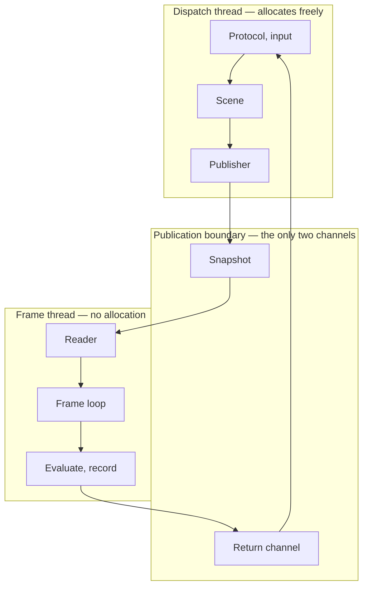
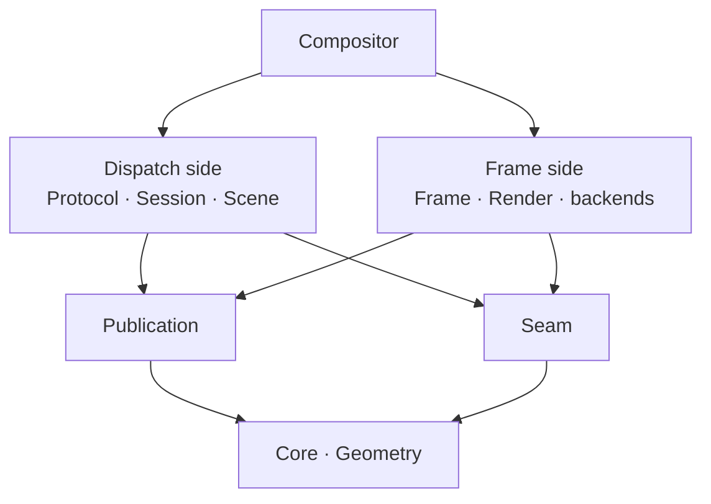

# Structure

Where gyro's code lives, what may depend on what, and which thread each piece runs on.

Companion documents: [Architecture.md](Architecture.md) for the platform seam and the frame loop,
[Animation.md](Animation.md) for the animation system, [Decisions.md](Decisions.md) for the decision
log.

This is the third tier. [Experience.md](Experience.md) says what a person perceives;
[Architecture.md](Architecture.md) and [Animation.md](Animation.md) say by what mechanism; this says
where that mechanism lives and what stops the parts reaching each other. Citations point up:
everything here rests on a decision recorded above it, and nothing above it needs this file in order
to be understood.

**Volatility: this document changes when the code moves**, which will be often. It is the most
volatile of the three tiers and that is the arrangement working correctly — a module appearing,
splitting, or being renamed changes this file and nothing else. If a change here forces a change in
[Architecture.md](Architecture.md), the change was not structural.

> **Most of this does not exist yet.** `Core`, `Geometry`, `Animation`, `Publication`, and `Testing` are built; the rest is a
> declaration of
> where code goes when it is written. What is worth writing down this early is the *graph* rather
> than the file list, because the graph is enforced from the first module and the edge that must not
> exist is cheapest to forbid while there is nothing to forbid.

## Two waists

Everything hangs off two modules that nothing hangs off of.

**`Publication` is the data waist** — what crosses between threads. The snapshot representation, the
single-producer / single-consumer ring, the return channel, the consumed-sequence watermark, the
per-buffer hold. It is
[decision 45](Decisions.md#45-protocol-dispatch-is-a-thread-not-a-task) and
[decision 50](Decisions.md#50-the-world-is-authored-on-the-dispatch-thread-the-snapshot-carries-coefficients)
given somewhere to live.

**`Seam` is the control waist** — every interface with more than one implementation, and the plain
data that crosses them: `IPresenter`, `IRenderer`, `ISession`, `IInput`, alongside `RenderTarget`,
`SyncPoint`, `PresentationInfo`, and `Region`. It is [the seam](Architecture.md#the-seam) plus the
one interface that is not platform at all, for the reason under [Frame is portable](#frame-is-portable).

Both are portable, both depend only on `Core` and `Geometry`, and **the composition root is the only
thing that knows both sides of either.**

## The runtime

The shape is a cycle, and the two crossings are the whole of the traffic between the threads. Down
the right goes the snapshot: offset-addressed POD, spring coefficients rather than evaluated values,
acquired once per iteration. Up the left goes the return channel: frame callbacks,
`wp_presentation_feedback`, `wl_buffer.release`, the exit-blit hold, and the measured costs that
feed [budgets](Architecture.md#budgets).

A third channel would be a design error rather than an addition, which is why the return channel is
one bounded queue and not four ad-hoc mechanisms — see
[the publication boundary](Architecture.md#the-publication-boundary).

## The modules

**The frame side does not depend on `Scene`, `Protocol`, or `Session`, and that edge must never be
added.** It is the one thing in this document worth enforcing rather than describing: an include of
`Scene` from `Frame` compiles, links, runs, and surfaces months later as jitter with no obvious
cause. `CMake/CheckLayering.cmake` is what draws the line.

| Module | Tier | Thread | Depends on |
| --- | --- | --- | --- |
| `Core` | portable | either | — |
| `Geometry` | portable | either | `Core` |
| `Animation` | portable | **both** | `Core`, `Geometry` |
| `Publication` | portable | **both** | `Core`, `Geometry` |
| `Seam` | portable | **both** | `Core`, `Geometry` |
| `Scene` | portable | dispatch | `Core`, `Geometry`, `Animation`, `Publication` |
| `Frame` | portable | frame | `Core`, `Geometry`, `Animation`, `Publication`, `Seam` |
| `Render` | platform | **both** | `Core`, `Geometry`, `Publication`, `Seam` |
| `Protocol` | platform | dispatch | `Core`, `Geometry`, `Scene` |
| `Session` | platform | dispatch | `Core`, `Protocol`, `Scene`, `Seam` |
| `Headless`, `Nested`, `Drm` | platform | split | `Core`, `Geometry`, `Seam` |
| `Console` | platform | own | `Core`, `Geometry`, `Seam` |
| `Compositor` | platform | constructs | everything |
| `Testing` | portable | — | — |

Portable means what [decision 6](Decisions.md#6-no-macos-port-development-continues-over-ssh) means:
ISO C++ and POSIX, no Linux-only or platform-stack headers, so the tests build and run on a machine
with no GPU, no seat, and no compositor. `CMake/CheckPortability.cmake` enforces it.

### Frame is portable

`Frame` holds the frame loop, `FrameClock`, admission control, and the timing policy, and it drives
`IRenderer` and `IPresenter` as interfaces rather than as Vulkan and KMS. That is what lets the
schedulability sweep and the idle assertion run in CI against fake clocks and a null renderer that
merely charges a simulated `C`, which is the first point at which
[decision 29](Decisions.md#29-outputs-are-periodic-real-time-tasks-the-test-allocates-effect-budget)
becomes falsifiable rather than argued.

If those interfaces lived in `Render` instead, `Frame` would be platform code and the sweep would be
testing a reimplementation of the loop — which is the thing that rots.

### Geometry is not part of Core

`Core` is dependency-free primitives: the timebase, the wake, handles, the slot allocator, logging.
`Geometry` is domain content: the exact rational scale, the restricted transform and its
classification predicate, the 3D TRS with anchor and quaternion, the coordinate spaces.

The split earns itself on one file.
[Architecture.md](Architecture.md#resample-once-and-know-when-it-is-zero) requires the transform
classification predicate to exist before it has a second caller, because plane promotion, damage
mapping, and the sharpness path all ask the same question and three independently derived answers is
how they drift apart. One module gives it one home.

### Animation's Geometry edge is one member

The edge is worth a paragraph because the obvious reasons for it are all wrong, and each of them
would have put it in a different place.

Not the springs. A spring's parameters are scalar whatever its channel's value type is — a
translation, a rotation, and an opacity are solved by the same two coefficients — so the solver is
generic over the channel and names none of its types. Not the settling thresholds either: those
arrive as arguments precisely so that neither the geometric ones settled by [decision
54](Decisions.md#54-settled-geometry-snaps-to-the-outputs-device-grid) nor the non-geometric ones
still [open](Open.md) have to be known inside `Animation`. And not the catalog's channel set, which
names translation, rotation, scale, and opacity as *labels* — a bundle holds a motion per channel
and never a value.

It is one member of one structure: the travel distance in a bundle's gesture mapping, which
[decision
13](Decisions.md#13-a-closed-motion-vocabulary-with-runtime-configuration-exposing-only-that-vocabulary)
puts in the catalog and [decision
65](Decisions.md#65-interactive-transitions-are-driven-by-a-progress-parameter-not-by-a-moving-target)
makes a displacement rather than a scalar. It has to be output-independent — a travel in device
pixels would make the same swipe mean a different fraction of the transition on a 1× and a 1.5×
monitor — and global space is the only space with that property, so the type is what obliges the two
conversions in front of it to be written rather than assumed. That is [decision
52](Decisions.md#52-coordinate-spaces-are-three-and-quantization-belongs-to-the-output) being
load-bearing at a distance from where it was made, and it is the whole of why this row says
`Geometry`.

The edge is also confined to `Author`, and that is checked rather than described. `Solve` is scalar
throughout, so the frame half of the module carries none of it — which is the general shape of this
table rather than a coincidence: a dependency that arrives with authoring stops at the publication
boundary. `gyro_add_module`'s `FRAME_DEPENDS` is where a module names the subset its frame half may
reach, and `CheckLayering.cmake` holds it to that, so a geometric type appearing in `Solve` fails the
build with the reason rather than with the generic missing-edge message.

It is worth noticing which of the two the module graph could see. The graph is per module, so it
would have permitted the include and had nothing to say: the row above says `Geometry` and `Solve` is
in the module the row is about. The rule that catches it is the thread partition rather than the
dependency one, which is the same shape as the halves themselves — the graph draws what may be
reached, and the boundary draws which half may reach it.

### The wake is in Core, and the table above is why

`Wake` is what [doing nothing must cost
nothing](Architecture.md#doing-nothing-must-cost-nothing) folds over, and it reads as animation
content — a spring is its commonest contributor and
[Animation.md](Animation.md#settling-answers-with-a-wake-not-a-boolean) carries the argument for its
shape. It is in `Core` anyway, and the module table settles it rather than taste: `Console` depends
on `Core`, `Geometry`, and `Seam` alone, and the recovery console's blinking cursor is one of the
contributions the fold exists to accept. Putting `Wake` in `Animation` would make the console unable
to name its own blink in the vocabulary the scheduler reduces, and `CheckLayering.cmake` would say so
rather than letting a second vocabulary grow beside the first. The idle ladder's timeouts and
retirement expiry make the same argument more quietly.

It is a `Core` primitive on its own terms too, by the test the paragraph above uses: it is a
statement about the timebase, it names nothing in any domain, and it has more than one caller before
it has two implementations.

## Threads are a second partition

The module graph is a dependency graph. Thread affinity is a different partition over the same code,
and the two are not the same shape. Four modules straddle the boundary, and each splits in half:

| Module | Frame half | Dispatch half |
| --- | --- | --- |
| `Animation` | `Solve` — closed form over published coefficients | `Author` — `Animatable`, catalog, retargeting |
| `Publication` | `Reader` — wait-free, const | `Publisher` — serializes, allocates, reclaims |
| `Render` | `Record` — passes, submission | `Import` — dmabuf, shm upload, resource creation |
| `Platform` | presentation | input, session |

That last row is worth noticing rather than arranging: [the seam](Architecture.md#the-seam) keeps
session, presentation, input, and outputs independent on testability grounds, and **they turn out to
split by thread as well.** Presentation is frame-side; input and session are dispatch-side. Keeping
them unfused buys the thread separation for nothing.

What the module graph enforces is the negative form, and that is the half that matters: the frame
side cannot reach the world, because the edge does not exist. What it cannot express is that `Frame`
must not reach `Animation::Author` — both are modules `Frame` legitimately depends on. For the four
straddlers that check runs at directory granularity, and `gyro_add_module` is where a module declares
its halves: `DISPATCH_HALF` names the subdirectories that are dispatch-side, `DISPATCH` says the
whole module is, and everything else is denied.

**Only the dispatch half is named, and the asymmetry is the point.** The frame side is what is being
protected, so it is the default and the exception is what gets declared — a module that has said
nothing cannot reach authoring. The opposite polarity would put the burden on whoever adds the next
module to notice that they had a duty, and they will not. What makes it a directory test rather than
a reading of the contents is
[decision 50](Decisions.md#50-the-world-is-authored-on-the-dispatch-thread-the-snapshot-carries-coefficients):
producing spring coefficients is dispatch-side and consuming them is not, so the halves split by
*direction* and the split is a path prefix.

A file is dispatch-side by where it sits, tests included. A test for something in a dispatch half
belongs in that half; one written at the module root fails the check rather than quietly
establishing that the root may reach authoring.

**The same partition applies to the module's own edges, and that is `FRAME_DEPENDS`.** A straddler's
two halves need not want the same dependencies, and the interesting direction is a dependency that
arrives with authoring: `Animation` reaches `Geometry` for
[one member of the gesture mapping](#animations-geometry-edge-is-one-member), which is authoring, so
the solver the frame thread calls has no business with it. Naming the subset the frame half may
reach is what turns that from a sentence in this document into a build failure, and the report says
which of the two lines was crossed — an edge the module does not have is a graph question, an edge it
has but only for its dispatch half is a boundary one. Declaring it is optional and silence means both
halves get `DEPENDS`, since a module whose halves want the same edges should not have to say so
twice.

The rest of thread discipline is runtime instrumentation rather than structure — the debug allocator
of [decision 36](Decisions.md#36-frame-path-discipline-is-enforced-mechanically-not-by-review),
which aborts on an allocation inside the frame section, and the priority ordering of
[decision 45](Decisions.md#45-protocol-dispatch-is-a-thread-not-a-task).

## Orchestration

**One composition root.** `Compositor` constructs the clock, the backend, the rendering device, the
publication channel, the scene, the protocol, and the threads, and hands each subsystem what it
needs. Nothing else names an implementation. This is `IClock`'s argument generalized: a subsystem
that can reach a dependency ambiently is a subsystem that eventually does, and *a singleton would
put a reachable now back exactly where this design just took one out.*

**An interface exists where there is a fake.** Clock, presenter, renderer, session, input — that set
is exactly what the headless backend substitutes, which is a serviceable test of whether a seam is
real or merely tasteful. An interface with one implementation and no prospect of a second is a cost
with no buyer.

**`Signal<>` is intra-thread only.** [The seam](Architecture.md#the-seam) puts signals on
`IPresenter` and `ISession`, and they are ordinary observer callbacks within one thread. A signal
crossing the boundary would be a third channel, and the design turns on there being two.

**Nothing crosses the boundary by ownership.** No `shared_ptr`, no mutex spanning it. Shared
ownership puts `free` on the frame path wearing a destructor's clothes, where the debug allocator
cannot catch it, and a shared lock rebuilds the priority inversion the thread ordering exists to
prevent. Reclamation is deferred against the consumed-sequence watermark.

## The three cases that decide ownership

Ownership questions are settled by the paths that tear things down, not by the paths that build
them. These three decide most of it.

**[Device migration](Architecture.md#device-migration) runs on every boot**, because `simpledrm`
binds the framebuffer before the real driver loads. `Render` must tear down and rebuild whole while
`Frame` keeps running and the presenter holds the last frame on glass. So `Frame` holds nothing of
`Render`'s beyond an interface pointer, no Vulkan handle outlives the device that made it, and the
swap is the composition root's.

**[Restart](Architecture.md#restart)** returns the DRM fd from the service manager's fd store, and
the mode is adopted rather than re-set. So `Seam` takes an already-open fd as its primary path with
"open one yourself" as a provider rather than as the only option —
[decision 39](Decisions.md#39-running-from-the-initramfs-is-deferred-and-deliberately-not-foreclosed)
wants the same affordance.

**[Resume](Architecture.md#suspend-and-resume) is a modeset**, and its checklist touches `Frame`
(invalidate every clock), `Scene` (hard-settle every spring, drain the retiring set), and `Render`
(expect `VK_ERROR_DEVICE_LOST`) in that order. Something has to sequence that, and the composition
root is the one place a cross-module sequence is allowed to exist. A subsystem reaching sideways to
another during resume is how this becomes a graph with no top.

## What is enforced

Each of these is a build failure rather than a review comment, which is the standing
[decision 36](Decisions.md#36-frame-path-discipline-is-enforced-mechanically-not-by-review)
establishes for the frame path and this file extends to the module graph.

| Check | Rule | Recorded in |
| --- | --- | --- |
| `CheckClockDiscipline.cmake` | one reader of the timebase | [decision 57](Decisions.md#57-one-timebase-clock_monotonic-converted-at-ingest-and-nowhere-else) |
| `CheckPortability.cmake` | no platform headers in a `PORTABLE` module | [decision 6](Decisions.md#6-no-macos-port-development-continues-over-ssh) |
| `CheckLayering.cmake` | every `#include` lies on a declared edge; the graph is a DAG; nothing outside a dispatch half includes one; a narrowed frame half reaches only its `FRAME_DEPENDS` | this document |

The fourth is not a build check and belongs in the table anyway, because it is the one decision 36
actually names: `Core/DebugAllocator.cpp` replaces the global `operator new` and `operator delete`
set and aborts on a call made inside a `Core/FrameSection.h` guard. It is thread-local by
construction — the dispatch thread allocates freely, which
[decision 45](Decisions.md#45-protocol-dispatch-is-a-thread-not-a-task) requires — so it is a
property of the frame thread's frame section and never of the process. Compiled in wherever
`_GLIBCXX_ASSERTIONS` is, which is `Debug` and `RelWithDebInfo`; the second is the one that matters,
since the assertion this exists to serve is a headless test and headless tests are what CI runs.

`Core` is an `OBJECT` library for it. A replacement operator that no symbol references is never
extracted from a static archive, and CMake adds an object library's files only to the targets that
name it directly — which is why `gyro_add_module` names `Core` on every test executable rather than
letting the module graph carry it.

`gyro_add_module` is where a module declares itself to all three. `PORTABLE` enrols it in the
second; `DEPENDS` is the graph the third holds it to. Dependencies are transitive, matching
`PUBLIC` linkage, so `Core` does not have to be named by everything — the frame-side edge is caught
either way, because nothing in that closure leads to the world.

A module with no `SOURCES` is header-only and becomes an `INTERFACE` library, since a static archive
needs something to archive. Most of this codebase is headed that way, so it is the ordinary case
rather than the exception, and it makes one more rule true by construction: the tests are then the
only thing that compiles the module, so **a header with no test is a header nothing has compiled.**
`gyro_add_module` requires `TESTS` where `SOURCES` is absent, which is what keeps that from being a
coincidence.

The check exists because CMake enforces a dependency it can see a *symbol* for, and most of this
codebase is headers. The timebase, handles, geometry, `Animatable`, and the snapshot accessors all
have no symbol to link, so CMake has nothing to notice and an include is the only dependency there
is.

## Open

- **Generated sources.** `gyro_add_module` prepends the module directory to every source, so the
  protocol bindings — generated into the build tree by a host tool — cannot yet be expressed.
- **Where the differ lives.** Placed in `Scene` here, so that `Animation` stays a pure library of
  springs and catalog with no knowledge of entities and can be built first per
  [decision 10](Decisions.md#10-the-animation-system-is-built-first).
  [Animation.md](Animation.md#declarative-commits) reads the other way, and the two should be
  reconciled before either is written.
- **Whether `Console` shares `Seam`'s presenter.** The pre-Vulkan console writes dumb buffers with
  CPU blits and needs no renderer, no device, and no scene. Whether that is a third implementation
  of `IPresenter` or a path beside the seam entirely is unresolved, and it decides whether `Seam`
  has to express a target nobody renders into.
