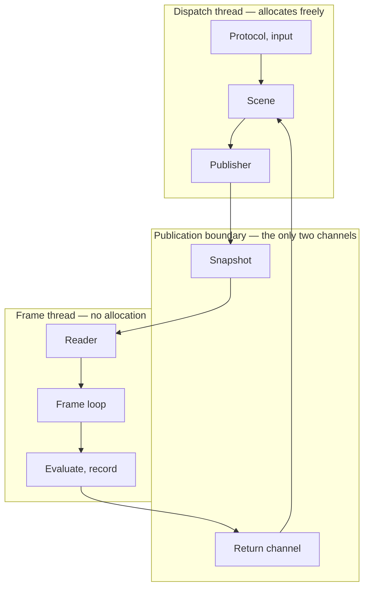
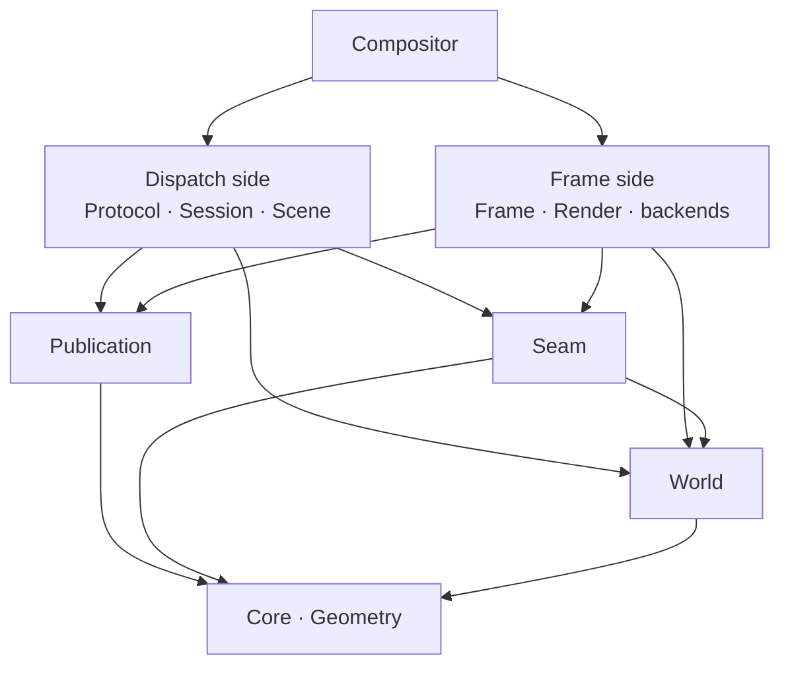

# Structure

Where gyro's code lives, what may depend on what, and which thread each piece runs on.

Companion documents: [Architecture.md](Architecture.md) for the platform seam and the frame loop,
[Animation.md](Animation.md) for the animation system, [Decisions.md](Decisions.md) for the decision
log.

This is the third tier. [Experience.md](Experience.md) says what a person perceives;
[Architecture.md](Architecture.md) and [Animation.md](Animation.md) say by what mechanism; this says
where that mechanism lives and what stops the parts reaching each other. Citations point up:
everything here rests on a decision recorded above it, and nothing above it needs this file in order
to be understood.

**Volatility: this document changes when the code moves**, which will be often. It is the most
volatile of the three tiers and that is the arrangement working correctly — a module appearing,
splitting, or being renamed changes this file and nothing else. If a change here forces a change in
[Architecture.md](Architecture.md), the change was not structural.

> **Most of this does not exist yet.** `Core`, `Geometry`, `World`, `Animation`, `Publication`,
> `Seam`, and `Testing` are built — `World` being the published node record, the dressing enums, and
> the content records, which are there because `Frame` walks them and `Scene` writes them and neither
> may name the other, and `Seam` in its two frame-side halves, which is `IPresenter` and `IRenderer`,
> the data their verbs take and report, and the source the presenter's completions arrive on, plus its
> first dispatch-side one in `ITextureImporter` — and
> `Frame` now holds the step those interfaces are driven from and the walk that turns a published
> scene into draw items. `Scene` is the other end of that walk, in its first half: the entity store,
> the output model, and the serializer that turns the two into a snapshot — construction and
> publication, with the commit scope that mutates one still to come.
> `Headless` is the first thing behind either seam:
> a simulated panel whose vblanks are arithmetic, a device that is the one source for all of them, a
> synthetic plane catalog, and a renderer that charges a cost and draws nothing. `Compositor` closes
> the circuit: it is the first module in the tree that is not portable, and it holds the `while`, the
> ring, the thread, and the one call that turns admission control's answer back into what the loop is
> configured with. `gyro --backend=headless` runs. The rest is a
> declaration of
> where code goes when it is written. What is worth writing down this early is the *graph* rather
> than the file list, because the graph is enforced from the first module and the edge that must not
> exist is cheapest to forbid while there is nothing to forbid.

## Two waists

Everything hangs off two modules that nothing hangs off of.

**`Publication` is the data waist** — what crosses between threads. The snapshot representation, the
single-producer / single-consumer ring, the return channel, the consumed-sequence watermark, the
per-buffer hold. It is
[decision 45](Decisions.md#45-protocol-dispatch-is-a-thread-not-a-task) and
[decision 50](Decisions.md#50-the-world-is-authored-on-the-dispatch-thread-the-snapshot-carries-coefficients)
given somewhere to live.

**`Seam` is the control waist** — every interface with more than one implementation, and the plain
data that crosses them: `IPresenter`, `IEventSource`, `IRenderer`, `ITextureImporter`, `ISession`,
`IInput`, alongside `RenderTarget`, `TextureSource`, `SyncPoint`, and `PresentationInfo`. It is [the seam](Architecture.md#the-seam) plus
the one interface that is not platform at all, for the reason under
[Frame is portable](#frame-is-portable).

The presentation half is built, and it added `OutputConfiguration` to that list — what `Reconfigure`
asks for and what `Reconfigured` reports was achieved, which is one type because the interesting
comparison is between the two. It is portable in a way worth stating, because an interface to KMS
reads as though it could not be. Nothing in it names a Linux header: a format is a four-character code and a modifier is a number,
both **reproduced** from stable kernel ABI rather than included, and a descriptor is `Core/Fd.h`'s.
That is what lets the frame loop's schedulability sweep run against a fake presenter on a machine
with no GPU. It also declares no dispatch half — both threads name these types and neither owns
them, since the frame thread calls both verbs and dispatch authors the configuration one of them
takes.

The render half is built beside it and is written against it: `IRenderer::Record` fills a target the
presenter owns and yields the `SyncPoint` that presenter's `Present` waits on. It is a second
interface rather than more of the first because
[decision 40](Decisions.md#40-software-rendering-is-a-device-not-a-backend-and-it-is-the-floor-tier)
and [decision 79](Decisions.md#79-the-console-is-a-renderer-not-a-presenter) make the writer vary
independently of where the pixels go — one DRM presenter is paired with `Blit` at boot and with a
Vulkan device a moment later. It added the evaluated draw list to the waist's data, for the reason
under [The draw list is in Seam](#the-draw-list-is-in-seam).

It added `IEventSource` on the same grounds and at a different granularity, which is the part worth
noticing. A presenter is one output's; the descriptor its completions arrive on is one *device's* —
one DRM file for every CRTC, one host connection for every window. So the drain that turns a
readable file into `Presented` is the backend's rather than the presenter's, and hanging it off
`IPresenter` would have had the loop register the same file once per output. See
[decision 80](Decisions.md#80-the-frame-loop-is-a-step-the-composition-root-owns-the-wait).

Both are portable, both depend only on `Core` and `Geometry`, and **the composition root is the only
thing that knows both sides of either.**

The two waists are reachable from different places, and that decides which one a piece of crossing
data belongs to — see [Region is in Geometry](#region-is-in-geometry-and-reachability-is-why).

## The runtime

The shape is a cycle, and the two crossings are the whole of the traffic between the threads. Down
the right goes the snapshot: offset-addressed POD, spring coefficients rather than evaluated values,
acquired once per iteration. Up the left goes the return channel: frame callbacks,
`wp_presentation_feedback`, `wl_buffer.release`, the exit-blit hold, and the measured costs that
feed [budgets](Architecture.md#budgets).

**The return leg lands on `Scene` rather than on `Protocol`**, which is
[decision 115](Decisions.md#115-scene-drains-the-return-channel-and-protocol-observes-what-it-derives)
and is not where it reads: the report names a presented *sequence*, and turning that into per-surface
consequences needs what dispatch authored. Three quarters of what it carries never reaches a client
at all — the watermark that frees snapshots, the exit-blit hold, the damage clear — and gyro drains
it during boot with no protocol in the process. What `Protocol` needs of it arrives as an ordinary
intra-thread signal, which is why no arrow is drawn for it: the graph is about the two channels, and
a signal is not one.

A third channel would be a design error rather than an addition, which is why the return channel is
one bounded queue and not four ad-hoc mechanisms — see
[the publication boundary](Architecture.md#the-publication-boundary).

## The modules

`World` is not a third waist. Nothing crosses *through* it — it is the vocabulary both halves of the
world spell their nodes in, placed below both waists for the reason
[the rule below](#region-is-in-geometry-and-reachability-is-why) gives. `Seam` reaches down into it,
which is the one direction a waist may go: a draw item carries the material the shell asked for, so
the enum is *below* the seam rather than declared in it, and `Protocol` and `Scene` can name a
material without either of them naming `Seam`.

**The frame side does not depend on `Scene`, `Protocol`, or `Session`, and that edge must never be
added.** It is the one thing in this document worth enforcing rather than describing: an include of
`Scene` from `Frame` compiles, links, runs, and surfaces months later as jitter with no obvious
cause. `CMake/CheckLayering.cmake` is what draws the line.

| Module | Tier | Thread | Depends on |
| --- | --- | --- | --- |
| `Core` | portable | either | — |
| `Geometry` | portable | either | `Core` |
| `Wire` | portable | either | `Core`, `Seam` |
| `World` | portable | **both** | `Core`, `Geometry` |
| `Animation` | portable | **both** | `Core`, `Geometry` |
| `Publication` | portable | **both** | `Core`, `Geometry` |
| `Seam` | portable | **both** | `Core`, `Geometry`, `World` |
| `Scene` | portable | dispatch | `Core`, `Geometry`, `World`, `Animation`, `Publication` |
| `Gym` | portable | dispatch | `Core`, `Geometry`, `World`, `Animation`, `Scene` |
| `Dispatch` | portable | dispatch | `Core`, `Publication`, `Scene`, `Gym` |
| `Trace` | portable | own | `Core` |
| `Blit` | **portable** | frame | `Core`, `Geometry`, `Seam` |
| `Frame` | portable | frame | `Core`, `Geometry`, `World`, `Animation`, `Publication`, `Seam` |
| `Render` | platform | **both** | `Core`, `Geometry`, `Publication`, `Seam` |
| `Protocol` | platform | dispatch | `Core`, `Geometry`, `Scene` |
| `Session` | platform | dispatch | `Core`, `Protocol`, `Scene`, `Seam` |
| `Headless` | **portable** | split | `Core`, `Geometry`, `Seam` |
| `Virtual` | platform | frame, own | `Core`, `Geometry`, `Seam`, `Headless` |
| `Nested` | platform | split | `Core`, `Geometry`, `Seam`, `Wire` |
| `Drm` | platform | split | `Core`, `Geometry`, `Seam` |
| `Console` | platform | own | `Core`, `Geometry`, `Seam`, `Blit` |
| `Compositor` | platform | constructs | everything |
| `Testing` | portable | — | — |

Portable means what [decision 6](Decisions.md#6-no-macos-port-development-continues-over-ssh) means:
ISO C++ and POSIX, no Linux-only or platform-stack headers, so the tests build and run on a machine
with no GPU, no seat, and no compositor. `CMake/CheckPortability.cmake` enforces it.

### Blit is portable, and it is the module where that matters most

The CPU renderer [decision 79](Decisions.md#79-the-console-is-a-renderer-not-a-presenter) names lives
in its own module rather than inside `Console`, and it is `PORTABLE` for a stronger reason than the
others are: a composite into a mapped pointer is arithmetic, so there is no platform header to
name, and `CheckPortability.cmake` holding it to that is what keeps the renderer that runs *when
there is no GPU* testable on a machine that has none. Every assertion about where an edge landed and
what a half-covered pixel is worth runs in CI, on the one path a failure cannot be diagnosed from —
by the time `Blit` is what is drawing, there is nothing else left to draw with.

It is not inside `Console` because the console is a text grid with its own thread and its own input,
and the blitter is an `IRenderer` on the frame thread that the boot splash reaches before any console
exists. `Console` depends on it; the reverse would put a glyph cache below the seam.

### Frame is portable

`Frame` holds the frame loop, `FrameClock`, admission control, and the timing policy, and it drives
`IRenderer` and `IPresenter` as interfaces rather than as Vulkan and KMS. That is what lets the
schedulability sweep and the idle assertion run in CI against fake clocks and a null renderer that
merely charges a simulated `C`, which is the first point at which
[decision 29](Decisions.md#29-outputs-are-periodic-real-time-tasks-the-test-allocates-effect-budget)
becomes falsifiable rather than argued.

If those interfaces lived in `Render` instead, `Frame` would be platform code and the sweep would be
testing a reimplementation of the loop — which is the thing that rots.

The table above is what `Frame` declares. `gyro_add_module` names the edges the code actually has,
because `CheckLayering.cmake` denies what is not declared, so the narrower declaration is the stronger
rule — `Publication` and `Seam` arrived with the loop that reads a snapshot and posts a watermark, and
`World` and `Animation` with the evaluator, which reads the node and content records and evaluates the
coefficients they name. What it reaches of `Animation` is the frame half: `Solve` is the default and
`Author` is a dispatch half, which the check denies from outside it without the declaration having to
say so.

**The evaluator is an interface inside `Frame` and not at either waist**, which is the one place this
module has a seam of its own. It has no second implementation that is not a test — `Scene` publishes,
`Frame` evaluates, and no backend is ever on the other end of it — so putting it in `Seam` would widen
the control waist for something with one caller and one callee. What crosses *out* of it is
[the draw list](#the-draw-list-is-in-seam), which is at the waist because a renderer does read it.

**Which is also why `Frame` does not wait.** It exposes one iteration, returning the
[`Wake`](../Source/Core/Wake.h) the next one is owed at; the `while` above it and the `io_uring`
timeout under it are the composition root's, because the root already constructs the threads. The
shim's whole contract is *wake at or after this instant, or earlier when a registered descriptor is
readable* — it may wake spuriously, it is handed no say in ordering, and the loop the sweep runs is
therefore the loop that ships. One of the descriptors it registers is dispatch's, per
[decision 83](Decisions.md#83-dispatchs-publication-is-an-event-source): a publication has to reach a
frame thread that folded to idle, and making that an `IEventSource` like any other is what keeps the
step's signature from growing a case for it.
[Decision 80](Decisions.md#80-the-frame-loop-is-a-step-the-composition-root-owns-the-wait) has why
the alternatives — a wait interface in `Seam`, a readiness set passed into the step — both put a
correctness ordering in the one place nothing exercises it.

### Headless is portable, and it is the instrument

`Headless` sits in the tier with `Frame` rather than with the two backends it shares a job title with,
and the reason is the same one [Frame is portable](#frame-is-portable) gives. It is what the
schedulability sweep runs *against*: the fake clock that takes arbitrary rates and phases, the
simulated panel that does not run at its nominal rate, the deliberately injected miss. That sweep has
to run on a machine with no GPU, no seat, and no compositor, and a module that is merely *incidentally*
portable stops being so the first time a platform header is convenient — silently, since nothing fails
until CI is the environment that no longer has what it acquired.

Nothing in it needs the platform. A vblank is a phase and a period; the images are heap pages behind
`RenderTarget`'s `MappedImage`; and the descriptor a backend would ordinarily wake on is *invalid*
here, which [Seam/EventSource.h](../Source/Seam/EventSource.h) had already settled as the ordinary
answer rather than a gap — a headless flip is a function of the clock, so there is no file to poll. The
null renderer that charges a simulated `C` is here for the same reason and not in `Render`, which is
platform code holding Vulkan. See
[decision 85](Decisions.md#85-the-headless-backend-is-portable-and-the-instrument-is-the-reason),
including what would take it back out of the tier and why the build would say so.

It has no dispatch half yet. Presentation is all that is built; scripted input is dispatch-side and
arrives with the input seam, at which point the module names one.

### Virtual is platform, and it is the one that allocates

`Virtual` is a presenter whose consumer is a file, an encoder, or a test rather than a panel. It sits
one row below `Headless` in the table and on the other side of the tier line, and the two differences
are the whole of why it is a separate module: its images are real dmabufs, so it names
`linux/udmabuf.h` and cannot be portable; and its targets retire when the *consumer* releases them
rather than when the next flip lands, which is the backpressure
[Seam/Presenter.h](../Source/Seam/Presenter.h) writes `AcquireTarget`'s empty answer around.

**It depends on `Headless`, and that edge is one class.** `VblankTimeline` is a period and a phase and
the arithmetic between them, which is what a recording's cadence is as much as a panel's. A platform
module depending down onto a portable one is the direction the graph allows; what would change the
answer is the timeline acquiring behaviour only a sweep wants, at which point it moves rather than
being copied.

**Presentation here is frame-side entire**, like the presentation half of every other backend. The
allocation is not — `BindTargets`' whole contract is that it runs at a target invalidation and never
inside the frame section — but that is a phase rather than a thread, and nothing here is authored on
dispatch. See
[decision 102](Decisions.md#102-a-virtual-output-allocates-the-buffers-it-hands-out-and-that-is-what-stands-the-renderer-up).

**It also runs a thread of its own, and it was the only portable-graph neighbour that did until
`Trace` became the second.** *(Added 2026-08-22, amended 2026-08-23.)* [Virtual/Dump.h](../Source/Virtual/Dump.h) writes a PAM per presented frame, and a file
write from the frame thread is the hazard [Open.md](Open.md)'s *spdlog async sink* entry names — so
the sink copies on the frame thread and a writer thread does the `open`, the `write`, and the
`rename`. That thread is neither frame nor dispatch: it is off both partitions, it touches nothing
either one owns, and what crosses to it is a copy in the sink's own slab rather than a target
descriptor, which is why it does not race `AcquireTarget` on the ring it is reading out of. This is
the "own" in the table's thread column, the same answer `Console` carries. See
[decision 121](Decisions.md#121---backenddump-is-a-backend-and-the-frame-it-writes-crosses-to-a-writer-thread-as-a-copy).

**The allocator it drives is in `Seam` rather than in this module.** *(Revised 2026-08-22.)*
[Virtual/Allocator.h](../Source/Virtual/Allocator.h) kept `IDmabufAllocator` out of the waist because
nothing outside `Virtual` named one, and
[decision 120](Decisions.md#120-a-nested-outputs-targets-are-exported-from-the-vulkan-device-and-the-allocator-moves-to-seam)
gives it a second caller: a nested output's targets are exported from the Vulkan device, so `Render`
implements the interface and `Nested` consumes it, and neither may name the other. That is the waist
rule met rather than bent — two implementations, two consumers in different modules, and the
composition root the only thing that knows both sides. `Virtual` still owns the `udmabuf` provider,
which is still the one that runs where there is no GPU.

**Only `Nested`'s frame half exists, and the table says `split` anyway.** Input is dispatch-side and
[decision 81](Decisions.md#81-a-source-is-pumped-by-one-thread-nested-opens-one-connection-pumped-by-the-frame-thread)
has the host connection pumped by the *frame* thread, so what the module owes when input lands is a
handoff across the publication boundary rather than a second reader. Until there is a dispatch thread
on the far end of that handoff there is nothing to declare: `gyro_add_module` refuses a
`DISPATCH_HALF` that names no directory, which is the right moment for the declaration to appear.

### The draw list is in Seam

What `IRenderer::Record` takes is a flat span of evaluated draw items — quads with a source, a colour
state, an opacity, and a material name — built by `Frame` into its own arena and read by whichever
renderer is bound. It sits at the control waist for the reason everything else here does: both sides
name it and neither owns it.

The alternative was to route it through the *other* waist, since
[the table above](#the-modules) already gives `Render` a `Publication` edge and the snapshot is
already the thing that crosses between threads. It does not work, and the reason is one tier up:
[decision 50](Decisions.md#50-the-world-is-authored-on-the-dispatch-thread-the-snapshot-carries-coefficients)
puts coefficients in the snapshot and evaluation on the frame thread, so a renderer reading it would
be the second evaluator of the same spring. Once `Frame` is what evaluates, something has to carry
what it evaluated, and that something belongs beside the interface that consumes it.

Which also keeps the two waists from touching. `Publication` and `Seam` both rest on `Core` and
`Geometry` alone and the composition root is the only thing that knows both sides of either; an edge
from one to the other, added for the benefit of a single interface, is the kind that is never removed
afterwards. See [decision 82](Decisions.md#82-the-renderer-is-handed-an-evaluated-draw-list-not-a-scene).

### The importer is the first waist interface the dispatch thread calls

`IRenderer` and `IPresenter` are frame-side entire, so reading the table above as *`Seam` straddles
because two threads each own some of it* was true only of the plain data until now.
[`ITextureImporter`](../Source/Seam/Importer.h) is the first interface here whose verbs run on the
dispatch thread, and the reason it is an interface of its own rather than two more methods on
`IRenderer` is exactly that: a caller holding one holds a type whose thread is settled, where a caller
holding the other would be reading a comment.

[The straddler table](#threads-are-a-second-partition) already predicted this — `Render`'s dispatch
half is named `Import` there, against nothing that existed. *(Corrected 2026-08-23, against the code
that arrived.)* **The prediction was wrong, and it was wrong about the interesting part.** It assumed
the split could be declared because a Vulkan import creates images, uploads and negotiates modifiers,
which is a directory's worth of code. It is — [Render/Textures.h](../Source/Render/Textures.h) — and
the partition still cannot be declared over it, because the *table* is read by both threads on
purpose. `Adopt` and `Forget` are dispatch's; `Find`, which resolves an id to a descriptor set, is
called from inside `Record`. A directory the frame half may not include is exactly what
`CheckLayering` means by a dispatch half, and this is a file the frame half must include.

That is not an accident of layout, it is the design:
[decision 131](Decisions.md#131-texture-import-is-a-second-interface-and-a-texture-retires-on-the-watermark)
rejected refcounting the table precisely so that the frame thread's lookup costs no synchronisation,
and what makes that safe is the watermark rather than a boundary — dispatch only ever writes a slot no
published snapshot names, and the frame thread only ever reads slots the snapshot it is composing from
does name. Two disjoint sets in one array, which is the same shape as `Blit`'s table one tier down and
the same reason it cannot be split either.

**So both renderers straddle and the build says so about neither, and that is the limit worth stating
rather than papering over.** Nothing stops the frame thread calling `Adopt`. What stands in for the
check is the discipline in [Seam/Importer.h](../Source/Seam/Importer.h), and it is not a convention:
`Forget` is defined below `Publication`'s watermark, so a caller on the wrong thread does not have the
number the verb is stated in terms of.

See [decision 131](Decisions.md#131-texture-import-is-a-second-interface-and-a-texture-retires-on-the-watermark)
and [decision 137](Decisions.md#137-the-vulkan-texture-table-belongs-to-the-device-and-a-mapped-buffer-needs-host-image-copy).

### A dressing's numbers are in Seam, and the enums naming it are not

`World/Material.h` says which materials exist and `Seam/Dressing.h` says what each one *is* — the
radius, the tint, `Smoke`'s contrast floor, and the tier table that decides a chain's structure.
`World/Elevation.h` and the light table below it in the same file are that split a second time, for
the other dressing: the levels are up where a shell can name one, and the height each becomes is
down here with a renderer that is never told which level it drew
([decision 129](Decisions.md#129-a-height-is-the-offset-and-the-light-is-two-constants-its-size-and-its-weight)).
The split is not a tidiness preference; each half is somewhere the other may not be.

The numbers cannot go up beside the enum, because
[decision 33](Decisions.md#33-effects-are-named-materials-not-parameterized-filter-calls) forbids the
call site naming a radius and `World/Material.h` is precisely the header a call site includes in order
to say `Material::Glass`. They cannot go into `Render` either, because
[decision 40](Decisions.md#40-software-rendering-is-a-device-not-a-backend-and-it-is-the-floor-tier)
makes software rendering a device rather than a backend — so `Blit` and the Vulkan renderer are two
implementations of one look, and a number in either is a number the other can disagree with. `Seam`'s
charter is *every interface with more than one implementation and the data crossing it*, and this is
the second half of that sentence with no interface attached.

Same shape as `Pixel` one file over: what a fourcc means in memory lives at the waist because a
renderer encodes through it and a test decodes through it.
[Decision 117](Decisions.md#117-a-gather-reads-the-target-it-is-drawing-into-the-numbers-live-in-seam-and-the-tier-rides-the-request).

### The quad builder is in Frame, and neither type it joins could take it

`Seam/Renderer.h`'s `Quad` and `Geometry/NodeTransform.h`'s `ComposedTransform` are the two ends of
one short function — four corners projected out of a composed chain — and it lives in neither. It
cannot live in `Geometry`, which may not say `Seam`. It could compile in `Seam`, and the waist's own
definition is what refuses it: *every interface with more than one implementation and the data
crossing it*. A quad builder is not an interface, has one caller and one implementation, and no
backend is ever on the far end of it — the same test that keeps
[the evaluator](#frame-is-portable) inside `Frame` rather than at the waist.

So it is `Frame/Projection.h`, beside the loop that will call it. Note which rule did *not* decide
this: [the rule below](#region-is-in-geometry-and-reachability-is-why) is about types both halves of
the world must name, and nothing dispatch-side has ever built a quad. What it takes as the output's
placement is `Geometry`'s own output adapter, which is where the origin folds against a global
translation while both are still double. See
[decision 93](Decisions.md#93-the-quad-is-assembled-in-frame-and-the-back-face-is-the-signed-area).

**The list is at the waist; two of the fields in it are not, and the split is by producer rather than
by awkwardness.** A quad, its sampling, its opacity, and its corner radius are frame-derived, which is
what the decision above is for. A `TextureId` is an import's identity and a `ColorState` is what the
client declared — both authored on the dispatch side, so both are in `Core`, by
[the rule below](#region-is-in-geometry-and-reachability-is-why). `Seam/Renderer.h` includes them the
same way it includes `Geometry/Space.h`, and the item's shape is unchanged.
`BufferId` relocates for `TextureId`'s reason exactly, and *(2026-08-23)* it is the one that says
something about the check rather than about the type: `Protocol` mints it and the identity was
declared in `Publication`, which `Protocol` may not name. Nothing caught it because a type with no
producer has no call sites to deny — `CheckLayering` reads includes, and an id nothing mints is
included by nobody who would fail. The moment to re-read a placement is when the first party that
*produces* the type appears.
See [decision 87](Decisions.md#87-a-type-both-halves-of-the-world-name-lives-below-both-waists-not-in-seam).

### Geometry is not part of Core

`Core` is dependency-free primitives: the timebase, the wake, handles, the slot allocator, the
observer signal, the result and descriptor types, logging, and — since both halves of the world name
them — a texture's identity and a buffer's color state.
`Geometry` is domain content: the exact rational scale, the restricted transform and its
classification predicate, the 3D TRS with anchor and quaternion, the coordinate spaces.

The split earns itself on one file.
[Architecture.md](Architecture.md#resample-once-and-know-when-it-is-zero) requires the transform
classification predicate to exist before it has a second caller, because plane promotion, damage
mapping, and the sharpness path all ask the same question and three independently derived answers is
how they drift apart. One module gives it one home.

### The wire codec is its own module, and it is not `Nested`'s

`Wire` is the Wayland wire codec: message framing, the argument vocabulary, fd passing over
`SCM_RIGHTS`, and the per-connection object map. It sits below both waists, because `Nested` is split
across the threads and reaching `Protocol` for a codec would make `Scene` reachable from the frame
side — the one edge [the table above](#the-modules) says must never be added.

**It depends on `Seam` for `IEventSource` and nothing else.** A connection is drained by the frame
loop alongside a DRM device and a simulated vblank, so it is a source like any other rather than
something `Frame/Loop.h` learns to poll specially. The edge is confined to `Wire/Connection.h`:
`Wire/Writer.h` forward-declares `Connection` and the one constructor needing it complete lives in
`Wire/Writer.cpp`, so marshalling a request does not pull the control waist into every generated call
site.

**It has one caller today and that is stated rather than hidden.**
[Decision 2](Decisions.md#2-gyro-owns-the-protocol-seam-libwayland-implements-the-server-codec)
gives the server codec to `libwayland-server`, so `Protocol` does not consume this; the client half
`Nested` needs is all of it. What earns the module anyway is that a codec with no backend in front of
it is exercised over a `socketpair` by a peer the test wrote — truncated headers, an fd arriving a
message early, a `new_id` reused inside the `delete_id` window — none of which a real host can be
asked to produce. See
[decision 119](Decisions.md#119-the-wayland-wire-codec-is-its-own-module-wire-and-it-is-portable).

**Portable, and that is the same argument.** `sendmsg` with `SCM_RIGHTS` over `AF_UNIX` is POSIX, so
the tier costs nothing and buys the machine with no GPU, no seat, and no compositor that decision 6
is about. `Nested` stays platform for its own reasons.

**A connection is pumped by one thread; the module is pumped by none.** That is
[decision 81](Decisions.md#81-a-source-is-pumped-by-one-thread-nested-opens-one-connection-pumped-by-the-frame-thread)'s
rule applying per object, which is why the table reads `either` rather than `both`: gyro's host
connection is the frame thread's for its whole life, and nothing here is shared between the two.

### Animation's Geometry edge is one member

The edge is worth a paragraph because the obvious reasons for it are all wrong, and each of them
would have put it in a different place.

Not the springs. A spring's parameters are scalar whatever its channel's value type is — a
translation, a rotation, and an opacity are solved by the same two coefficients — so the solver is
generic over the channel and names none of its types. Not the settling thresholds either: those
arrive as arguments precisely so that neither the geometric ones settled by [decision
54](Decisions.md#54-settled-geometry-snaps-to-the-outputs-device-grid) nor the non-geometric ones
still [open](Open.md) have to be known inside `Animation`. And not the catalog's channel set, which
names translation, rotation, scale, and opacity as *labels* — a bundle holds a motion per channel
and never a value.

It is one member of one structure: the travel distance in a bundle's gesture mapping, which
[decision
13](Decisions.md#13-a-closed-motion-vocabulary-with-runtime-configuration-exposing-only-that-vocabulary)
puts in the catalog and [decision
65](Decisions.md#65-interactive-transitions-are-driven-by-a-progress-parameter-not-by-a-moving-target)
makes a displacement rather than a scalar. It has to be output-independent — a travel in device
pixels would make the same swipe mean a different fraction of the transition on a 1× and a 1.5×
monitor — and global space is the only space with that property, so the type is what obliges the two
conversions in front of it to be written rather than assumed. That is [decision
52](Decisions.md#52-coordinate-spaces-are-three-and-quantization-belongs-to-the-output) being
load-bearing at a distance from where it was made, and it is the whole of why this row says
`Geometry`.

The edge is also confined to `Author`, and that is checked rather than described. `Solve` is scalar
throughout, so the frame half of the module carries none of it — which is the general shape of this
table rather than a coincidence: a dependency that arrives with authoring stops at the publication
boundary. `gyro_add_module`'s `FRAME_DEPENDS` is where a module names the subset its frame half may
reach, and `CheckLayering.cmake` holds it to that, so a geometric type appearing in `Solve` fails the
build with the reason rather than with the generic missing-edge message.

It is worth noticing which of the two the module graph could see. The graph is per module, so it
would have permitted the include and had nothing to say: the row above says `Geometry` and `Solve` is
in the module the row is about. The rule that catches it is the thread partition rather than the
dependency one, which is the same shape as the halves themselves — the graph draws what may be
reached, and the boundary draws which half may reach it.

### The wake is in Core, and the table above is why

`Wake` is what [doing nothing must cost
nothing](Architecture.md#doing-nothing-must-cost-nothing) folds over, and it reads as animation
content — a spring is its commonest contributor and
[Animation.md](Animation.md#settling-answers-with-a-wake-not-a-boolean) carries the argument for its
shape. It is in `Core` anyway, and the module table settles it rather than taste: `Console` depends
on `Core`, `Geometry`, and `Seam` alone, and the recovery console's blinking cursor is one of the
contributions the fold exists to accept. Putting `Wake` in `Animation` would make the console unable
to name its own blink in the vocabulary the scheduler reduces, and `CheckLayering.cmake` would say so
rather than letting a second vocabulary grow beside the first. The idle ladder's timeouts and
retirement expiry make the same argument more quietly.

It is a `Core` primitive on its own terms too, by the test the paragraph above uses: it is a
statement about the timebase, it names nothing in any domain, and it has more than one caller before
it has two implementations.

### Region is in Geometry, and reachability is why

`Region` reads as `Seam` data. It appears in `IPresenter::Present`, it becomes `FB_DAMAGE_CLIPS` on
KMS and `wl_surface.damage_buffer` nested, and the two backends are the reason
[Architecture.md](Architecture.md#presentation) says damage is in the interface from the start. That
is three arguments for the control waist and all of them are about the consumer.

The table settles it against them, the same way it settled the wake. **A type that a dispatch-side
module and a frame-side module must both name lives in `Core`, `Geometry`, or a waist both can reach
— never in `Seam`.** `Seam` is on the frame side's edge set and not on the world's: `Scene` depends
on `Core`, `Geometry`, `Animation`, and `Publication`, and `Protocol` on `Core`, `Geometry`, and
`Scene`. Neither can say `Seam`, and neither should — the composition root being the only thing that
knows both sides of a waist is what would be given up.

Damage has producers on that side. A client's `wl_surface.damage_buffer` rectangles are wire
knowledge and nothing else in the process can hold them, so `Protocol` receives them, `Scene` stores
them, and the publisher serialises them, in `BufferSpace`, before any of it reaches a presenter. With
`Region` in `Seam` the first of those three fails `CheckLayering.cmake` the day surface damage is
written, and the report would name an edge rather than this paragraph.

`Geometry` is where it lands rather than `Core` by [the split above](#geometry-is-not-part-of-core):
it is rect arithmetic over the coordinate spaces, `Rect<S, T>` is already there, and
[decision 52](Decisions.md#52-coordinate-spaces-are-three-and-quantization-belongs-to-the-output)
already writes damage into `Geometry`'s vocabulary by making a damage rectangle the enclosing integer
rectangle *plus the resampling filter's support radius*. Mapping damage between spaces is then
`AxisTransform`'s `Map`, which exists, rather than a second traversal written beside it.
`Seam` loses nothing by the move, because it depends on `Geometry` and `Present`'s signature does
not change. `Scale` is the settled precedent — it crosses in `OutputConfiguration` and has always
lived here.

Two things this does *not* rest on, because both are wrong and each would generalize badly.

**Not that `Region` has no implementations.** Neither do `RenderTarget`, `SyncPoint`, or
`PresentationInfo`; the waist is interfaces *and the plain data that crosses them*, and the data
half was never expected to have a second implementation.

**Not that `Publication` would have to name it.** The waist is type-blind on purpose —
`Publication/Snapshot.h` carries a payload as an offset, a count, and a stride, never as a type,
which is how it carries `Spring<double>` without an `Animation` edge and how it would carry a rect
run without a `Geometry` one. `Publication` is therefore exempt from the rule above rather than an
instance of it, and a crossing type is never placed by asking what the snapshot must include.

The rule earns itself once more, on the channel running the other way. Most of a frame's damage is
not published at all: animation crosses as coefficients and is evaluated per output at that output's
own presentation time, so where a moving node *is* on frame N is frame-side knowledge, and
[decision 63](Decisions.md#63-effects-declare-their-kind-and-their-damage-the-verifier-keeps-them-honest)'s
expansion and accumulation are frame-side with it. What crosses forwards is the client's rectangles;
what crosses backwards is the report. `Protocol` sends `wp_presentation_feedback` and cannot say
`Seam` either, so the presented timestamp reaches it as `Core` types in
[decision 75](Decisions.md#75-the-return-channel-is-one-report-per-frame-per-surface-facts-are-derived-not-sent)'s
record, and `PresentationInfo` stays in `Seam` as what a presenter signals to `FrameClock`. The two
are near enough to fuse and the table says not to.

**The pair landed and the table held.** *(2026-08-23.)* What crosses back is the published sequence
and the instant, as `Core` types; the observed period, the vblank counter and the honesty flags stayed
in `Seam`, because they are the frame clock's inputs and no derivation on the far side is a function
of them. A record that had taken all six would have been `PresentationInfo` under another name,
reaching the one module forbidden from naming the waist it lives at.

**The rule has since been applied four more times, and it does not always answer *move*.**
`TextureId` and `ColorState` relocate to `Core` for damage's reason exactly — `Protocol` mints one
and `Scene` stores the other, and neither may say `Seam`. `OutputConfiguration` does not: `Scene`
needs an output model, but almost nothing `OutputConfiguration` carries serves it, because that type
is a negotiation between the frame thread and a backend. So `Scene` declares the record it wants and
the composition root fills it in — which it may do, being the only thing that knows both sides of
both waists. The axis is how often the fact moves: translation is right for a fact that changes on
hotplug and wrong for one that changes per commit, since a per-commit translation is a map consulted
on the frame path.
See [decision 87](Decisions.md#87-a-type-both-halves-of-the-world-name-lives-below-both-waists-not-in-seam).

**The fourth application is what finally costs a module.** The published node record is a type
`Scene` writes and `Frame` walks — the frame side validates the tree as it traverses it, so it reads
these fields rather than passing them along — and `Frame` may not depend on `Scene`, which is
[the one edge](#the-modules) above. Neither relocation nor translation answers it. `Core` cannot take
it, because a node names a transform and an extent and `Core` may not say `Geometry`; a per-node
translation on the frame path is what the axis above rejects; and `Scene` declaring it is the edge
that must not exist. So `World` is created on `Geometry` alone and the record lives there, with the
node kind and `Material` following when the scene vocabulary [Open.md](Open.md) holds open is
designed. Note what did *not* have to change: `Publication` still names none of it, because
`PutNodes` and `Nodes<T>()` are templates for the same reason `Put` and `Run<T>` are — the exemption
two paragraphs up, working. See
[decision 91](Decisions.md#91-the-worlds-vocabulary-is-a-module-of-its-own-below-both-waists).

### Scene is one tree, and the entity is the record's authoring side

`World` holds what a node *is*; `Scene` holds what writes one. The shape is settled by
[decision 111](Decisions.md#111-an-entity-is-a-nodes-authoring-side-the-store-is-one-tree) and it is
one kind of object rather than two: an entity is the dispatch side's record, a `World::Node` is what
it publishes, and the two are one to one. The store is
[`SlotAllocator`](../Source/Core/SlotAllocator.h) for identity and intrusive parent / first-child /
next-sibling links for the tree, with a top level that is a list rather than a root — matching the
node run, which [`Evaluator`](../Source/Frame/Evaluator.h) already walks as siblings from index zero.

Four things live here and each is a decision above rather than a new choice. The **store** and its
handles. The **differ**, which
[decision 89](Decisions.md#89-a-commit-resolves-in-two-phases-a-change-becomes-motion-where-its-inputs-are-complete)
placed here so that `Animation` stays a pure library. The **commit**, which
[decision 112](Decisions.md#112-a-commit-is-a-scope-with-an-origin-and-the-wire-says-when-it-closes)
makes a scope with an author and an origin rather than an object with a lifetime, so it is a member
of the scene with reusable work lists. And the **return channel's reader**, which is
[decision 115](Decisions.md#115-scene-drains-the-return-channel-and-protocol-observes-what-it-derives):
`Protocol` depends on `Scene` and not the reverse, so what `Protocol` needs of a presented sequence
arrives as a `Signal<>` it owns the link to — [decision 77](Decisions.md#77-a-signals-observers-are-links-the-observers-own)'s
shape, legal because both are the dispatch thread and a signal is intra-thread by rule.
[`Return`](../Source/Scene/Return.h) is that reader *(2026-08-23)*, and it announces per output rather
than per surface for as long as there are no retained handle runs to turn a sequence into surfaces —
which is enough to exercise the leg end to end, and the boot path is why that is worth having before
a client exists.

**Its dependency row does not change, and that is the check that the placements above are right.**
`Scene` was already declared on `Core`, `Geometry`, `World`, `Animation`, and `Publication`. A commit
scope needs the timebase; the store needs `SlotAllocator` and `Handle`; client damage needs
`Region<BufferSpace>`, which is in `Geometry` for
[the reason above](#region-is-in-geometry-and-reachability-is-why); the return drain needs `Signal`
and the report record. Every one of those is already reachable, and nothing here wants `Seam`.

**`Scene` is `DISPATCH` whole rather than a straddler**, which is what makes the frame side's
inability to reach it a graph property instead of a directory one. Nothing in it runs on the frame
thread — the walk that consumes what it publishes is `Frame`'s, and the two never meet.

### The gyms are a module, and the invariant is scenes with no protocol behind them

`Gym` holds the scenes gyro authors for itself: a handful of nodes moving under springs, as the
instrument for looking at what the compositor actually draws. It is the first thing in the tree that
authors a scene the way a shell would, outside a test.

**It is a module rather than files under `Compositor`, and `PORTABLE` is what earns it.** A gym
reaches none of the root's vocabulary — no ring, no `SCHED_FIFO`, no backend, no output negotiation —
so it builds and is tested on a machine with no GPU, no seat, and no compositor, which is the tier the
whole instrument case rests on. Left in the root it would be portable *by accident*: the root is the
one module that is not, so the first time something there reached for a platform header nothing would
say so. The boot splash is the second scene with exactly this shape, and the alternative worth naming
is a directory inside `Scene`, which is refused because `Scene` is the machinery a gym is a *caller*
of and a module holding its own call sites stops being the thing under test.

**`DISPATCH` whole, for `Scene`'s reason.** A gym holds a `SceneStore` and opens `SceneCommit`s, so
the frame side's inability to reach it is a graph property rather than a directory one. It does not
depend on `Publication`: a gym authors and never publishes. The loop around it — `Open` once,
`Advance` on the wake it asked for, publish — is `Dispatch`'s, and the `sleep` at the end of that
sentence is the composition root's, exactly as the frame loop's `while` is.

**Two of its scenes do not draw under the CPU renderer, and the module says so rather than leaving it
to be found.** [Blit/Blit.cpp](../Source/Blit/Blit.cpp)'s `Classify` refuses a material, an
elevation, a nonzero corner radius, and a quad that is not axis-aligned — and one refused item fails
the whole `Record`, so the frame is *lost* rather than degraded. That makes rotation and materials
instruments for the Vulkan renderer specifically: under `--backend=dump` they write no frames at all
for as long as they are moving, which is an empty directory somebody would otherwise file against the
backend. `DrawsOnCpu` is a free function beside the interface rather than a verb on it, so the root
can say so at startup without a gym having to answer a question about a renderer it never sees.

### The dispatch loop steps one author, and there are two of them

`ISceneAuthor` in [Scene/Author.h](../Source/Scene/Author.h) is the slot the dispatch loop steps:
`Open` builds a tree once, `Advance` retargets what is due and answers when to come back. `Gym` is one
implementor and `Protocol`'s `ClientHost` is the other — gyro authoring for itself against nothing,
and a person's windows arriving over a socket. `--gym` selects between them, `--no-socket` selects
neither, and the loop never learns which it has.

**They meet at `SceneStore`, not at the interface**, which is the whole reason the contract is general.
A gym opens a `SceneCommit` and retargets a lane; a host will open one and place a window. Both are
writing the same tree, so the interface carries only what the *loop* needs — a wake, and a failure
path that exists in `Open` and not in `Advance`.

**What the host has and a gym does not is a descriptor, and that never becomes a verb here.** The
composition root takes the host's one pollable fd — libwayland multiplexes every client behind it —
and puts it in the dispatch thread's `ppoll` beside the stop. Reading it is the host's, inside its own
`Advance`, because a request handler needs the store and the texture space at the instant it runs and
`ISceneAuthor` passes both in as arguments precisely so no author retains them. Writing back is the
root's, immediately before the wait: everything gyro owes a client is queued during the step, and a
flush deferred to the next `Advance` deadlocks on a settled world, where the only thing that would
wake dispatch is the client acting on the callback it never received.
[Decision 143](Decisions.md#143-the-client-host-is-a-scene-author-and-the-flush-belongs-to-the-thread-that-sleeps)
has the argument.

### The dispatch step is a module because the outbox is behind a dispatch half

`Dispatch` holds one function: author, serialise, publish, reclaim, and answer when to come back. It
is [decision 80](Decisions.md#80-the-frame-loop-is-a-step-the-composition-root-owns-the-wait)'s shape
on the producer side of the boundary — a step, with the wait left to whoever owns the thread — and the
symmetry is deliberate, since the composition root is the only thing in the process permitted to name
a ring, a descriptor, or a thread.

**It is a module because `CheckLayering` leaves no alternative, and that is a better reason than
taste.** `SnapshotOutbox` lives in `Publication/Publisher`, which is a declared dispatch half, and the
check reads every file outside a dispatch half as the side being protected. The composition root is
*neither* thread — it constructs both — so `Compositor.cpp` cannot name the outbox, cannot name the
serializer, and cannot hold the store. Putting the step in its own `DISPATCH` module turns the
boundary into a graph property, and `PORTABLE` keeps the producer half of the publication boundary
runnable on a machine with no GPU, no seat, and no compositor — the same tier `Gym` is held to, for
the same reason.

**What is here is not the dispatch loop [Architecture.md](Architecture.md#the-dispatch-loop)
describes**, and the difference is scope rather than disagreement. That one drains input first,
demarshals client traffic under a per-connection budget, and imports buffers; none of those have a
producer yet. What exists is the part underneath all of it that does not change when they arrive, with
a gym standing where the clients will stand — `ISceneAuthor`'s two verbs being the shape a shell has anyway.

**The one number it carries is a poll, and it is there because the return direction has no doorbell.**
[Decision 83](Decisions.md#83-dispatchs-publication-is-an-event-source) gave the forward channel an
eventfd because an idle frame thread had nothing to wake it. The mirror hole is a publish the ring had
no room for: it is unblocked by the frame thread posting a `FrameReport`, and
[Publication/Return.h](../Source/Publication/Return.h) carries no descriptor, so dispatch retries on a
timer instead. It is [open](Open.md), and the path is only reached when the frame thread is already
four publishes behind.

## Threads are a second partition

The module graph is a dependency graph. Thread affinity is a different partition over the same code,
and the two are not the same shape. Four modules straddle the boundary, and each splits in half:

| Module | Frame half | Dispatch half |
| --- | --- | --- |
| `Animation` | `Solve` — closed form over published coefficients | `Author` — `Animatable`, catalog, retargeting |
| `Publication` | `Reader` — wait-free, const | `Publisher` — serializes, allocates, reclaims |
| `Render` | `Record` — passes, submission | `Import` — dmabuf, shm upload, resource creation. **Not declarable**, and [the section above](#the-importer-is-the-first-waist-interface-the-dispatch-thread-calls) says why: `Textures` is read from both threads by design |
| `Platform` | presentation | input, session |

That last row is worth noticing rather than arranging: [the seam](Architecture.md#the-seam) keeps
session, presentation, input, and outputs independent on testability grounds, and **they turn out to
split by thread as well.** Presentation is frame-side; input and session are dispatch-side. Keeping
them unfused buys the thread separation for nothing.

What the module graph enforces is the negative form, and that is the half that matters: the frame
side cannot reach the world, because the edge does not exist. What it cannot express is that `Frame`
must not reach `Animation::Author` — both are modules `Frame` legitimately depends on. For the four
straddlers that check runs at directory granularity, and `gyro_add_module` is where a module declares
its halves: `DISPATCH_HALF` names the subdirectories that are dispatch-side, `DISPATCH` says the
whole module is, and everything else is denied.

**Only the dispatch half is named, and the asymmetry is the point.** The frame side is what is being
protected, so it is the default and the exception is what gets declared — a module that has said
nothing cannot reach authoring. The opposite polarity would put the burden on whoever adds the next
module to notice that they had a duty, and they will not. What makes it a directory test rather than
a reading of the contents is
[decision 50](Decisions.md#50-the-world-is-authored-on-the-dispatch-thread-the-snapshot-carries-coefficients):
producing spring coefficients is dispatch-side and consuming them is not, so the halves split by
*direction* and the split is a path prefix.

A file is dispatch-side by where it sits, tests included. A test for something in a dispatch half
belongs in that half; one written at the module root fails the check rather than quietly
establishing that the root may reach authoring.

**The same partition applies to the module's own edges, and that is `FRAME_DEPENDS`.** A straddler's
two halves need not want the same dependencies, and the interesting direction is a dependency that
arrives with authoring: `Animation` reaches `Geometry` for
[one member of the gesture mapping](#animations-geometry-edge-is-one-member), which is authoring, so
the solver the frame thread calls has no business with it. Naming the subset the frame half may
reach is what turns that from a sentence in this document into a build failure, and the report says
which of the two lines was crossed — an edge the module does not have is a graph question, an edge it
has but only for its dispatch half is a boundary one. Declaring it is optional and silence means both
halves get `DEPENDS`, since a module whose halves want the same edges should not have to say so
twice.

The rest of thread discipline is runtime instrumentation rather than structure — the debug allocator
of [decision 36](Decisions.md#36-frame-path-discipline-is-enforced-mechanically-not-by-review),
which aborts on an allocation inside the frame section, and the priority ordering of
[decision 45](Decisions.md#45-protocol-dispatch-is-a-thread-not-a-task).

## Orchestration

**One composition root.** `Compositor` constructs the clock, the backend, the rendering device, the
publication channel, the scene, the protocol, and the threads, and hands each subsystem what it
needs. Nothing else names an implementation. This is `IClock`'s argument generalized: a subsystem
that can reach a dependency ambiently is a subsystem that eventually does, and *a singleton would
put a reachable now back exactly where this design just took one out.*

**An interface exists where there is a fake.** Clock, presenter, renderer, session, input — that set
is exactly what the headless backend substitutes, which is a serviceable test of whether a seam is
real or merely tasteful. An interface with one implementation and no prospect of a second is a cost
with no buyer.

**`Signal<>` is intra-thread only.** [The seam](Architecture.md#the-seam) puts signals on
`IPresenter` and `ISession`, and they are ordinary observer callbacks within one thread. A signal
crossing the boundary would be a third channel, and the design turns on there being two. The rule is
mechanical in the one direction where it is unambiguous: a signal is claimed by the first thread to
emit it and aborts on a second. Connect and disconnect are not checked, because teardown legitimately
crosses threads — migration destroys the presenter from the composition root — and nothing in the
object separates that from the bug.
[Decision 77](Decisions.md#77-a-signals-observers-are-links-the-observers-own) has the rest,
including why the observer owns the link and why a `Connection` cannot move.

**Nothing crosses the boundary by ownership.** No `shared_ptr`, no mutex spanning it. Shared
ownership puts `free` on the frame path wearing a destructor's clothes, where the debug allocator
cannot catch it, and a shared lock rebuilds the priority inversion the thread ordering exists to
prevent. Reclamation is deferred against the consumed-sequence watermark.

### Trace depends on Core and nothing else, and that edge is the design

*(Added 2026-08-23.)* The ring a thread writes into is in
[Core/Trace.h](../Source/Core/Trace.h) rather than in `Trace`, for
[Core/FrameSection.h](../Source/Core/FrameSection.h)'s reason one layer along: every module records,
so the verb has to be reachable from everywhere the way the frame-path marker already is. What is in
the module is the expensive half — interning, protobuf encoding, the file, and the thread that does
all three.

**`Core` is the whole of `DEPENDS`, and the temptation it forecloses is the point.** A tracing module
permitted to name `Frame` would sooner or later read a budget, a clock or a decision to annotate a
record with, and an instrument that reaches into what it measures is one whose absence changes the
answer. Everything a record carries is pushed in by the call site: a literal, a track, and one
number. Nothing is pulled.

**`PORTABLE` is not free here and is worth the price.** The snapshot writes a file and runs a thread,
which are ISO C++ rather than POSIX, so the encoder is testable on a machine with no GPU, no seat and
no compositor — and it is tested there, against a decoder the test writes, because a trace nobody has
parsed is a file nobody knows the shape of. What the tier forecloses is any attempt to *collect* the
kernel's side of the picture from in here: scheduling, io_uring and the GPU scheduler are `traced`'s
to record, and this module's entire claim on the format is that its output concatenates with that
one. See [decision 139](Decisions.md#139-the-trace-ring-is-always-armed-and-the-format-is-somebody-elses).

**The writer thread is neither frame nor dispatch, which is the "own" in the table's thread column** —
the same answer `Virtual`'s dump writer carries, and now the second instance of it. It touches
nothing either loop owns: it copies a ring against a live producer, validates the copy afterwards
against the producer's own index, and never makes the frame thread wait for it.

### The root is where the platform collects

`Compositor` is the first module here that is not portable, and that is the tier working rather than
eroding. `io_uring`, `SCHED_FIFO`, `mlockall`, and `RLIMIT_RTTIME` all live in it, and they live in it
*because* `Frame` and `Headless` may not say any of those words.
[Decision 80](Decisions.md#80-the-frame-loop-is-a-step-the-composition-root-owns-the-wait) is what put
them on this side of the line: the loop is a step and the wait is the root's, so the platform
collects at the top instead of seeping into the module the
[schedulability sweep](Architecture.md#outputs-are-independent-periodic-tasks) runs.

Five things sit here and nowhere else, and each is a consequence of something above rather than a new
choice.

**The `while`, the ring, and the thread.** The shim arms one absolute `IORING_OP_TIMEOUT` for the
`Wake` the step returned, waits, and calls the step again. It is *absolute* rather than relative
because a relative timeout has to be computed from a `now` read before the enter, which puts every
preemption between the two on the far side of the deadline — and a late wake is the one error the
contract does not permit it to make. The ring has exactly one reap site, for the reason
[why io_uring](Architecture.md#why-io_uring) gives: `DEFER_TASKRUN` defers only while the ring is
reaped through `io_uring_enter`, and peeking the completion tail withdraws the property silently
rather than failing.

**The stop path is an `IEventSource`.** A `SIGINT` has to reach a frame thread that folded to idle,
which is the same problem
[decision 83](Decisions.md#83-dispatchs-publication-is-an-event-source) solves for a publication, so
it gets the same answer and the machinery is written once. Dispatch's nudge is a second instance of
`Interrupt` rather than a second mechanism, and
[decision 128](Decisions.md#128-the-publication-doorbell-rings-when-a-snapshot-crossed-not-on-every-step)
is when it is written: a publication the ring accepted, and not a step that had one refused.

**The other thread, and the other wait.** The dispatch thread is the root's for the frame thread's
reason —
[decision 80](Decisions.md#80-the-frame-loop-is-a-step-the-composition-root-owns-the-wait) is a rule
about who owns a wait rather than about which wait — so `Dispatch` is a step and the `while` around it
is here. What is *not* symmetric is the wait itself: it is a `ppoll` on one descriptor rather than a
second ring, and the deadline it computes is relative rather than absolute, both for reasons
[decision 126](Decisions.md#126-the-dispatch-threads-wait-is-a-ppoll-on-one-descriptor-and-the-root-converts-the-wake)
gives and neither of which survives the arrival of client sockets. The root also lays the outputs out
in global space and converts a `Wake` the author answered into an instant, because a scene's position
and a panel's rate are two things only this module holds at once. It runs at normal priority by
omission: `PromoteToRealTime` is called inside the frame thread, and a scheduling policy is one
thread's property.

**Admission control's answer has to be turned back into two numbers.** `Admit` reasons about one `C`
per output; [Budget](../Source/Frame/Budget.h) keeps a CPU mark and a GPU mark and
[Timing](../Source/Frame/Timing.h) composes them as a *pipeline* rather than a sum. So something
crosses that difference in both directions, and it is `Compositor/Schedule.h`: going in, `C` is the
composed reserve, because a set admitted against a smaller figure than the record-time check
evaluates is a set that passes the test and misses the frame; coming back, a reduced allocation
scales both device halves and leaves the safety margin alone, since the margin is gyro's own wakeup
latency and not the scene's to give up. It is here rather than in `Frame` because admission runs when
a *configuration* changes and the configuration is the root's.

**The renderer is per output; the device is per queue.** `IRenderer::BindTargets` allocates and
imports, so a writer is bound to one presenter's target set for as long as that set exists. What
`FrameOutput::Bind` is told is the *device* index — the queue the work serialises on — and that is
what makes [decision 29](Decisions.md#29-outputs-are-periodic-real-time-tasks-the-test-allocates-effect-budget)'s
blocking term per device rather than per output. Two outputs on one GPU are two renderers naming one
queue.

## The three cases that decide ownership

Ownership questions are settled by the paths that tear things down, not by the paths that build
them. These three decide most of it.

**[Device migration](Architecture.md#device-migration) runs on every boot**, because `simpledrm`
binds the framebuffer before the real driver loads. `Render` must tear down and rebuild whole while
`Frame` keeps running and the presenter holds the last frame on glass. So `Frame` holds nothing of
`Render`'s beyond an interface pointer, no Vulkan handle outlives the device that made it, and the
swap is the composition root's.

**[Restart](Architecture.md#restart)** returns the DRM fd from the service manager's fd store, and
the mode is adopted rather than re-set. So `Seam` takes an already-open fd as its primary path with
"open one yourself" as a provider rather than as the only option —
[decision 39](Decisions.md#39-running-from-the-initramfs-is-deferred-and-deliberately-not-foreclosed)
wants the same affordance.

**[Resume](Architecture.md#suspend-and-resume) is a modeset**, and its checklist touches `Frame`
(invalidate every clock), `Scene` (hard-settle every spring, drain the retiring set), and `Render`
(expect `VK_ERROR_DEVICE_LOST`) in that order. Something has to sequence that, and the composition
root is the one place a cross-module sequence is allowed to exist. A subsystem reaching sideways to
another during resume is how this becomes a graph with no top.

## What is enforced

Each of these is a build failure rather than a review comment, which is the standing
[decision 36](Decisions.md#36-frame-path-discipline-is-enforced-mechanically-not-by-review)
establishes for the frame path and this file extends to the module graph.

| Check | Rule | Recorded in |
| --- | --- | --- |
| `CheckClockDiscipline.cmake` | one reader of the timebase | [decision 57](Decisions.md#57-one-timebase-clock_monotonic-converted-at-ingest-and-nowhere-else) |
| `CheckPortability.cmake` | no platform headers in a `PORTABLE` module | [decision 6](Decisions.md#6-no-macos-port-development-continues-over-ssh) |
| `CheckLayering.cmake` | every `#include` lies on a declared edge; the graph is a DAG; nothing outside a dispatch half includes one; a narrowed frame half reaches only its `FRAME_DEPENDS` | this document |

The fourth is not a build check and belongs in the table anyway, because it is the one decision 36
actually names: `Core/DebugAllocator.cpp` replaces the global `operator new` and `operator delete`
set and aborts on a call made inside a `Core/FrameSection.h` guard. It is thread-local by
construction — the dispatch thread allocates freely, which
[decision 45](Decisions.md#45-protocol-dispatch-is-a-thread-not-a-task) requires — so it is a
property of the frame thread's frame section and never of the process. Compiled in wherever
`_GLIBCXX_ASSERTIONS` is, which is `Debug` and `RelWithDebInfo`; the second is the one that matters,
since the assertion this exists to serve is a headless test and headless tests are what CI runs.

`Core` is an `OBJECT` library for it. A replacement operator that no symbol references is never
extracted from a static archive, and CMake adds an object library's files only to the targets that
name it directly — which is why `gyro_add_module` names `Core` on every test executable rather than
letting the module graph carry it.

`gyro_add_module` is where a module declares itself to all three. `PORTABLE` enrols it in the
second; `DEPENDS` is the graph the third holds it to. Dependencies are transitive, matching
`PUBLIC` linkage, so `Core` does not have to be named by everything — the frame-side edge is caught
either way, because nothing in that closure leads to the world.

A module with no `SOURCES` is header-only and becomes an `INTERFACE` library, since a static archive
needs something to archive. Most of this codebase is headed that way, so it is the ordinary case
rather than the exception, and it makes one more rule true by construction: the tests are then the
only thing that compiles the module, so **a header with no test is a header nothing has compiled.**
`gyro_add_module` requires `TESTS` where `SOURCES` is absent, which is what keeps that from being a
coincidence.

The check exists because CMake enforces a dependency it can see a *symbol* for, and most of this
codebase is headers. The timebase, handles, geometry, `Animatable`, and the snapshot accessors all
have no symbol to link, so CMake has nothing to notice and an include is the only dependency there
is.

## Open

- **Generated sources.** `gyro_add_module` prepends the module directory to every source, so the
  protocol bindings — generated into the build tree by a host tool — cannot yet be expressed.
- ~~**Where the differ lives.**~~ *Answered 2026-08-22 by
  [decision 89](Decisions.md#89-a-commit-resolves-in-two-phases-a-change-becomes-motion-where-its-inputs-are-complete):
  `Scene`, as placed here, and the module question was the smaller half of the entry. What the
  reconciliation had to settle is *when* a mutation becomes motion — at the write for a property
  change, at commit close for anything whose inputs are the rest of the commit — and the second of
  those is entity knowledge throughout, which is what keeps it out of `Animation` and leaves
  [decision 10](Decisions.md#10-the-animation-system-is-built-first)'s build order intact.
  `Animation.md` did not in fact read the other way; it described the same machinery without saying
  where it ran.*
- ~~**Whether `Console` shares `Seam`'s presenter.**~~ *Answered 2026-08-17 by
  [decision 79](Decisions.md#79-the-console-is-a-renderer-not-a-presenter): neither of the two
  readings this entry offered. The axis is who writes the pixels rather than who owns the images, so
  the console's blitter is an `IRenderer` named `Blit` and the presenter beneath it is the ordinary
  one — which is what keeps the frame clock, the damage path, and the presentation feedback from
  being built twice and handed over at the firmware handoff. `RenderTarget` carries discriminated
  memory as the price.*
